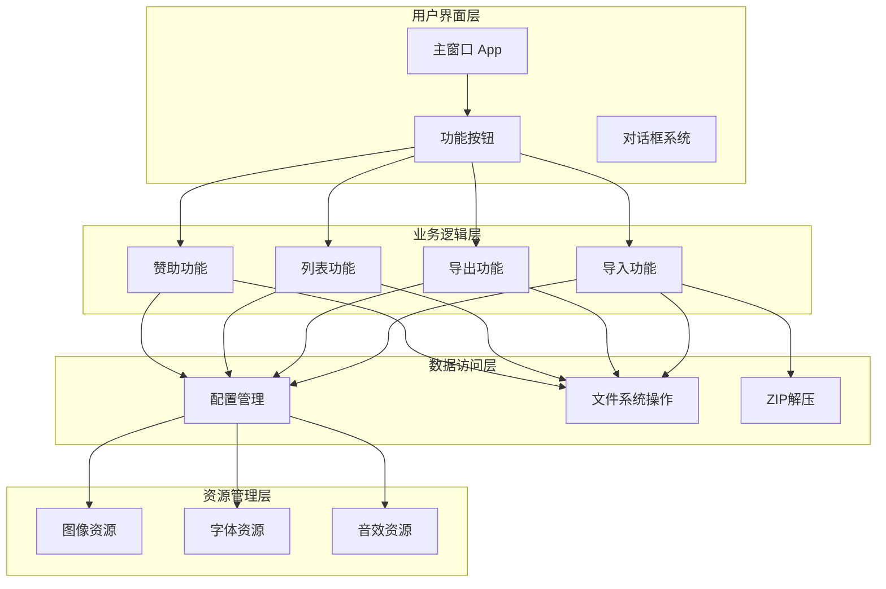
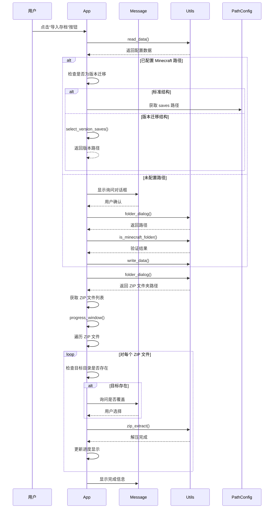
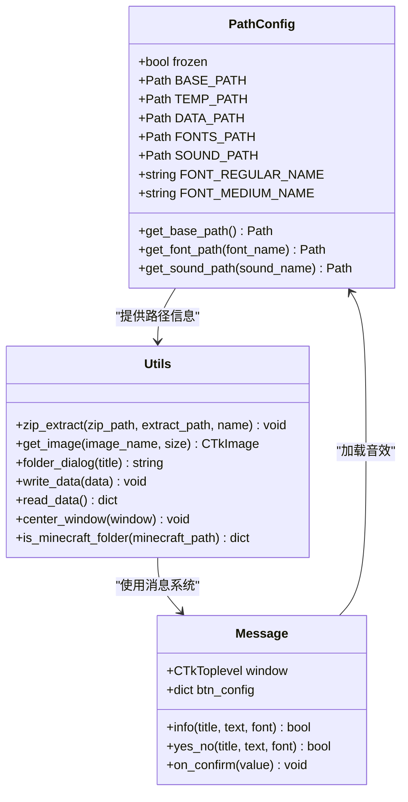
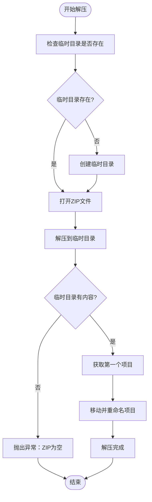
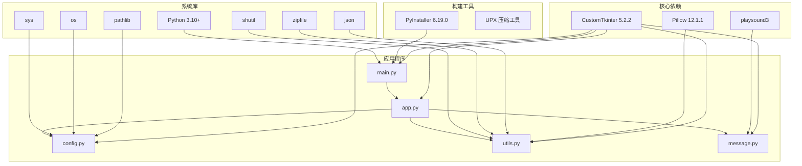

# Minecraft 存档管理器 - 代理系统文档

<cite>
**本文档引用的文件**
- [src/main.py](file://src/main.py)
- [src/app.py](file://src/app.py)
- [src/config.py](file://src/config.py)
- [src/utils.py](file://src/utils.py)
- [src/message.py](file://src/message.py)
- [README.md](file://README.md)
- [requirements.txt](file://requirements.txt)
- [data.json](file://data.json)
- [action_history.txt](file://action_history.txt)
</cite>

## 目录
1. [简介](#简介)
2. [项目结构](#项目结构)
3. [核心组件](#核心组件)
4. [架构概览](#架构概览)
5. [详细组件分析](#详细组件分析)
6. [依赖关系分析](#依赖关系分析)
7. [性能考虑](#性能考虑)
8. [故障排除指南](#故障排除指南)
9. [结论](#结论)

## 简介

Minecraft 存档管理器是一个专为 Minecraft Java 版设计的存档管理工具，旨在简化玩家的存档导入、导出和管理工作。该项目采用 Python 编写，使用 CustomTkinter 作为 GUI 框架，提供了直观易用的图形界面，支持一键导入 ZIP 格式的地图文件到 Minecraft 的 saves 文件夹中。

该工具的主要功能包括：
- **导入存档**：将下载的 ZIP 地图文件解压到 .minecraft/saves 文件夹
- **导出备份**：将现有存档打包备份
- **存档列表**：管理所有存档文件
- **赞助支持**：提供开发者支持渠道

## 项目结构

项目采用模块化的文件组织结构，主要分为以下几个核心目录：

```mermaid
graph TB
subgraph "项目根目录"
A[src/] -- 源代码目录
B[img/] -- 图像资源
C[sounds/] -- 音效文件
D[fonts/] -- 字体文件
E[temp/] -- 临时文件
F[data.json] -- 配置数据
G[requirements.txt] -- 依赖文件
H[README.md] -- 项目说明
I[action_history.txt] -- 开发历史
end
subgraph "src/ 源代码"
J[main.py] -- 主入口点
K[app.py] -- 主应用程序类
L[config.py] -- 配置管理
M[utils.py] -- 工具函数
N[message.py] -- 消息对话框
end
A --> J
A --> K
A --> L
A --> M
A --> N
```

**图表来源**
- [src/main.py:1-7](file://src/main.py#L1-L7)
- [src/app.py:1-631](file://src/app.py#L1-L631)
- [src/config.py:1-94](file://src/config.py#L1-L94)

**章节来源**
- [README.md:25-34](file://README.md#L25-L34)
- [src/main.py:1-7](file://src/main.py#L1-L7)

## 核心组件

### 应用程序主类 (App)

App 类是整个应用程序的核心控制器，负责管理用户界面和业务逻辑。该类继承自 CustomTkinter 的 CTk 类，提供了完整的 GUI 功能。

主要职责包括：
- 初始化主窗口和界面布局
- 管理四个核心功能按钮
- 处理用户交互事件
- 协调各个功能模块的工作

### 配置管理系统

配置系统负责管理应用程序的各种设置和路径信息，包括：
- 路径配置类 (PathConfig)
- 字体文件路径管理
- 音效文件路径管理
- 打包环境和开发环境的路径处理

### 工具函数库

工具函数库提供了应用程序所需的各种实用功能：
- ZIP 文件解压功能
- 图像资源加载和缩放
- 文件夹选择对话框
- 配置数据的读写操作
- 窗口居中显示功能

### 消息对话框系统

消息对话框系统提供了统一的用户交互界面，包括：
- 信息提示对话框
- 确认选择对话框
- 模态窗口管理
- 音效反馈机制

**章节来源**
- [src/app.py:5-631](file://src/app.py#L5-L631)
- [src/config.py:15-94](file://src/config.py#L15-L94)
- [src/utils.py:1-186](file://src/utils.py#L1-L186)
- [src/message.py:4-114](file://src/message.py#L4-L114)

## 架构概览

应用程序采用分层架构设计，各组件之间通过清晰的接口进行通信：



**图表来源**
- [src/app.py:167-301](file://src/app.py#L167-L301)
- [src/utils.py:4-32](file://src/utils.py#L4-L32)
- [src/config.py:15-94](file://src/config.py#L15-L94)

## 详细组件分析

### 导入存档功能

导入存档功能是应用程序的核心特性，实现了从 ZIP 文件到 Minecraft saves 目录的完整转换流程：



**图表来源**
- [src/app.py:167-301](file://src/app.py#L167-L301)
- [src/utils.py:4-32](file://src/utils.py#L4-L32)
- [src/message.py:67-114](file://src/message.py#L67-L114)

#### 导入流程的关键步骤

1. **配置检查**：首先检查用户是否已经保存了 Minecraft 路径配置
2. **路径验证**：验证所选路径是否为有效的 Minecraft 目录
3. **版本检测**：识别标准结构还是版本迁移结构
4. **文件选择**：让用户选择包含 ZIP 文件的文件夹
5. **批量处理**：逐个处理 ZIP 文件并显示进度
6. **覆盖确认**：对于已存在的存档进行覆盖确认
7. **完成通知**：显示导入统计结果

### 配置管理系统

配置管理系统提供了灵活的路径管理和环境适配功能：



**图表来源**
- [src/config.py:15-94](file://src/config.py#L15-L94)
- [src/utils.py:1-186](file://src/utils.py#L1-L186)
- [src/message.py:4-114](file://src/message.py#L4-L114)

#### 路径管理策略

配置系统采用了智能的路径管理策略，能够适应不同的运行环境：

- **开发环境**：使用项目根目录作为基础路径
- **打包环境**：使用 PyInstaller 的 sys._MEIPASS 作为基础路径
- **资源定位**：自动处理字体、图像、音效等资源文件的路径
- **跨平台兼容**：支持 Windows、Linux、macOS 等不同操作系统

### 工具函数库

工具函数库提供了应用程序运行所需的基础功能：

#### ZIP 解压算法



**图表来源**
- [src/utils.py:4-32](file://src/utils.py#L4-L32)

#### 图像资源加载

工具函数库提供了统一的图像资源加载机制，支持不同分辨率的图像缩放：

- **多分辨率支持**：自动适配不同 DPI 设置
- **缓存机制**：避免重复加载相同的图像资源
- **打包兼容**：支持 PyInstaller 打包后的资源访问
- **类型安全**：返回类型安全的 CTkImage 对象

**章节来源**
- [src/app.py:167-301](file://src/app.py#L167-L301)
- [src/utils.py:4-186](file://src/utils.py#L4-L186)
- [src/config.py:15-94](file://src/config.py#L15-L94)

## 依赖关系分析

应用程序的依赖关系相对简单且清晰，主要依赖于以下外部库：



**图表来源**
- [requirements.txt:1-10](file://requirements.txt#L1-L10)
- [src/main.py:1-7](file://src/main.py#L1-L7)
- [src/app.py:1-4](file://src/app.py#L1-L4)

### 依赖管理策略

项目采用了合理的依赖管理策略：

- **最小依赖原则**：只引入必要的第三方库
- **版本锁定**：固定依赖版本确保构建一致性
- **打包优化**：通过 UPX 压缩减小可执行文件大小
- **跨平台兼容**：确保在不同操作系统上正常运行

**章节来源**
- [requirements.txt:1-10](file://requirements.txt#L1-L10)
- [action_history.txt:227-240](file://action_history.txt#L227-L240)

## 性能考虑

### 内存管理

应用程序在处理大量 ZIP 文件时采用了高效的内存管理策略：

- **流式解压**：使用 zipfile 模块的流式解压，避免一次性加载整个文件到内存
- **临时文件夹**：先解压到临时目录，然后移动到最终位置，减少磁盘碎片
- **渐进式更新**：进度条采用渐进式更新，避免频繁的界面重绘

### I/O 性能优化

针对文件系统操作进行了专门的性能优化：

- **批量操作**：支持批量导入多个 ZIP 文件
- **异步处理**：UI 线程保持响应，后台执行文件操作
- **进度反馈**：实时显示处理进度，提升用户体验

### 资源管理

应用程序实现了完善的资源管理机制：

- **自动清理**：临时文件在使用后自动清理
- **资源复用**：图像和字体资源在内存中缓存
- **路径缓存**：配置路径信息缓存避免重复计算

## 故障排除指南

### 常见问题及解决方案

#### 1. Minecraft 路径检测失败

**问题描述**：应用程序无法识别有效的 Minecraft 目录

**可能原因**：
- 选择了错误的文件夹
- Minecraft 安装不完整
- 权限不足

**解决方法**：
1. 确认选择了包含 launcher_profiles.json 的 .minecraft 文件夹
2. 检查 saves 或 versions 目录是否存在
3. 以管理员权限运行应用程序

#### 2. ZIP 文件解压失败

**问题描述**：导入过程中 ZIP 文件解压失败

**可能原因**：
- ZIP 文件损坏
- 磁盘空间不足
- 权限问题

**解决方法**：
1. 验证 ZIP 文件完整性
2. 检查目标磁盘剩余空间
3. 确认对 saves 目录有写入权限

#### 3. 图像资源加载失败

**问题描述**：应用程序无法显示图像资源

**可能原因**：
- 图片文件缺失
- 打包时资源未包含
- 路径解析错误

**解决方法**：
1. 确认 img/ 目录下包含所有必需的 PNG 文件
2. 检查 PyInstaller 打包命令中的 --add-data 参数
3. 验证路径配置是否正确

#### 4. 字体显示异常

**问题描述**：应用程序字体显示不正确

**可能原因**：
- 字体文件缺失
- 字体名称不匹配
- 系统字体冲突

**解决方法**：
1. 确认 fonts/ 目录包含 HarmonyOS Sans 字体文件
2. 检查字体 family name 配置
3. 重启应用程序以重新加载字体

### 调试技巧

#### 日志记录

应用程序在关键操作点添加了详细的日志记录，可以通过以下方式启用：

1. 检查控制台输出
2. 查看 action_history.txt 中的操作记录
3. 使用调试模式运行应用程序

#### 配置验证

定期验证配置文件的完整性：

```python
# 检查 data.json 结构
{
    "minecraft_path": "",  # Minecraft 根目录路径
    "migrate": false       # 是否为版本迁移结构
}
```

**章节来源**
- [src/utils.py:98-114](file://src/utils.py#L98-L114)
- [src/utils.py:161-186](file://src/utils.py#L161-L186)
- [action_history.txt:1-244](file://action_history.txt#L1-L244)

## 结论

Minecraft 存档管理器是一个设计精良、功能完备的存档管理工具。通过采用模块化的设计理念和清晰的分层架构，该应用程序实现了良好的可维护性和扩展性。

### 主要优势

1. **用户友好**：直观的图形界面和简洁的操作流程
2. **功能完整**：涵盖了存档管理的核心需求
3. **跨平台**：支持多种操作系统环境
4. **易于扩展**：模块化设计便于添加新功能
5. **性能优化**：针对大型文件处理进行了专门优化

### 技术亮点

- **智能路径管理**：自动适配开发和生产环境
- **资源优化**：高效的图像和字体资源管理
- **错误处理**：完善的异常处理和用户反馈机制
- **构建优化**：支持 UPX 压缩和多平台打包

### 发展建议

1. **功能扩展**：实现导出备份和存档列表功能
2. **性能提升**：添加多线程处理支持
3. **用户体验**：增强进度反馈和状态显示
4. **国际化**：支持多语言界面
5. **自动化**：添加定时备份和同步功能

该应用程序为 Minecraft 玩家提供了一个可靠、高效的存档管理解决方案，具有良好的发展前景和扩展潜力。