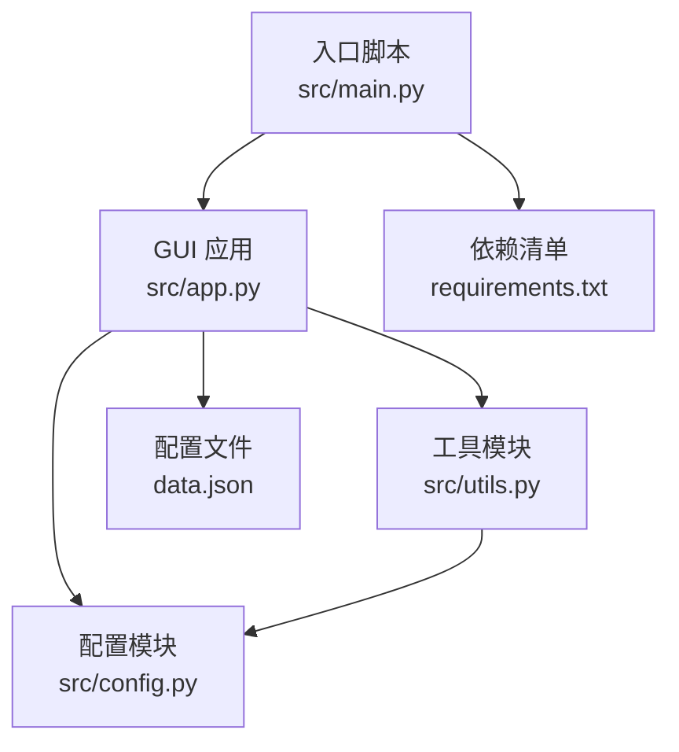
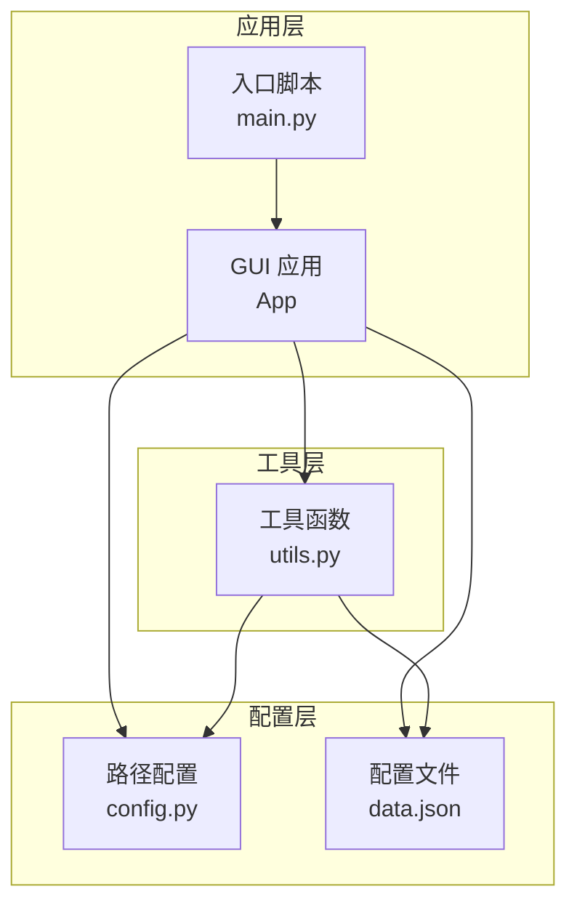
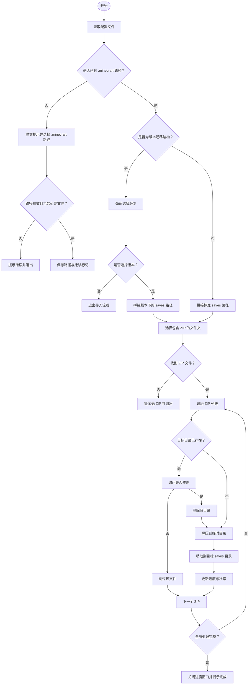
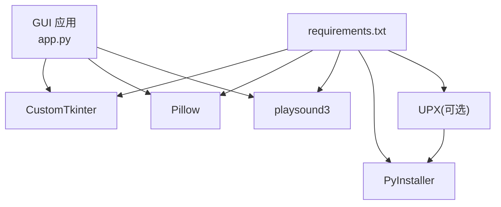

# 功能特性

<cite>
**本文引用的文件**
- [src/main.py](file://src/main.py)
- [src/app.py](file://src/app.py)
- [src/utils.py](file://src/utils.py)
- [src/config.py](file://src/config.py)
- [src/message.py](file://src/message.py)
- [README.md](file://README.md)
- [data.json](file://data.json)
- [requirements.txt](file://requirements.txt)
</cite>

## 目录
1. [简介](#简介)
2. [项目结构](#项目结构)
3. [核心组件](#核心组件)
4. [架构总览](#架构总览)
5. [详细组件分析](#详细组件分析)
6. [依赖分析](#依赖分析)
7. [性能考虑](#性能考虑)
8. [故障排查指南](#故障排查指南)
9. [结论](#结论)
10. [附录](#附录)

## 简介
本文件面向存档管理器的功能特性进行系统化说明，围绕四大核心能力展开：存档导入、导出备份、存档列表管理、存档修复。文档将从系统架构、组件关系、数据流、处理逻辑、参数配置、错误处理、使用流程、最佳实践以及性能优化等维度进行全面阐述，并辅以可视化图表帮助不同技术背景的读者快速理解与上手。

## 项目结构
项目采用"入口脚本 + GUI 应用 + 工具函数 + 配置管理"的分层组织方式，核心文件如下：
- 入口脚本：负责启动 GUI 应用
- GUI 应用：提供四大功能按钮及交互界面
- 工具模块：封装通用操作（ZIP 解压、资源加载、路径选择、数据持久化等）
- 配置模块：统一管理路径、字体、音效等资源定位
- 配置文件：记录 Minecraft 路径与版本迁移标记
- 依赖清单：定义运行与打包所需第三方库

**图表来源**
- [src/main.py:1-7](file://src/main.py#L1-L7)
- [src/app.py:1-645](file://src/app.py#L1-L645)
- [src/utils.py:1-186](file://src/utils.py#L1-L186)
- [src/config.py:1-94](file://src/config.py#L1-L94)
- [data.json:1-4](file://data.json#L1-L4)
- [requirements.txt:1-10](file://requirements.txt#L1-L10)

**章节来源**
- [src/main.py:1-7](file://src/main.py#L1-L7)
- [README.md:25-34](file://README.md#L25-L34)

## 核心组件
- 应用入口与主循环：负责创建 GUI 实例并进入事件循环
- GUI 应用类：负责构建界面、绑定按钮事件、弹窗提示与进度展示
- 工具函数集：封装 ZIP 解压、资源加载、路径选择、数据读写、窗口居中与自适应宽度等
- 配置管理：统一管理路径、字体、音效资源，兼容开发与打包两种运行环境
- 配置文件：记录 Minecraft 根目录路径与版本迁移标记，供后续导入流程复用

**章节来源**
- [src/main.py:1-7](file://src/main.py#L1-L7)
- [src/app.py:6-38](file://src/app.py#L6-L38)
- [src/utils.py:4-186](file://src/utils.py#L4-L186)
- [src/config.py:15-94](file://src/config.py#L15-L94)
- [data.json:1-4](file://data.json#L1-L4)

## 架构总览
应用采用"事件驱动 + 模块化工具"的架构模式：
- 入口脚本触发 GUI 初始化
- GUI 类负责用户交互与流程编排
- 工具模块提供底层能力（文件操作、资源访问、对话框）
- 配置模块提供资源定位与路径抽象
- 配置文件持久化用户偏好

**图表来源**
- [src/main.py:1-7](file://src/main.py#L1-L7)
- [src/app.py:1-645](file://src/app.py#L1-L645)
- [src/utils.py:1-186](file://src/utils.py#L1-L186)
- [src/config.py:1-94](file://src/config.py#L1-L94)
- [data.json:1-4](file://data.json#L1-L4)

## 详细组件分析

### 存档导入（Import Save）
- 功能概述
  - 将 ZIP 地图文件批量解压到 Minecraft 的 saves 目录，支持标准结构与版本迁移结构两种路径识别。
- 用户界面
  - 主界面"导入存档"按钮触发流程；首次使用时弹窗引导用户提供 .minecraft 路径并校验有效性；若检测到版本迁移结构，会弹窗选择具体版本后再定位 saves。
- 实现逻辑
  - 读取配置文件，决定是否已有 .minecraft 路径与迁移标记
  - 若未提供，弹窗提示并打开系统文件夹选择器；校验 launcher_profiles.json 与 saves 或 versions 结构
  - 保存路径与迁移标记至配置文件
  - 选择包含 ZIP 的文件夹，遍历所有 .zip 并逐个解压
  - 解压前检查目标目录是否存在，如存在则询问覆盖策略
  - 解压过程通过临时目录中转，确保完整性后再移动到最终目标
  - 显示进度窗口，实时更新百分比与当前处理的存档名
- 关键流程图

**图表来源**
- [src/app.py:171-305](file://src/app.py#L171-L305)
- [src/utils.py:4-32](file://src/utils.py#L4-L32)
- [src/utils.py:161-186](file://src/utils.py#L161-L186)

- 参数与配置
  - 配置文件字段：minecraft_path、migrate
  - 资源路径：临时目录、数据文件、字体与音效路径
- 错误处理
  - 路径无效：提示错误并终止
  - 无 ZIP：提示无文件并终止
  - 解压空包：抛出异常并中断
  - 用户取消：及时返回，不执行后续步骤
- 性能与优化
  - 使用临时目录中转解压，降低直接写入失败风险
  - 进度窗口实时刷新，提升用户体验
  - 批量处理时按顺序执行，避免并发冲突
- 使用流程
  1) 启动应用
  2) 点击"导入存档"
  3) 如首次使用，选择 .minecraft 路径并确认
  4) 若为版本迁移结构，选择目标版本
  5) 选择包含 ZIP 的文件夹
  6) 等待进度完成，查看导入结果
- 最佳实践
  - 导入前先备份重要存档
  - 确保 ZIP 包内包含单一层级的世界目录，避免多层嵌套导致解压异常
  - 避免同时运行多个存档管理器实例，防止目标目录被并发修改

**章节来源**
- [src/app.py:171-305](file://src/app.py#L171-L305)
- [src/utils.py:4-32](file://src/utils.py#L4-L32)
- [src/utils.py:85-113](file://src/utils.py#L85-L113)
- [src/utils.py:161-186](file://src/utils.py#L161-L186)
- [src/config.py:15-94](file://src/config.py#L15-L94)
- [data.json:1-4](file://data.json#L1-L4)

### 导出备份（Export Save）
- 当前状态
  - 功能占位，尚未实现具体逻辑
- 用户界面
  - "导出存档"按钮点击后弹出提示窗口，告知功能开发中
- 实现建议
  - 输入：选择要备份的存档目录
  - 输出：生成 ZIP 包，可选命名规则与目标路径
  - 进度：显示压缩进度与完成提示
- 使用流程
  1) 点击"导出存档"
  2) 等待提示"功能开发中"
  3) 后续版本将提供实际备份能力

**章节来源**
- [src/app.py:307-317](file://src/app.py#L307-L317)

### 存档列表（List Saves）
- 当前状态
  - 功能占位，尚未实现具体逻辑
- 用户界面
  - "存档列表"按钮点击后弹出提示窗口，告知功能开发中
- 实现建议
  - 读取 saves 目录，枚举子目录作为存档项
  - 展示存档名称、最后修改时间、大小等信息
  - 提供排序、筛选、删除、重命名等操作入口
- 使用流程
  1) 点击"存档列表"
  2) 等待提示"功能开发中"
  3) 后续版本将提供实际列表管理能力

**章节来源**
- [src/app.py:319-329](file://src/app.py#L319-L329)

### 存档修复（Fix Save）
- 当前状态
  - 功能占位，尚未实现具体逻辑
- 用户界面
  - "存档修复"按钮存在但未绑定事件处理
- 实现建议
  - 诊断：扫描存档目录，识别损坏或不完整文件
  - 修复：尝试重建缺失文件、修复权限问题、清理异常文件
  - 回滚：对关键文件进行备份，便于回滚
- 使用流程
  1) 点击"存档修复"
  2) 等待提示"功能开发中"
  3) 后续版本将提供实际修复能力

**章节来源**
- [src/app.py:131-142](file://src/app.py#L131-L142)

### 赞助与关于（Donate & About）
- 赞助
  - 弹窗展示"感谢支持"，提供微信与支付宝两种支付方式入口
  - 点击后弹出对应二维码窗口，模态显示
  - 支持图标：Tabler Icons (MIT)，音效：Pixabay.com，字体：HarmonyOS Sans (免费商用)
- 关于
  - "关于软件"按钮存在，当前未绑定事件处理
- 使用流程
  1) 点击"赞助一下"
  2) 选择支付方式
  3) 查看二维码并扫码支付
  4) "关于软件"按钮可在未来补充版本信息与许可说明

**章节来源**
- [src/app.py:331-446](file://src/app.py#L331-L446)
- [src/app.py:566-595](file://src/app.py#L566-L595)
- [src/app.py:157-168](file://src/app.py#L157-L168)

## 依赖分析
- 运行时依赖
  - CustomTkinter：跨平台 GUI 框架
  - Pillow：图像处理与资源加载
  - playsound3：音效播放
  - 其他：zipfile、shutil、json、pathlib、tkinter 等标准库
- 打包与分发
  - PyInstaller：将应用打包为独立可执行文件
  - UPX：可选压缩，减小体积但可能增加启动时间
- 资源组织
  - 图片、字体、音效在开发与打包环境下通过统一路径配置类进行定位

**图表来源**
- [requirements.txt:1-10](file://requirements.txt#L1-L10)
- [src/app.py:1-3](file://src/app.py#L1-L3)

**章节来源**
- [requirements.txt:1-10](file://requirements.txt#L1-L10)
- [src/app.py:1-3](file://src/app.py#L1-L3)

## 性能考虑
- 解压流程
  - 采用临时目录中转再移动的方式，避免直接写入失败导致的脏数据
  - 批量处理时顺序执行，避免并发写入冲突
- 界面响应
  - 进度窗口实时刷新，提升用户感知
  - 模态窗口阻塞用户交互，保证操作一致性
- 资源加载
  - 图像与字体路径通过统一配置类解析，兼容打包环境
  - 音效异步播放，不影响主流程
- 打包优化
  - 使用 UPX 可显著减小体积，但需权衡启动时间与杀软误报风险

## 故障排查指南
- 路径无效
  - 现象：提示"不是有效的 .minecraft 文件夹"
  - 排查：确认所选目录包含 launcher_profiles.json 与 saves 或 versions
  - 处理：重新选择正确路径或切换版本迁移结构
- 无 ZIP 文件
  - 现象：提示"选择的文件夹中没有找到 ZIP 文件"
  - 排查：确认所选文件夹内存在 .zip 文件
  - 处理：更换文件夹或检查 ZIP 是否被正确下载
- 解压失败
  - 现象：ZIP 包为空或解压过程中出现异常
  - 排查：检查 ZIP 文件完整性与来源
  - 处理：使用其他来源的 ZIP 包或修复原文件
- 用户取消
  - 现象：多次点击取消导致流程提前结束
  - 处理：重新开始流程，确保每一步都确认继续
- 覆盖确认
  - 现象：目标目录已存在同名存档
  - 处理：谨慎选择覆盖，避免丢失原有数据

**章节来源**
- [src/app.py:239-244](file://src/app.py#L239-L244)
- [src/app.py:259-265](file://src/app.py#L259-L265)
- [src/utils.py:26-27](file://src/utils.py#L26-L27)
- [src/app.py:279-281](file://src/app.py#L279-L281)

## 结论
存档管理器以简洁直观的界面提供了存档导入能力，并为导出备份、存档列表与存档修复预留了扩展空间。通过统一的配置管理与工具模块，系统在开发与打包环境下保持一致的资源定位与行为。建议在后续版本中完善导出备份与列表管理功能，逐步实现存档修复能力，以形成完整的存档生命周期管理体系。

## 附录
- 快速开始
  - 打开程序 → 点击"导入存档" → 选择 .minecraft 路径（首次） → 选择包含 ZIP 的文件夹 → 等待完成
- 常见问题
  - 为什么需要选择 .minecraft 路径？用于定位 saves 或版本迁移结构
  - 什么是版本迁移结构？指包含 versions 子目录的现代 Minecraft 结构
  - 导入后如何验证？在 Minecraft 游戏中查看"单人游戏"列表
- 开发与打包
  - 安装依赖后使用 PyInstaller 打包，可选 UPX 压缩

**章节来源**
- [README.md:18-23](file://README.md#L18-L23)
- [README.md:42-86](file://README.md#L42-L86)