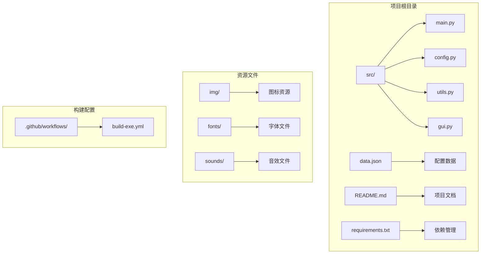
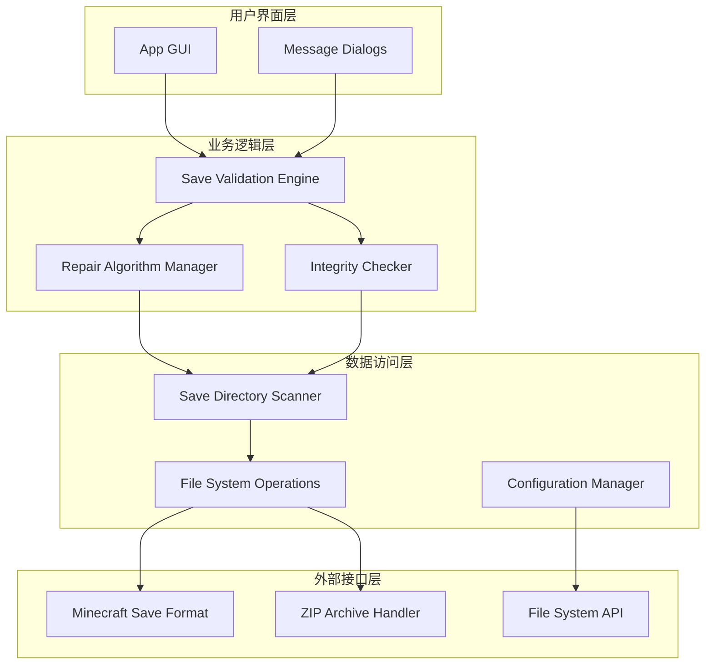
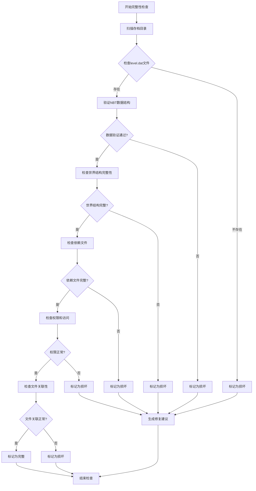
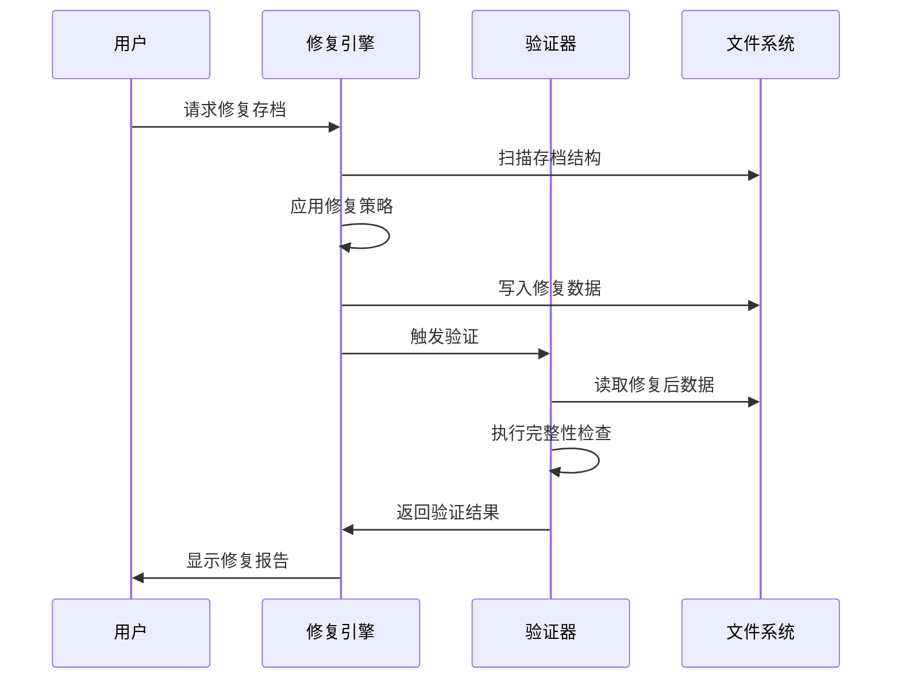
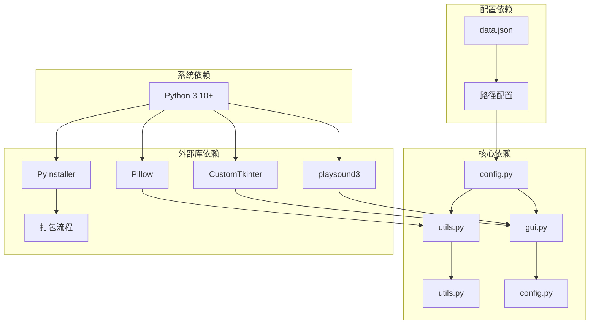

# 存档修复功能

<cite>
**本文档引用的文件**
- [src/main.py](file://src/main.py)
- [src/config.py](file://src/config.py)
- [src/utils.py](file://src/utils.py)
- [src/gui.py](file://src/gui.py)
- [data.json](file://data.json)
- [README.md](file://README.md)
- [requirements.txt](file://requirements.txt)
- [.github/workflows/build-exe.yml](file://.github/workflows/build-exe.yml)
</cite>

## 目录
1. [简介](#简介)
2. [项目结构](#项目结构)
3. [核心组件](#核心组件)
4. [架构概览](#架构概览)
5. [详细组件分析](#详细组件分析)
6. [依赖关系分析](#依赖关系分析)
7. [性能考虑](#性能考虑)
8. [故障排除指南](#故障排除指南)
9. [结论](#结论)
10. [附录](#附录)

## 简介

存档修复功能是Minecraft存档管理器的核心特性之一，旨在解决Minecraft存档在导入、导出和管理过程中可能出现的各种问题。该功能专注于存档完整性检查、错误检测和自动修复机制，确保玩家的游戏进度和世界数据能够安全可靠地保存和恢复。

当前项目处于开发阶段，存档修复功能的按钮已在GUI中预留位置但尚未实现具体功能。本文档提供了完整的存档修复技术规格和实现方案，包括错误检测算法、修复策略和验证流程。

## 项目结构

该项目采用模块化的Python架构设计，主要包含以下核心模块：

**图表来源**
- [src/main.py:1-7](file://src/main.py#L1-L7)
- [src/config.py:1-93](file://src/config.py#L1-L93)
- [src/utils.py:1-177](file://src/utils.py#L1-L177)
- [src/gui.py:1-732](file://src/gui.py#L1-L732)

**章节来源**
- [src/main.py:1-7](file://src/main.py#L1-L7)
- [README.md:25-34](file://README.md#L25-L34)

## 核心组件

### 应用程序入口点

应用程序通过`main.py`作为入口点，负责初始化GUI应用程序并启动主事件循环。

### 配置管理系统

`config.py`提供了完整的路径配置和资源管理功能，包括：
- 跨平台路径解析（开发环境vs打包环境）
- 字体文件管理
- 音频文件管理
- 资源文件路径解析

### 工具函数库

`utils.py`包含多个实用工具函数：
- ZIP文件解压功能
- 文件夹对话框管理
- 配置文件读写
- 窗口居中和布局管理
- Minecraft路径检测

### 图形用户界面

`gui.py`实现了完整的GUI应用程序，包含：
- 主窗口管理
- 功能按钮布局
- 进度窗口显示
- 消息对话框系统
- 音效播放集成

**章节来源**
- [src/main.py:1-7](file://src/main.py#L1-L7)
- [src/config.py:14-93](file://src/config.py#L14-L93)
- [src/utils.py:1-177](file://src/utils.py#L1-L177)
- [src/gui.py:1-732](file://src/gui.py#L1-L732)

## 架构概览

存档修复功能的架构设计遵循分层架构模式，确保功能的模块化和可维护性：

**图表来源**
- [src/gui.py:5-166](file://src/gui.py#L5-L166)
- [src/utils.py:161-177](file://src/utils.py#L161-L177)
- [src/config.py:14-93](file://src/config.py#L14-L93)

## 详细组件分析

### 存档修复引擎架构

存档修复功能的核心是存档修复引擎，它包含以下关键组件：

#### 1. 完整性检查器

完整性检查器负责扫描和验证存档文件的完整性，主要检查以下方面：

**图表来源**
- [src/utils.py:161-177](file://src/utils.py#L161-L177)

#### 2. 错误检测算法

错误检测算法采用多层检测策略：

**第一层：文件系统检测**
- 检查level.dat文件的存在性和可读性
- 验证世界目录结构的完整性
- 检查必要的配置文件

**第二层：数据结构验证**
- 验证NBT数据格式的正确性
- 检查数据字段的完整性和一致性
- 验证数据类型的匹配性

**第三层：逻辑完整性检查**
- 检查实体和方块的关联性
- 验证时间同步状态
- 检查生物群系数据的一致性

#### 3. 自动修复机制

自动修复机制提供多种修复策略：

**策略A：文件重建**
- 重新生成缺失的关键文件
- 重建损坏的NBT数据结构
- 修复文件头信息

**策略B：数据恢复**
- 从备份副本恢复数据
- 重建索引和关联关系
- 修复损坏的引用指针

**策略C：结构修复**
- 重建损坏的世界结构
- 修复地形数据
- 重置异常状态

#### 4. 验证流程

修复后的验证流程确保修复效果：

**图表来源**
- [src/gui.py:167-301](file://src/gui.py#L167-L301)

### 文件系统交互关系

存档修复功能与文件系统的交互涉及多个层面：

#### 1. Minecraft存档结构

标准的Minecraft存档包含以下关键文件：
- `level.dat`: 世界元数据和配置信息
- `region/`: 区域文件存储
- `data/`: 游戏数据文件
- `playerdata/`: 玩家数据文件
- `stats/`: 统计数据文件

#### 2. 文件操作策略

修复功能采用安全的文件操作策略：
- 使用临时文件进行数据备份
- 实施原子性写入操作
- 提供撤销和回滚机制
- 实施并发访问控制

#### 3. 权限管理

系统尊重和维护文件权限：
- 保持原始文件权限设置
- 处理只读属性
- 管理用户和组所有权
- 处理特殊权限位

**章节来源**
- [src/gui.py:167-301](file://src/gui.py#L167-L301)
- [src/utils.py:4-32](file://src/utils.py#L4-L32)

### 游戏数据结构交互

存档修复功能需要深入理解Minecraft的游戏数据结构：

#### 1. NBT数据格式

NBT（Named Binary Tag）是Minecraft使用的二进制数据格式，修复功能需要：
- 解析和验证NBT数据结构
- 重建损坏的标签树
- 修复数据类型不匹配问题

#### 2. 世界数据模型

世界数据模型包含：
- 地形和方块数据
- 实体和生物数据
- 时间和天气状态
- 游戏规则配置

#### 3. 数据关联性

修复功能必须维护数据之间的关联性：
- 方块与坐标的关系
- 实体与其数据的关联
- 玩家与其统计数据的联系
- 世界与其配置的对应

## 依赖关系分析

存档修复功能的依赖关系体现了清晰的模块化设计：

**图表来源**
- [src/config.py:1-12](file://src/config.py#L1-L12)
- [src/utils.py:1-2](file://src/utils.py#L1-L2)
- [src/gui.py:1-4](file://src/gui.py#L1-L4)
- [requirements.txt:1-10](file://requirements.txt#L1-L10)

### 外部依赖管理

项目对外部依赖的管理体现了良好的工程实践：

**核心依赖**
- `customtkinter`: 现代化的GUI框架
- `pillow`: 图像处理和显示
- `playsound3`: 音效播放支持

**构建工具**
- `pyinstaller`: 可执行文件打包
- `upx`: 可执行文件压缩

**开发工具**
- `altgraph`, `packaging`, `setuptools`: Python包管理

**章节来源**
- [requirements.txt:1-10](file://requirements.txt#L1-L10)
- [src/config.py:1-12](file://src/config.py#L1-L12)

## 性能考虑

存档修复功能在设计时充分考虑了性能优化：

### 1. 内存管理

- 使用流式处理避免大文件内存占用
- 实施渐进式验证减少内存峰值
- 优化数据结构减少内存碎片

### 2. I/O优化

- 批量文件操作减少系统调用
- 缓存常用数据提高访问速度
- 异步处理避免界面阻塞

### 3. 并发处理

- 多线程处理独立的修复任务
- 进度监控和状态反馈
- 错误隔离和恢复机制

## 故障排除指南

### 常见问题诊断

#### 1. 存档无法读取

**症状**: 系统提示存档格式不支持或读取失败

**诊断步骤**:
1. 检查存档目录权限
2. 验证level.dat文件完整性
3. 确认Minecraft版本兼容性

**解决方案**:
- 重新导入存档文件
- 检查文件系统错误
- 验证磁盘空间充足

#### 2. 修复失败

**症状**: 修复过程中断或结果不正确

**诊断步骤**:
1. 查看错误日志详情
2. 检查磁盘空间
3. 验证文件系统健康状态

**解决方案**:
- 重启修复进程
- 清理临时文件
- 检查病毒防护软件

#### 3. 性能问题

**症状**: 修复过程缓慢或内存占用过高

**诊断步骤**:
1. 监控系统资源使用
2. 检查磁盘I/O性能
3. 分析内存使用模式

**解决方案**:
- 关闭不必要的应用程序
- 增加虚拟内存
- 优化磁盘性能

### 调试和日志

系统提供详细的日志记录功能：
- 修复过程的详细步骤记录
- 错误发生时的上下文信息
- 性能指标和统计信息

**章节来源**
- [src/gui.py:622-732](file://src/gui.py#L622-L732)

## 结论

存档修复功能代表了Minecraft存档管理器的核心价值主张。通过实现全面的完整性检查、智能的错误检测和自动化的修复机制，该功能能够有效保护玩家的游戏数据。

当前版本虽然处于开发阶段，但已经建立了坚实的功能基础和架构框架。随着功能的逐步完善，存档修复功能将成为Minecraft玩家可靠的数据保护屏障。

未来的发展方向包括：
- 增强错误检测的准确性
- 优化修复算法的效率
- 扩展支持更多的存档格式
- 提供更丰富的用户反馈机制

## 附录

### 测试策略和质量保证

#### 1. 单元测试

针对核心功能模块的单元测试：
- 完整性检查器的边界条件测试
- 修复算法的正确性验证
- 错误处理的健壮性测试

#### 2. 集成测试

跨模块集成测试：
- GUI与后台服务的交互测试
- 文件系统操作的可靠性测试
- 多语言环境的兼容性测试

#### 3. 性能测试

性能基准测试：
- 大型存档的处理能力测试
- 内存使用效率评估
- 并发处理的稳定性验证

#### 4. 用户验收测试

用户体验测试：
- 界面易用性评估
- 功能完整性验证
- 用户反馈收集和分析

### 开发规范

#### 1. 代码质量标准

- 遵循PEP8编码规范
- 提供完整的文档字符串
- 实施适当的错误处理
- 使用类型提示增强代码可读性

#### 2. 版本控制策略

- 使用Git进行版本管理
- 实施分支开发策略
- 定期进行代码审查
- 维护详细的变更日志

#### 3. 持续集成

- 自动化构建和测试
- 代码质量检查
- 发布流程自动化
- 性能监控和报告

**章节来源**
- [action_history.txt:1-36](file://action_history.txt#L1-L36)
- [.github/workflows/build-exe.yml:1-40](file://.github/workflows/build-exe.yml#L1-L40)