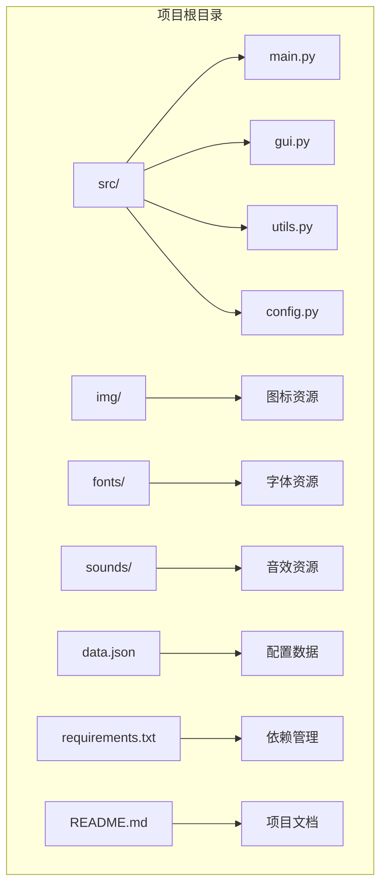
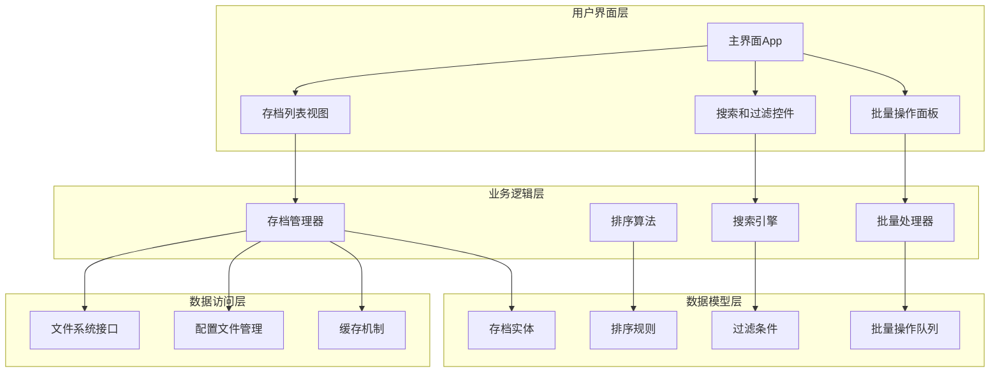
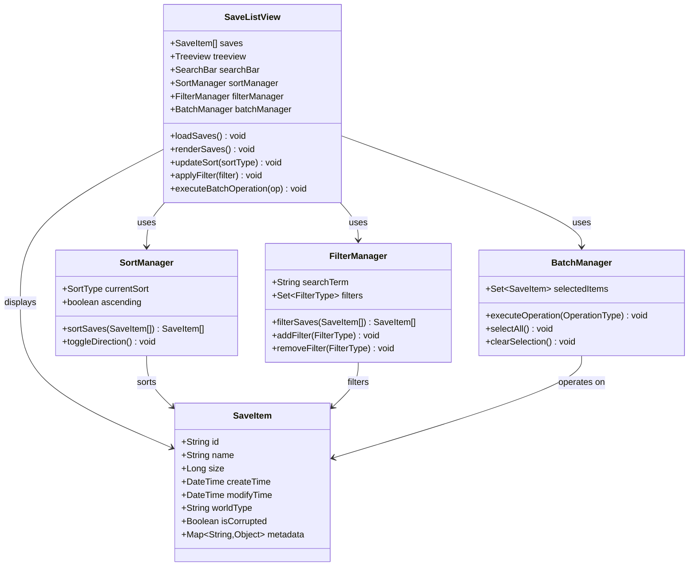
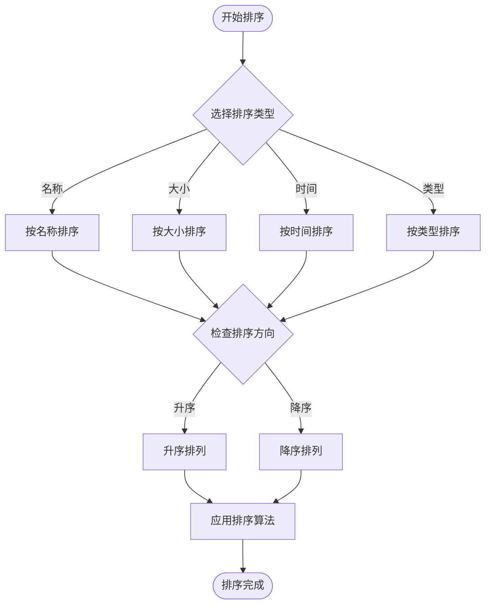
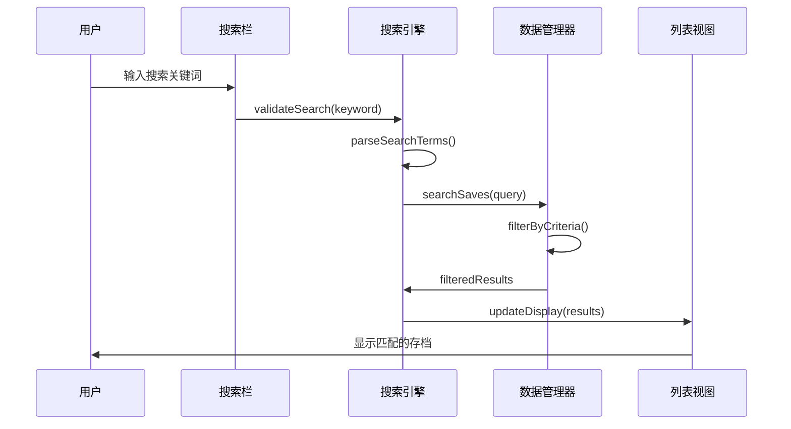
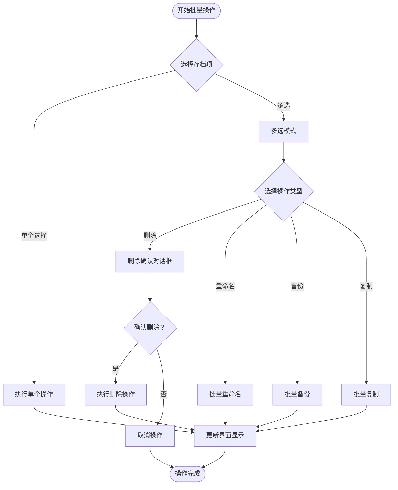
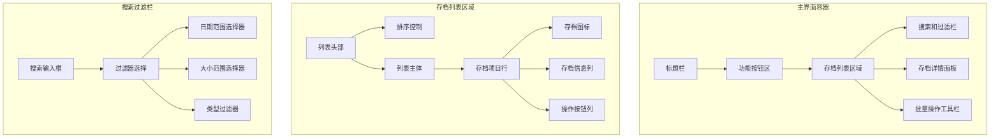
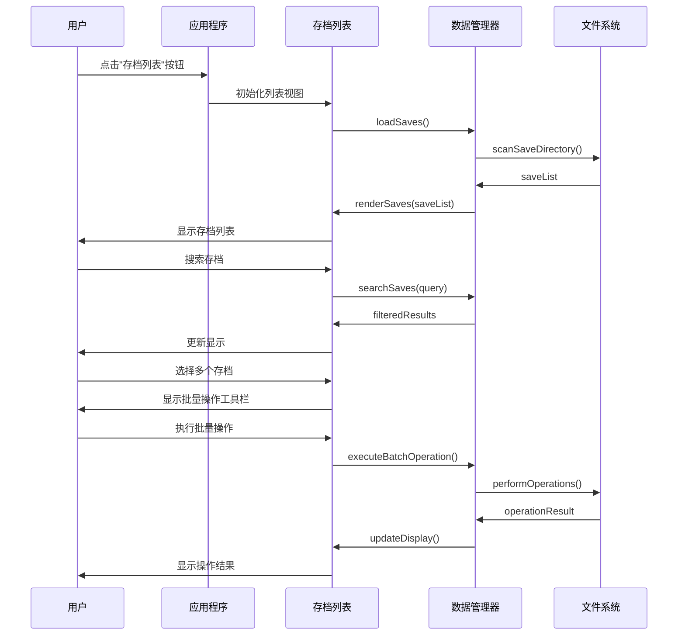
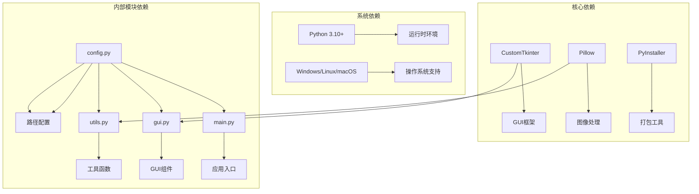
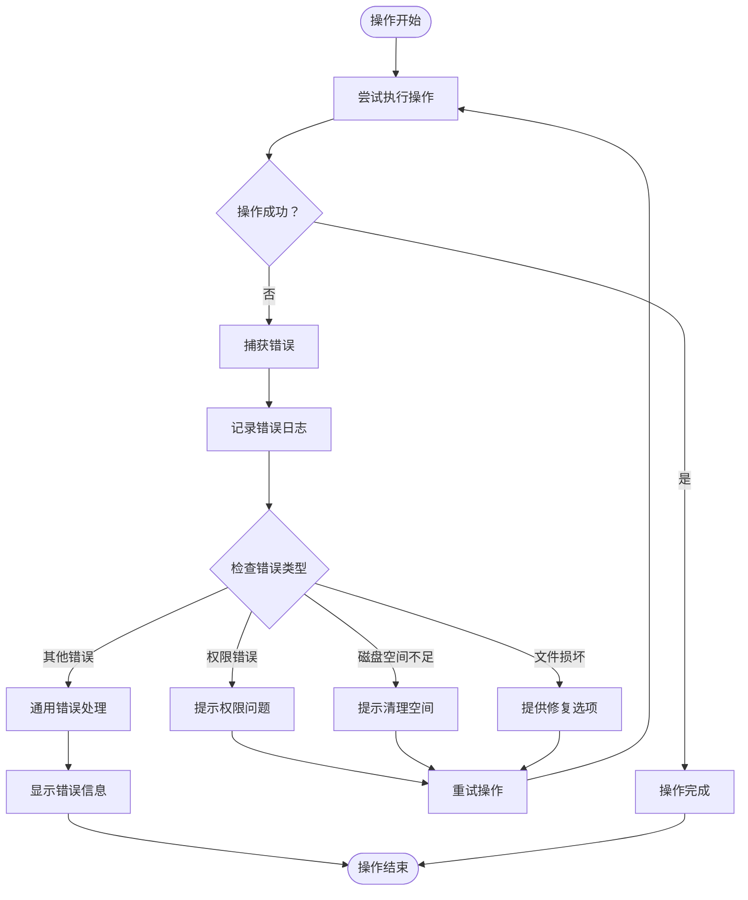

# 存档列表功能

<cite>
**本文档引用的文件**
- [src/main.py](file://src/main.py)
- [src/gui.py](file://src/gui.py)
- [src/utils.py](file://src/utils.py)
- [src/config.py](file://src/config.py)
- [README.md](file://README.md)
- [requirements.txt](file://requirements.txt)
- [data.json](file://data.json)
</cite>

## 目录
1. [简介](#简介)
2. [项目结构](#项目结构)
3. [核心组件](#核心组件)
4. [架构概览](#架构概览)
5. [详细组件分析](#详细组件分析)
6. [依赖分析](#依赖分析)
7. [性能考虑](#性能考虑)
8. [故障排除指南](#故障排除指南)
9. [结论](#结论)

## 简介

存档列表功能是Minecraft存档管理器的核心特性之一，旨在为用户提供直观、高效的存档浏览、管理和组织体验。该功能将允许用户查看所有可用的Minecraft存档，进行排序和过滤操作，执行批量管理任务，并提供丰富的存档信息展示。

### 功能概述

- **存档浏览**：以列表形式展示所有可用的Minecraft存档
- **信息展示**：显示存档的基本信息如名称、大小、创建时间、修改时间
- **排序功能**：支持按名称、大小、时间等多种方式排序
- **搜索功能**：提供实时搜索和过滤能力
- **批量操作**：支持多选存档进行统一管理
- **存档管理**：提供删除、重命名、备份等管理操作

## 项目结构

该项目采用模块化的Python架构，使用CustomTkinter构建跨平台GUI界面。

**图表来源**
- [src/main.py:1-7](file://src/main.py#L1-L7)
- [src/gui.py:1-732](file://src/gui.py#L1-L732)
- [src/config.py:1-93](file://src/config.py#L1-L93)

**章节来源**
- [src/main.py:1-7](file://src/main.py#L1-L7)
- [README.md:25-34](file://README.md#L25-L34)

## 核心组件

### 应用程序入口点

应用程序通过`main.py`启动，创建主窗口并初始化GUI组件。

### GUI应用程序类

`App`类是整个应用程序的核心，负责：
- 初始化主窗口和界面布局
- 管理各种功能按钮的创建和事件处理
- 实现用户界面的响应式设计

### 路径配置系统

`PathConfig`类提供统一的路径管理功能，支持开发和打包两种环境模式。

### 工具函数库

包含文件操作、图像处理、对话框管理等实用工具函数。

**章节来源**
- [src/gui.py:5-36](file://src/gui.py#L5-L36)
- [src/config.py:14-93](file://src/config.py#L14-L93)
- [src/utils.py:1-177](file://src/utils.py#L1-L177)

## 架构概览

存档列表功能将采用分层架构设计，确保代码的可维护性和扩展性。

**图表来源**
- [src/gui.py:610-620](file://src/gui.py#L610-L620)
- [src/utils.py:98-113](file://src/utils.py#L98-L113)

## 详细组件分析

### 存档列表视图组件

#### 设计规范

**图表来源**
- [src/gui.py:610-620](file://src/gui.py#L610-L620)

#### 数据结构设计

存档信息将以结构化的方式存储和管理：

| 字段名 | 类型 | 描述 | 示例 |
|--------|------|------|------|
| id | String | 存档唯一标识符 | "world_12345" |
| name | String | 存档显示名称 | "我的新世界" |
| size | Long | 存档文件大小（字节） | 104857600 |
| createTime | DateTime | 创建时间戳 | "2024-01-15 14:30:00" |
| modifyTime | DateTime | 最后修改时间 | "2024-01-20 09:15:30" |
| worldType | String | 世界类型 | "DEFAULT", "FLAT", "LARGEBIOME" |
| isCorrupted | Boolean | 是否损坏 | false |
| metadata | Map<String,Object> | 元数据信息 | 包含版本、种子等 |

#### 排序算法实现

**图表来源**
- [src/gui.py:610-620](file://src/gui.py#L610-L620)

### 搜索和过滤系统

#### 搜索引擎架构

**图表来源**
- [src/gui.py:610-620](file://src/gui.py#L610-L620)

#### 过滤条件类型

| 过滤类型 | 条件描述 | 语法示例 | 用途场景 |
|----------|----------|----------|----------|
| 名称匹配 | 按存档名称包含关键词 | "world" | 快速定位特定存档 |
| 时间范围 | 按创建或修改时间范围 | "2024-01-01..2024-01-31" | 查找特定时间段的存档 |
| 大小范围 | 按存档文件大小范围 | "<100MB" | 管理大型存档 |
| 世界类型 | 按世界生成类型过滤 | "FLAT,DEFAULT" | 分类管理不同类型存档 |
| 状态筛选 | 按存档状态过滤 | "corrupted,valid" | 识别问题存档 |

### 批量操作管理

#### 批量操作流程

**图表来源**
- [src/gui.py:610-620](file://src/gui.py#L610-L620)

#### 批量操作类型

| 操作类型 | 功能描述 | 安全措施 | 使用场景 |
|----------|----------|----------|----------|
| 删除 | 批量删除存档文件 | 确认对话框，回收站支持 | 清理无用存档 |
| 重命名 | 批量重命名存档 | 验证命名合法性，冲突检测 | 规范化存档命名 |
| 备份 | 批量创建存档备份 | 自动备份命名，进度显示 | 数据保护 |
| 复制 | 批量复制存档 | 目标空间检查，权限验证 | 存档迁移 |

### 用户界面设计方案

#### 主界面布局

**图表来源**
- [src/gui.py:37-165](file://src/gui.py#L37-L165)

#### 交互流程设计

**图表来源**
- [src/gui.py:610-620](file://src/gui.py#L610-L620)

## 依赖分析

### 外部依赖关系

**图表来源**
- [requirements.txt:1-10](file://requirements.txt#L1-L10)
- [src/config.py:1-12](file://src/config.py#L1-L12)

### 内部模块耦合

存档列表功能的实现将遵循低耦合高内聚的设计原则：

- **配置模块**：提供统一的路径和资源管理
- **工具模块**：封装通用的文件操作和系统交互
- **GUI模块**：负责用户界面的渲染和事件处理
- **数据模块**：管理存档数据的持久化和检索

**章节来源**
- [requirements.txt:1-10](file://requirements.txt#L1-L10)
- [src/config.py:14-93](file://src/config.py#L14-L93)

## 性能考虑

### 存档扫描优化

对于大型存档目录，需要实现高效的扫描和索引机制：

- **增量扫描**：只扫描自上次扫描以来发生变化的目录
- **异步处理**：使用后台线程处理耗时的文件系统操作
- **缓存策略**：缓存最近使用的存档信息，减少重复读取
- **内存管理**：限制同时加载的存档数量，避免内存溢出

### 界面响应性

- **虚拟滚动**：对于大量存档的情况，使用虚拟滚动技术
- **懒加载**：延迟加载存档预览和详细信息
- **进度反馈**：为长时间操作提供进度指示器

### 数据持久化

- **增量更新**：只更新发生变化的存档元数据
- **事务性操作**：确保批量操作的原子性
- **备份机制**：在执行危险操作前自动创建备份

## 故障排除指南

### 常见问题及解决方案

| 问题类型 | 症状描述 | 可能原因 | 解决方案 |
|----------|----------|----------|----------|
| 存档无法显示 | 列表为空或显示异常 | 权限不足或路径错误 | 检查.minecraf/saves目录权限 |
| 搜索无结果 | 搜索框输入无反应 | 编码或正则表达式问题 | 验证搜索关键词格式 |
| 批量操作失败 | 部分存档操作失败 | 文件锁定或权限问题 | 关闭相关进程，检查文件状态 |
| 界面卡顿 | 列表滚动或切换缓慢 | 内存不足或CPU占用过高 | 清理缓存，重启应用 |

### 错误处理机制

**图表来源**
- [src/gui.py:622-732](file://src/gui.py#L622-L732)

## 结论

存档列表功能作为Minecraft存档管理器的核心特性，将为用户提供强大而直观的存档管理体验。通过采用模块化的设计架构、高效的算法实现和友好的用户界面，该功能能够满足从普通玩家到高级用户的多样化需求。

### 技术优势

- **跨平台兼容**：基于CustomTkinter的原生GUI支持多操作系统
- **高性能实现**：优化的文件系统扫描和数据处理算法
- **用户体验优秀**：直观的界面设计和流畅的交互体验
- **可扩展性强**：模块化的架构便于功能扩展和维护

### 发展前景

随着功能的不断完善和优化，存档列表功能将成为Minecraft存档管理领域的标杆产品，为玩家提供更加便捷、高效、安全的存档管理解决方案。