# 存档导入功能

<cite>
**本文档引用的文件**
- [src/main.py](file://src/main.py)
- [src/gui.py](file://src/gui.py)
- [src/config.py](file://src/config.py)
- [src/utils.py](file://src/utils.py)
- [README.md](file://README.md)
- [data.json](file://data.json)
- [requirements.txt](file://requirements.txt)
</cite>

## 目录
1. [简介](#简介)
2. [项目结构](#项目结构)
3. [核心组件](#核心组件)
4. [架构概览](#架构概览)
5. [详细组件分析](#详细组件分析)
6. [依赖关系分析](#依赖关系分析)
7. [性能考虑](#性能考虑)
8. [故障排除指南](#故障排除指南)
9. [结论](#结论)

## 简介

存档导入功能是Minecraft Java版存档管理器的核心特性之一，它允许用户将ZIP格式的地图文件批量导入到Minecraft的saves目录中。该功能实现了完整的Minecraft路径检测、版本迁移支持、ZIP文件解压和目标目录选择机制，为用户提供了一键式存档导入体验。

## 项目结构

该项目采用模块化设计，主要包含以下核心文件：

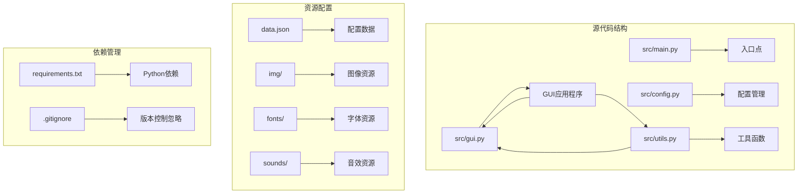

**图表来源**
- [src/main.py:1-7](file://src/main.py#L1-L7)
- [src/gui.py:1-732](file://src/gui.py#L1-L732)
- [src/config.py:1-93](file://src/config.py#L1-L93)
- [src/utils.py:1-177](file://src/utils.py#L1-L177)

**章节来源**
- [src/main.py:1-7](file://src/main.py#L1-L7)
- [README.md:25-34](file://README.md#L25-L34)

## 核心组件

### GUI应用程序框架

App类作为整个应用程序的主控制器，负责管理用户界面和业务逻辑协调。该类继承了CustomTkinter的CTk框架，提供了现代化的用户界面体验。

### 配置管理系统

PathConfig类统一管理所有路径配置，支持开发环境和打包环境的动态路径解析，确保资源文件在不同部署环境中的正确访问。

### 工具函数库

utils.py模块提供了存档导入所需的核心工具函数，包括ZIP文件解压、路径验证、文件对话框等实用功能。

**章节来源**
- [src/gui.py:5-36](file://src/gui.py#L5-L36)
- [src/config.py:14-93](file://src/config.py#L14-L93)
- [src/utils.py:4-177](file://src/utils.py#L4-L177)

## 架构概览

存档导入功能采用分层架构设计，实现了清晰的关注点分离：

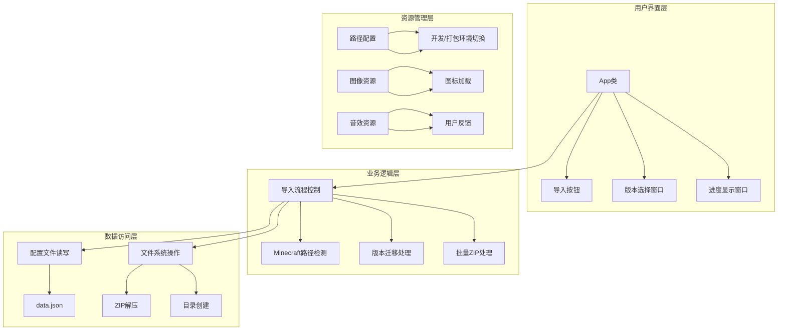

**图表来源**
- [src/gui.py:167-302](file://src/gui.py#L167-L302)
- [src/utils.py:4-32](file://src/utils.py#L4-L32)
- [src/config.py:14-93](file://src/config.py#L14-L93)

## 详细组件分析

### 导入存档功能实现

导入功能的核心实现位于App类的import_save方法中，该方法处理完整的存档导入流程：

#### 路径检测算法

系统采用智能的Minecraft路径检测机制，能够识别标准结构和版本迁移结构：

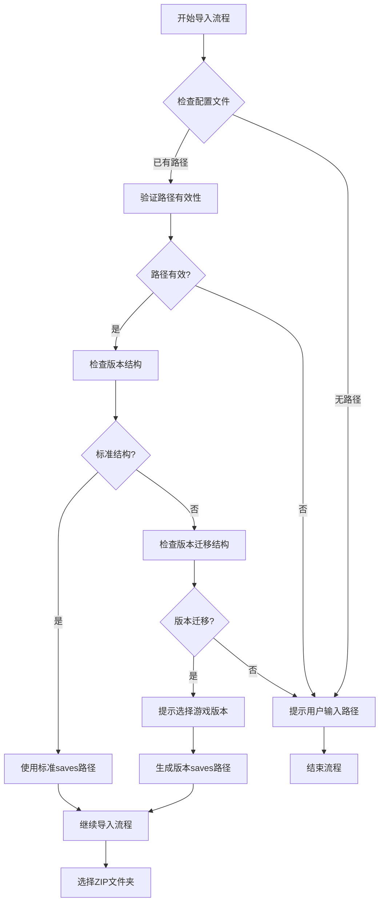

**图表来源**
- [src/gui.py:173-241](file://src/gui.py#L173-L241)

#### 版本迁移支持机制

对于使用版本迁移功能的Minecraft安装，系统提供专门的版本选择界面：

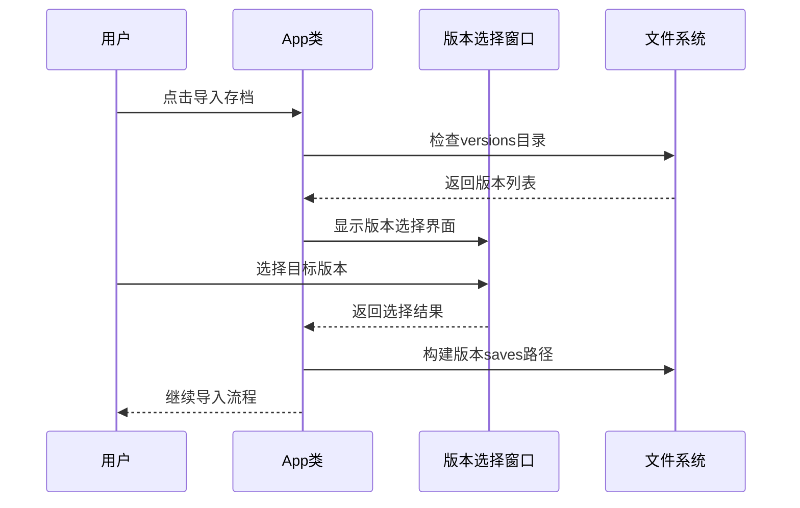

**图表来源**
- [src/gui.py:303-411](file://src/gui.py#L303-L411)

#### ZIP文件解压流程

ZIP文件解压采用两阶段处理机制，确保数据完整性和安全性：

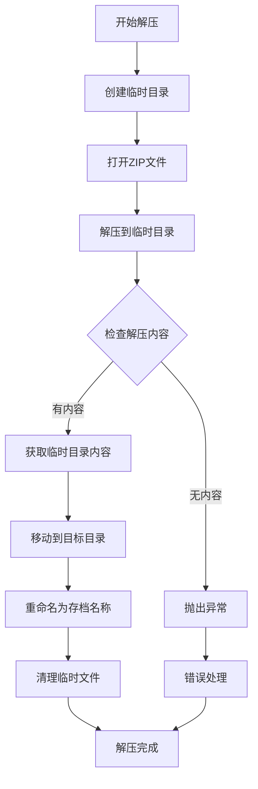

**图表来源**
- [src/utils.py:4-32](file://src/utils.py#L4-L32)

#### 覆盖确认机制

系统在处理重复存档时提供智能的覆盖确认机制：

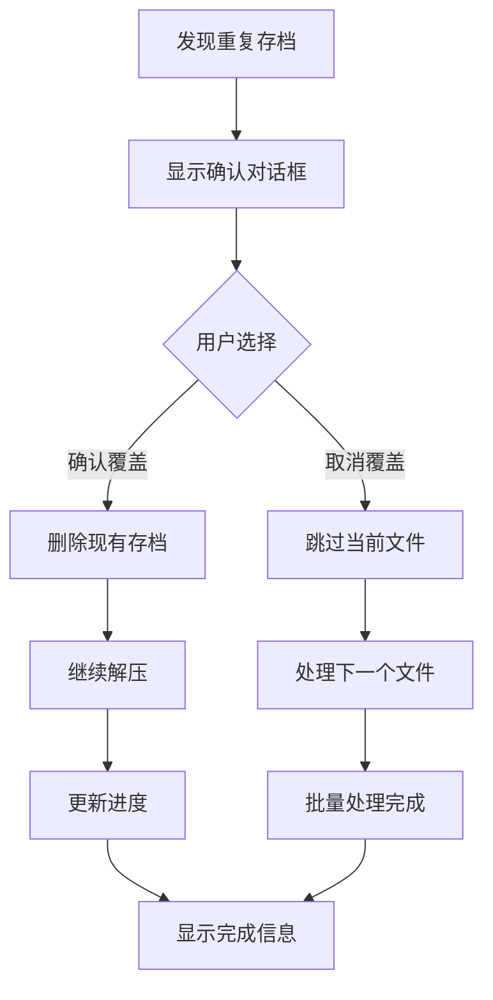

**图表来源**
- [src/gui.py:274-280](file://src/gui.py#L274-L280)

#### 进度反馈系统

系统提供实时的进度反馈，包括百分比显示、文件名更新和状态信息：

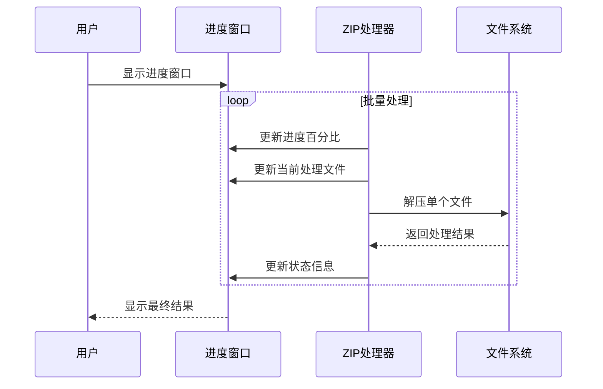

**图表来源**
- [src/gui.py:264-296](file://src/gui.py#L264-L296)

**章节来源**
- [src/gui.py:167-302](file://src/gui.py#L167-L302)
- [src/utils.py:4-32](file://src/utils.py#L4-L32)

### 配置管理系统

PathConfig类实现了灵活的路径管理机制，支持开发环境和打包环境的无缝切换：

#### 资源路径解析

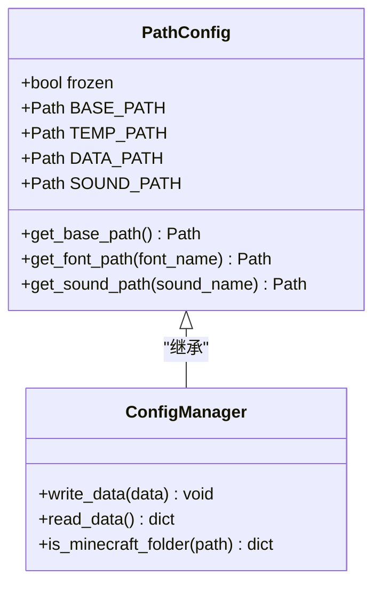

**图表来源**
- [src/config.py:14-93](file://src/config.py#L14-L93)
- [src/utils.py:85-114](file://src/utils.py#L85-L114)

#### 配置数据结构

系统使用JSON格式存储配置信息，包含Minecraft路径和版本迁移标志：

| 配置项 | 类型 | 默认值 | 描述 |
|--------|------|--------|------|
| minecraft_path | string | "" | Minecraft安装目录路径 |
| migrate | boolean | false | 是否启用版本迁移模式 |

**章节来源**
- [src/config.py:14-93](file://src/config.py#L14-L93)
- [src/utils.py:85-114](file://src/utils.py#L85-L114)
- [data.json:1-4](file://data.json#L1-L4)

### 用户界面交互流程

系统提供直观的用户界面，通过按钮和对话框引导用户完成存档导入过程：

#### 主界面布局

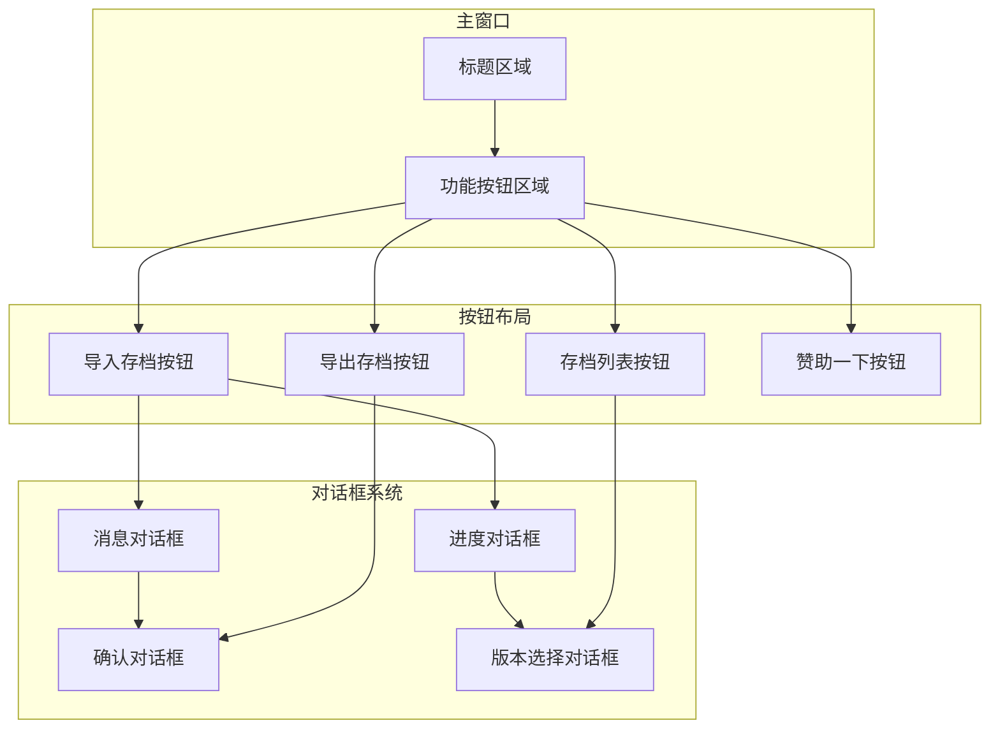

**图表来源**
- [src/gui.py:37-166](file://src/gui.py#L37-L166)

#### 交互流程序列

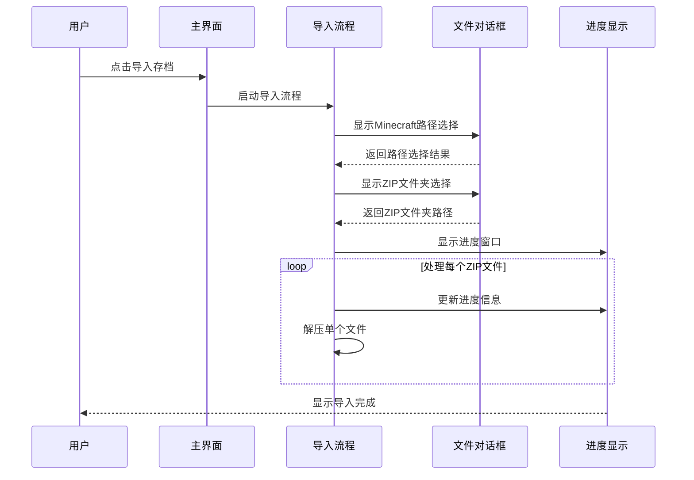

**图表来源**
- [src/gui.py:167-302](file://src/gui.py#L167-L302)

**章节来源**
- [src/gui.py:37-166](file://src/gui.py#L37-L166)
- [src/gui.py:167-302](file://src/gui.py#L167-L302)

## 依赖关系分析

项目依赖关系清晰明确，主要依赖包括：

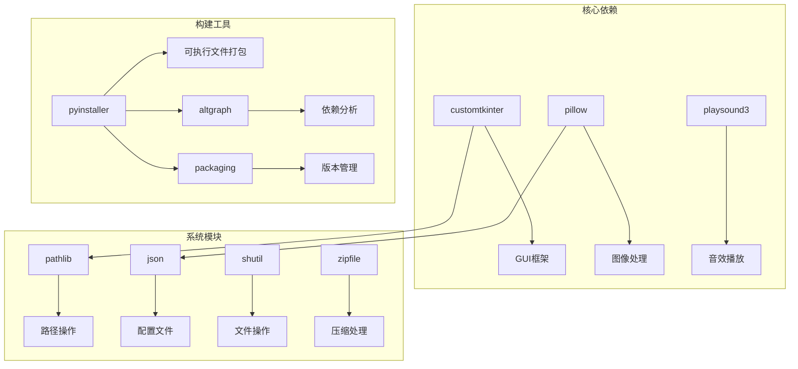

**图表来源**
- [requirements.txt:1-10](file://requirements.txt#L1-L10)

### 外部依赖集成

系统通过CustomTkinter实现跨平台GUI支持，通过Pillow处理图像资源，通过PyInstaller实现可执行文件打包。这些依赖的选择体现了项目对易用性和可移植性的重视。

**章节来源**
- [requirements.txt:1-10](file://requirements.txt#L1-L10)

## 性能考虑

### 内存管理优化

系统采用流式处理方式处理ZIP文件，避免了大文件内存溢出问题。临时文件处理采用先解压到临时目录再移动的方式，减少了磁盘碎片。

### 并发处理策略

虽然当前实现采用顺序处理方式，但系统架构支持未来添加并发处理能力。每个ZIP文件的解压操作相对独立，可以考虑使用多线程提高处理效率。

### 资源加载优化

图像和音效资源采用延迟加载策略，在需要时才进行资源文件的解压和加载，减少了启动时间和内存占用。

## 故障排除指南

### 常见问题及解决方案

#### Minecraft路径检测失败

**问题描述**: 系统无法识别有效的Minecraft安装目录

**解决步骤**:
1. 确认选择的目录包含`launcher_profiles.json`文件
2. 检查目录权限是否正确
3. 验证Minecraft安装完整性

#### ZIP文件解压错误

**问题描述**: ZIP文件解压过程中出现异常

**解决步骤**:
1. 检查ZIP文件完整性
2. 确认磁盘空间充足
3. 验证目标目录写入权限

#### 版本迁移路径问题

**问题描述**: 版本迁移模式下无法找到正确的saves目录

**解决步骤**:
1. 确认`versions`目录存在且可访问
2. 检查目标版本目录结构
3. 验证版本名称正确性

### 错误处理机制

系统实现了多层次的错误处理机制：

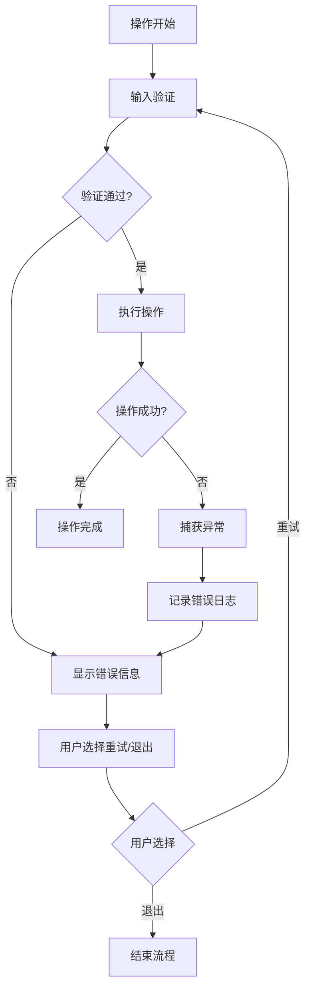

**图表来源**
- [src/gui.py:255-261](file://src/gui.py#L255-L261)
- [src/utils.py:26-27](file://src/utils.py#L26-L27)

**章节来源**
- [src/gui.py:255-261](file://src/gui.py#L255-L261)
- [src/utils.py:26-27](file://src/utils.py#L26-L27)

## 结论

存档导入功能通过精心设计的架构和完善的错误处理机制，为用户提供了稳定可靠的Minecraft存档管理体验。系统的主要优势包括：

1. **智能路径检测**: 自动识别标准和版本迁移两种Minecraft安装结构
2. **用户友好界面**: 直观的操作流程和实时进度反馈
3. **安全可靠处理**: 完整的错误处理和数据保护机制
4. **灵活配置支持**: 支持多种部署环境和资源管理方式

该功能为后续的导出备份、存档列表管理和存档修复等功能奠定了坚实的基础，形成了完整的Minecraft存档管理解决方案。