# 存档导出功能

<cite>
**本文档引用的文件**
- [README.md](file://README.md)
- [src/main.py](file://src/main.py)
- [src/gui.py](file://src/gui.py)
- [src/utils.py](file://src/utils.py)
- [src/config.py](file://src/config.py)
- [data.json](file://data.json)
- [.github/workflows/build-exe.yml](file://.github/workflows/build-exe.yml)
- [requirements.txt](file://requirements.txt)
</cite>

## 目录
1. [简介](#简介)
2. [项目结构](#项目结构)
3. [核心组件](#核心组件)
4. [架构概览](#架构概览)
5. [详细组件分析](#详细组件分析)
6. [依赖关系分析](#依赖关系分析)
7. [性能考虑](#性能考虑)
8. [故障排除指南](#故障排除指南)
9. [结论](#结论)
10. [附录](#附录)

## 简介

存档导出功能是Minecraft存档管理器的核心特性之一，旨在为用户提供便捷的存档备份和导出能力。该项目是一个基于Python和CustomTkinter开发的桌面应用程序，专门用于管理Minecraft Java版的存档文件。

根据项目说明，存档导出功能当前处于开发状态，但已在GUI层面上实现了基本框架。该功能将允许用户将现有的Minecraft存档打包备份，为存档的安全管理和版本控制提供支持。

## 项目结构

项目采用清晰的分层架构设计，主要包含以下核心组件：

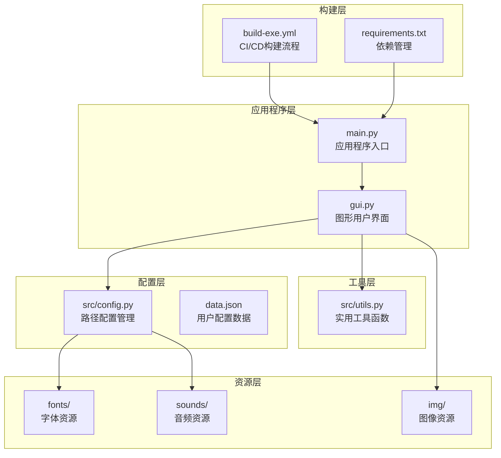

**图表来源**
- [src/main.py:1-7](file://src/main.py#L1-L7)
- [src/gui.py:1-732](file://src/gui.py#L1-L732)
- [src/config.py:1-93](file://src/config.py#L1-L93)

**章节来源**
- [README.md:25-34](file://README.md#L25-L34)
- [src/main.py:1-7](file://src/main.py#L1-L7)

## 核心组件

### 应用程序入口点

应用程序采用标准的Python入口点模式，通过main.py文件启动整个系统：

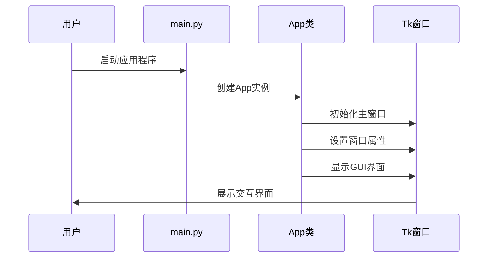

**图表来源**
- [src/main.py:5-7](file://src/main.py#L5-L7)
- [src/gui.py:6-36](file://src/gui.py#L6-L36)

### GUI应用程序架构

GUI系统采用面向对象设计，App类负责管理整个用户界面：

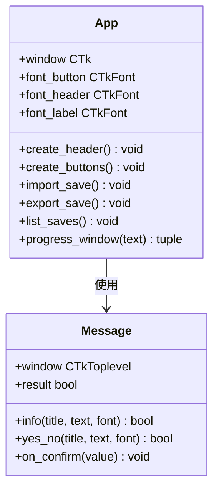

**图表来源**
- [src/gui.py:5-732](file://src/gui.py#L5-L732)

**章节来源**
- [src/gui.py:598-620](file://src/gui.py#L598-L620)

## 架构概览

存档导出功能的架构设计遵循模块化原则，各个组件职责明确：

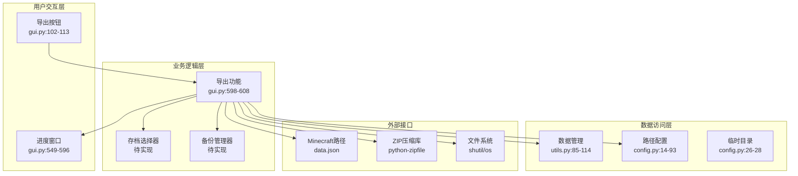

**图表来源**
- [src/gui.py:102-113](file://src/gui.py#L102-L113)
- [src/gui.py:598-608](file://src/gui.py#L598-L608)
- [src/utils.py:85-114](file://src/utils.py#L85-L114)
- [src/config.py:14-93](file://src/config.py#L14-L93)

## 详细组件分析

### 导出功能当前状态分析

目前存档导出功能处于占位符状态，实现了基本的GUI框架但未实现具体功能：

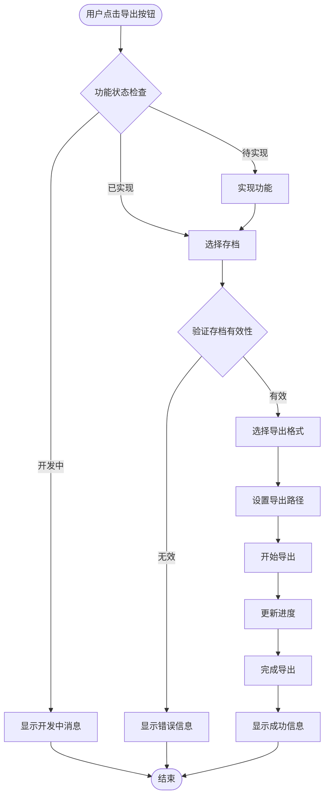

**图表来源**
- [src/gui.py:598-608](file://src/gui.py#L598-L608)

### 路径配置系统

路径配置系统为导出功能提供了灵活的文件系统支持：

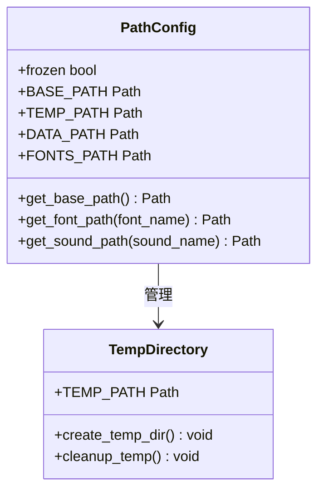

**图表来源**
- [src/config.py:14-93](file://src/config.py#L14-L93)

**章节来源**
- [src/config.py:26-28](file://src/config.py#L26-L28)

### 数据管理机制

数据持久化机制确保用户配置和导出历史得到妥善保存：

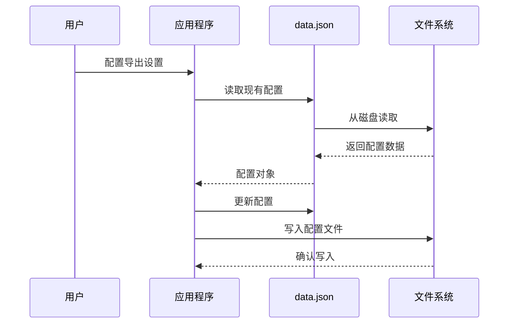

**图表来源**
- [src/utils.py:85-114](file://src/utils.py#L85-L114)
- [data.json:1-4](file://data.json#L1-L4)

**章节来源**
- [src/utils.py:98-114](file://src/utils.py#L98-L114)

## 依赖关系分析

### 外部依赖管理

项目使用requirements.txt统一管理第三方依赖：

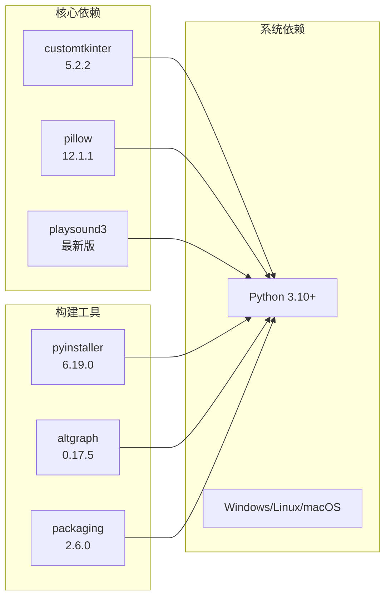

**图表来源**
- [requirements.txt:1-10](file://requirements.txt#L1-L10)

### CI/CD构建流程

GitHub Actions自动化构建流程确保跨平台兼容性：

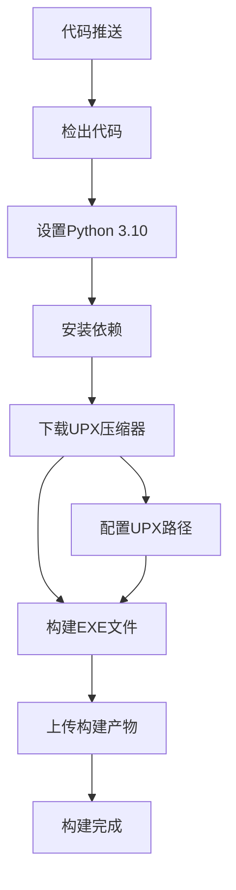

**图表来源**
- [.github/workflows/build-exe.yml:1-40](file://.github/workflows/build-exe.yml#L1-L40)

**章节来源**
- [.github/workflows/build-exe.yml:31-34](file://.github/workflows/build-exe.yml#L31-L34)

## 性能考虑

### 内存管理优化

导出功能需要考虑大量文件处理时的内存使用：

- **流式处理**：对于大型存档，采用流式ZIP创建避免内存溢出
- **分块传输**：大文件分块读取和写入
- **垃圾回收**：及时释放不再使用的临时文件句柄

### 并发处理策略

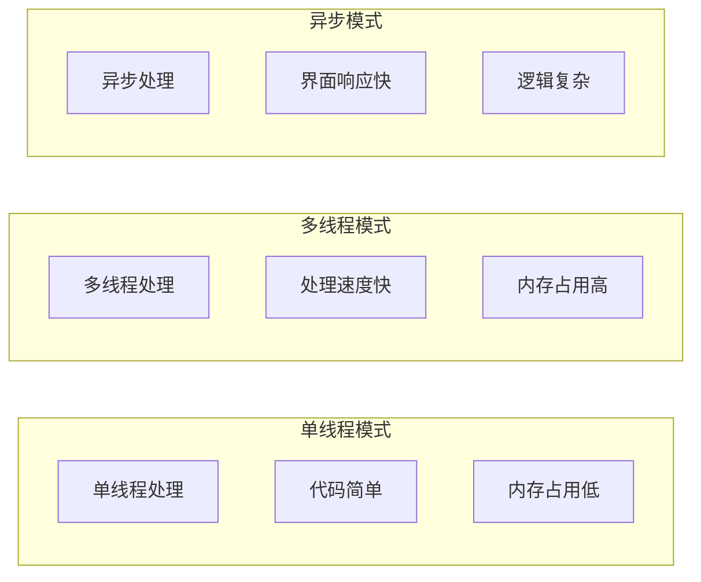

### 磁盘I/O优化

- **批量操作**：合并多个文件操作减少磁盘寻道
- **预分配空间**：为输出文件预分配磁盘空间
- **缓存策略**：合理使用系统文件缓存

## 故障排除指南

### 常见问题诊断

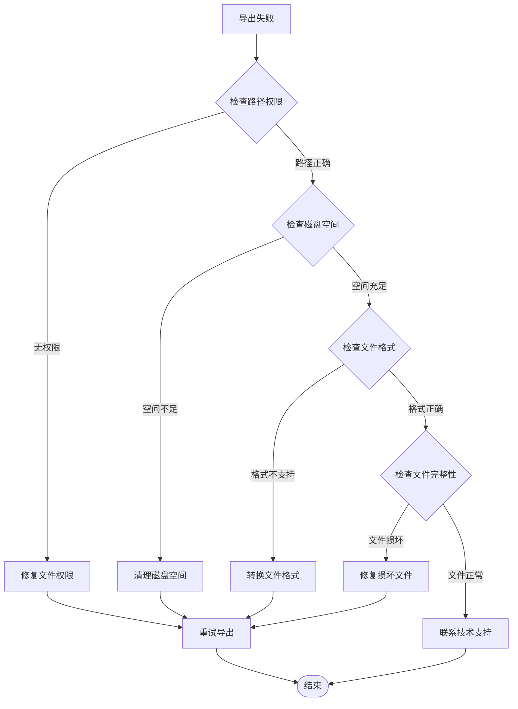

### 错误处理机制

应用程序采用统一的消息管理系统处理各种异常情况：

**章节来源**
- [src/gui.py:622-732](file://src/gui.py#L622-L732)

## 结论

存档导出功能作为Minecraft存档管理器的重要组成部分，目前具备了良好的基础架构和开发框架。虽然功能尚未完全实现，但通过现有的GUI组件、路径配置系统和数据管理机制，为后续的功能扩展奠定了坚实的基础。

### 当前优势

1. **清晰的架构设计**：模块化结构便于功能扩展
2. **完善的GUI框架**：按钮、对话框、进度显示等组件齐全
3. **灵活的配置系统**：支持多种部署环境
4. **自动化构建流程**：跨平台打包和发布

### 发展建议

1. **优先实现核心功能**：先完成基本的ZIP导出功能
2. **添加格式支持**：支持多种存档格式转换
3. **增强错误处理**：完善异常情况的处理机制
4. **优化用户体验**：改进界面交互和反馈机制

## 附录

### 开发进度跟踪

| 功能模块 | 状态 | 优先级 | 预计完成时间 |
|---------|------|--------|-------------|
| 导出功能实现 | 开发中 | 高 | 2024-02-15 |
| 存档列表管理 | 开发中 | 中 | 2024-02-20 |
| 格式转换支持 | 规划中 | 中 | 2024-03-01 |
| 批量导出功能 | 规划中 | 低 | 2024-03-15 |
| 自动备份策略 | 规划中 | 低 | 2024-04-01 |

### 技术规格

- **开发语言**：Python 3.10+
- **GUI框架**：CustomTkinter
- **图像处理**：Pillow
- **音频播放**：playsound3
- **打包工具**：PyInstaller
- **构建系统**：GitHub Actions

### 未来扩展计划

1. **云存储集成**：支持云端备份服务
2. **增量备份**：只备份变更的文件
3. **压缩算法优化**：支持多种压缩格式
4. **加密保护**：为敏感存档提供加密功能
5. **版本管理**：支持存档版本对比和恢复