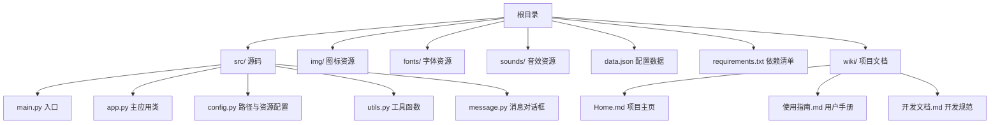
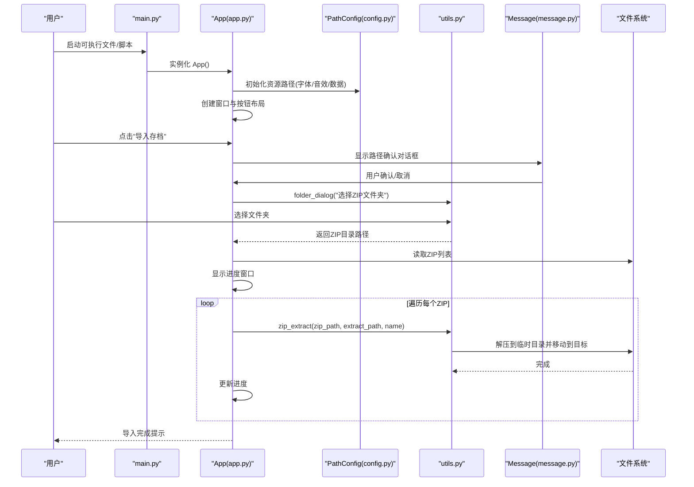
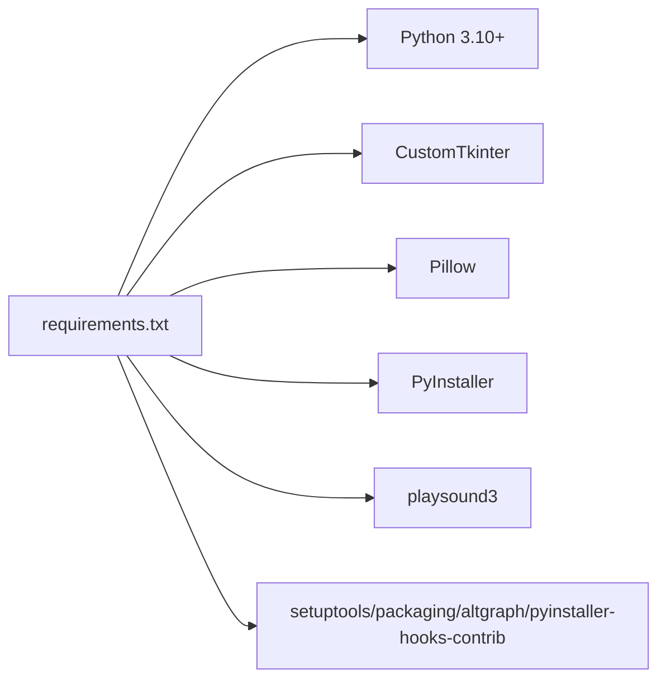

# 快速开始

<cite>
**本文引用的文件**
- [README.md](file://README.md)
- [requirements.txt](file://requirements.txt)
- [wiki/使用指南.md](file://wiki/使用指南.md)
- [wiki/Home.md](file://wiki/Home.md)
- [wiki/开发文档.md](file://wiki/开发文档.md)
- [src/main.py](file://src/main.py)
- [src/app.py](file://src/app.py)
- [src/config.py](file://src/config.py)
- [src/utils.py](file://src/utils.py)
- [src/message.py](file://src/message.py)
- [data.json](file://data.json)
</cite>

## 更新摘要
**变更内容**
- 新增基于用户指南文档的详细安装流程
- 更新项目结构说明以反映实际的模块组织
- 补充完整的功能介绍和使用流程
- 优化依赖分析和环境要求说明
- 增强故障排查指南的实用性

## 目录
1. [简介](#简介)
2. [项目结构](#项目结构)
3. [核心组件](#核心组件)
4. [架构总览](#架构总览)
5. [详细组件分析](#详细组件分析)
6. [依赖分析](#依赖分析)
7. [性能考虑](#性能考虑)
8. [故障排查指南](#故障排查指南)
9. [结论](#结论)
10. [附录](#附录)

## 简介
本指南面向初学者与开发者，帮助你在最短时间内完成存档管理器的安装、配置与使用。通过本指南，你将学会：
- 环境要求与依赖安装
- 两种部署方式：下载预编译版本或自行打包
- 基本使用流程：启动程序、配置Minecraft路径、执行导入/导出/列表等操作
- 常见问题的快速解决方法

**更新** 基于新增的用户指南文档，提供了更详细的安装设置说明和使用流程指导。

## 项目结构
该项目采用"源码分层 + 资源分离"的组织方式：
- 源码位于 src/，包含入口、GUI、配置与工具函数
- 资源位于根目录：img/（图标）、fonts/（字体）、sounds/（音效）
- 配置数据文件 data.json 用于持久化 Minecraft 路径与迁移标记
- requirements.txt 定义运行与打包所需依赖
- wiki/ 目录包含完整的项目文档



**图表来源**
- [src/main.py:1-7](file://src/main.py#L1-L7)
- [src/app.py:1-645](file://src/app.py#L1-L645)
- [src/config.py:1-94](file://src/config.py#L1-L94)
- [src/utils.py:1-186](file://src/utils.py#L1-L186)
- [src/message.py:1-114](file://src/message.py#L1-L114)
- [wiki/Home.md:1-41](file://wiki/Home.md#L1-L41)
- [wiki/使用指南.md:1-93](file://wiki/使用指南.md#L1-L93)
- [wiki/开发文档.md:1-149](file://wiki/开发文档.md#L1-L149)

**章节来源**
- [src/main.py:1-7](file://src/main.py#L1-L7)
- [src/app.py:1-645](file://src/app.py#L1-L645)
- [src/config.py:1-94](file://src/config.py#L1-L94)
- [src/utils.py:1-186](file://src/utils.py#L1-L186)
- [src/message.py:1-114](file://src/message.py#L1-L114)
- [wiki/Home.md:1-41](file://wiki/Home.md#L1-L41)
- [wiki/使用指南.md:1-93](file://wiki/使用指南.md#L1-L93)
- [wiki/开发文档.md:1-149](file://wiki/开发文档.md#L1-L149)

## 核心组件
- 入口模块：负责创建 GUI 应用并启动事件循环
- App 类：封装主窗口、按钮布局、导入/导出/列表等交互逻辑
- 配置模块：统一管理资源路径（字体、音效、数据文件）与打包/开发环境切换
- 工具模块：提供 ZIP 解压、图片加载、文件夹选择、数据读写、窗口居中等通用能力
- 消息模块：提供统一的消息对话框和确认框接口
- 配置文件：data.json 保存 Minecraft 路径与迁移标记，供后续导入时复用

**章节来源**
- [src/main.py:1-7](file://src/main.py#L1-L7)
- [src/app.py:6-645](file://src/app.py#L6-L645)
- [src/config.py:15-94](file://src/config.py#L15-L94)
- [src/utils.py:1-186](file://src/utils.py#L1-L186)
- [src/message.py:4-114](file://src/message.py#L4-L114)
- [data.json:1-4](file://data.json#L1-L4)

## 架构总览
应用启动流程与核心交互如下所示：



**图表来源**
- [src/main.py:5-7](file://src/main.py#L5-L7)
- [src/app.py:171-306](file://src/app.py#L171-L306)
- [src/config.py:15-94](file://src/config.py#L15-L94)
- [src/utils.py:4-32](file://src/utils.py#L4-L32)
- [src/message.py:29-114](file://src/message.py#L29-L114)

## 详细组件分析

### 环境与依赖
- 运行环境
  - Python 3.10 或更高版本
  - GUI 框架：CustomTkinter
  - 图像处理：Pillow
- 开发/打包依赖
  - PyInstaller（用于打包）
  - playsound3（用于播放音效）
  - setuptools、packaging、altgraph、pyinstaller-hooks-contrib 等辅助工具

**更新** 基于 requirements.txt 提供了准确的依赖版本信息。

**章节来源**
- [requirements.txt:1-10](file://requirements.txt#L1-L10)

### 安装与部署

#### 方法一：直接运行源代码（推荐新手）
- 步骤
  1) 克隆仓库并进入项目目录
  2) 创建虚拟环境（推荐）
  3) 激活虚拟环境
  4) 安装依赖：pip install -r requirements.txt
  5) 运行程序：python src/main.py

**更新** 基于用户指南文档提供了完整的源码运行流程。

#### 方法二：使用可执行文件
- 从 [Releases](../../releases) 页面下载对应系统的可执行文件，直接运行即可。

**章节来源**
- [wiki/使用指南.md:5-30](file://wiki/使用指南.md#L5-L30)
- [wiki/使用指南.md:28-31](file://wiki/使用指南.md#L28-L31)

### 基本使用流程

#### 首次使用
- 选择 .minecraft 文件夹
  - 首次导入存档时，程序会询问你的 `.minecraft` 文件夹位置
  - 常见位置：
    - **Windows**: `%APPDATA%\.minecraft`
    - **Linux**: `~/.minecraft`
    - **macOS**: `~/Library/Application Support/minecraft`
- 选择 ZIP 文件夹
  - 选择存放地图 ZIP 文件的文件夹，程序会自动识别其中的所有 ZIP 文件

**更新** 基于用户指南文档提供了详细的首次使用指导。

**章节来源**
- [wiki/使用指南.md:34-48](file://wiki/使用指南.md#L34-L48)

#### 导入存档

##### 标准结构
- 如果你的 Minecraft 使用标准结构（存档在 `.minecraft/saves`）：
  1. 点击「导入存档」按钮
  2. 选择 ZIP 文件夹
  3. 等待导入完成

##### 版本迁移结构
- 如果你的 Minecraft 使用版本迁移结构（存档在 `.minecraft/versions/<版本>/saves`）：
  1. 点击「导入存档」按钮
  2. 选择要导入到的游戏版本
  3. 选择 ZIP 文件夹
  4. 等待导入完成

##### 重复存档处理
- 如果目标位置已存在同名存档，程序会提示：
  - **覆盖**：删除旧存档，导入新存档
  - **跳过**：保留旧存档，跳过该 ZIP 文件

**更新** 基于用户指南文档提供了完整的导入流程说明。

**章节来源**
- [wiki/使用指南.md:51-75](file://wiki/使用指南.md#L51-L75)

### 配置文件
程序会在项目根目录创建 `data.json` 文件存储配置：

```json
{
  "minecraft_path": "/path/to/.minecraft",
  "migrate": false
}
```

- `minecraft_path`: `.minecraft` 文件夹路径
- `migrate`: 是否为版本迁移结构

如需重新设置路径，直接删除此文件即可。

**章节来源**
- [wiki/使用指南.md:78-93](file://wiki/使用指南.md#L78-L93)

## 依赖分析
- 运行时依赖
  - Python 3.10+
  - CustomTkinter：跨平台 GUI
  - Pillow：图像处理
- 打包与构建依赖
  - PyInstaller：生成可执行文件
  - playsound3：音效播放
  - setuptools、packaging、altgraph、pyinstaller-hooks-contrib：打包辅助



**图表来源**
- [requirements.txt:1-10](file://requirements.txt#L1-L10)

**章节来源**
- [requirements.txt:1-10](file://requirements.txt#L1-L10)

## 性能考虑
- ZIP 解压采用临时目录 + 移动的方式，避免直接写入目标导致的权限与并发问题
- 进度窗口与异步更新提升用户体验
- 消息对话框提供即时反馈，改善用户交互体验

**章节来源**
- [src/utils.py:4-32](file://src/utils.py#L4-L32)
- [src/app.py:267-306](file://src/app.py#L267-L306)
- [src/message.py:29-114](file://src/message.py#L29-L114)

## 故障排查指南
- 无法找到 .minecraft 路径
  - 确认选择了正确的 .minecraft 文件夹（包含 launcher_profiles.json）
  - 若为版本迁移结构，程序会自动识别并允许选择具体版本
- ZIP 文件未导入
  - 确认所选文件夹内存在 .zip 文件
  - 检查 ZIP 是否损坏或为空
- 源码运行问题
  - 确保已正确创建并激活虚拟环境
  - 检查 Python 版本是否满足 3.10+ 要求
- 图标/字体/音效缺失
  - 确认打包时已添加 --add-data 参数包含 img/fonts/sounds
  - 开发环境下检查资源文件夹路径是否正确

**更新** 基于用户指南文档和实际代码实现了更全面的故障排查指导。

**章节来源**
- [src/app.py:171-306](file://src/app.py#L171-L306)
- [src/utils.py:161-186](file://src/utils.py#L161-L186)
- [wiki/使用指南.md:34-48](file://wiki/使用指南.md#L34-L48)

## 结论
通过本快速开始指南，你已掌握：
- 环境与依赖要求
- 两种部署方式（源码运行/可执行文件）
- 基本使用流程与 Minecraft 路径配置
- 常见问题的快速解决思路

建议在首次使用前先阅读用户指南文档，以便更顺利地完成部署与使用。

## 附录

### 快速安装清单
- 安装 Python 3.10+
- 创建虚拟环境：python -m venv .venv
- 激活虚拟环境：.venv\Scripts\activate (Windows) 或 source .venv/bin/activate (Linux/macOS)
- 安装依赖：pip install -r requirements.txt
- 运行入口：python src/main.py（开发环境）

**更新** 基于用户指南文档提供了完整的安装设置清单。

**章节来源**
- [wiki/使用指南.md:5-26](file://wiki/使用指南.md#L5-L26)
- [requirements.txt:1-10](file://requirements.txt#L1-L10)