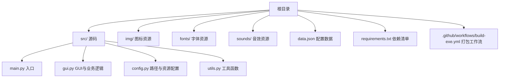
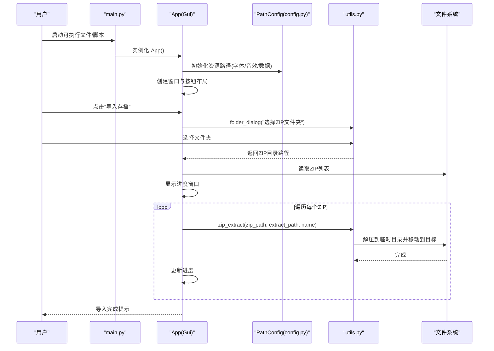
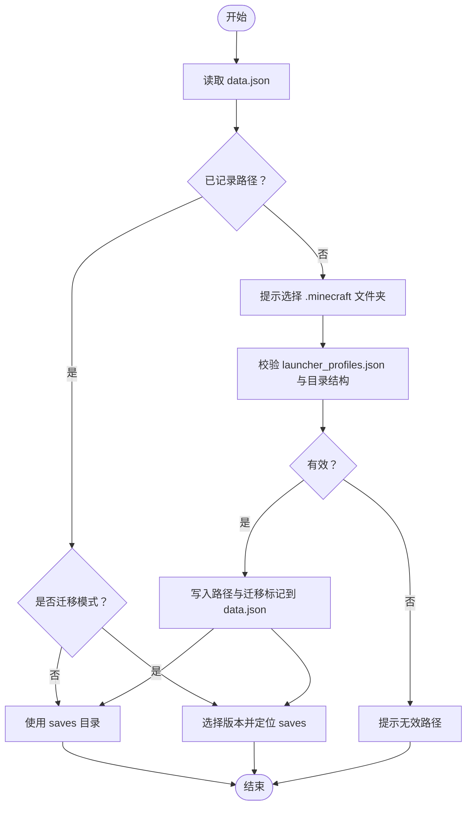
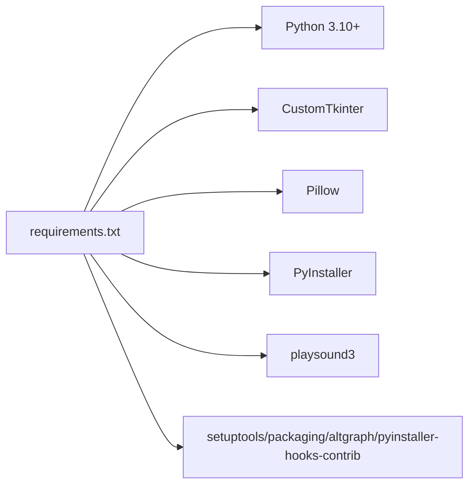

# 快速开始

<cite>
**本文引用的文件**
- [README.md](file://README.md)
- [requirements.txt](file://requirements.txt)
- [.github/workflows/build-exe.yml](file://.github/workflows/build-exe.yml)
- [src/main.py](file://src/main.py)
- [src/gui.py](file://src/gui.py)
- [src/config.py](file://src/config.py)
- [src/utils.py](file://src/utils.py)
- [data.json](file://data.json)
- [icon.ico](file://icon.ico)
</cite>

## 目录
1. [简介](#简介)
2. [项目结构](#项目结构)
3. [核心组件](#核心组件)
4. [架构总览](#架构总览)
5. [详细组件分析](#详细组件分析)
6. [依赖分析](#依赖分析)
7. [性能考虑](#性能考虑)
8. [故障排查指南](#故障排查指南)
9. [结论](#结论)
10. [附录](#附录)

## 简介
本指南面向初学者与开发者，帮助你在最短时间内完成存档管理器的安装、配置与使用。你将学会：
- 环境要求与依赖安装
- 两种部署方式：下载预编译版本或自行打包
- 基本使用流程：启动程序、配置Minecraft路径、执行导入/导出/列表等操作
- 常见问题的快速解决方法

## 项目结构
该项目采用“源码分层 + 资源分离”的组织方式：
- 源码位于 src/，包含入口、GUI、配置与工具函数
- 资源位于根目录：img/（图标）、fonts/（字体）、sounds/（音效）
- 配置数据文件 data.json 用于持久化 Minecraft 路径与迁移标记
- requirements.txt 定义运行与打包所需依赖
- GitHub Actions 工作流定义了自动化打包流程

图表来源
- [README.md:25-34](file://README.md#L25-L34)
- [src/main.py:1-7](file://src/main.py#L1-L7)
- [src/gui.py:1-730](file://src/gui.py#L1-L730)
- [src/config.py:1-93](file://src/config.py#L1-L93)
- [src/utils.py:1-177](file://src/utils.py#L1-L177)
- [data.json:1-4](file://data.json#L1-L4)
- [requirements.txt:1-10](file://requirements.txt#L1-L10)
- [.github/workflows/build-exe.yml:1-40](file://.github/workflows/build-exe.yml#L1-L40)

章节来源
- [README.md:25-34](file://README.md#L25-L34)
- [src/main.py:1-7](file://src/main.py#L1-L7)
- [src/gui.py:1-730](file://src/gui.py#L1-L730)
- [src/config.py:1-93](file://src/config.py#L1-L93)
- [src/utils.py:1-177](file://src/utils.py#L1-L177)
- [data.json:1-4](file://data.json#L1-L4)
- [requirements.txt:1-10](file://requirements.txt#L1-L10)
- [.github/workflows/build-exe.yml:1-40](file://.github/workflows/build-exe.yml#L1-L40)

## 核心组件
- 入口模块：负责创建 GUI 应用并启动事件循环
- GUI 类：封装主窗口、按钮布局、导入/导出/列表等交互逻辑
- 配置模块：统一管理资源路径（字体、音效、数据文件）与打包/开发环境切换
- 工具模块：提供 ZIP 解压、图片加载、文件夹选择、数据读写、窗口居中等通用能力
- 配置文件：data.json 保存 Minecraft 路径与迁移标记，供后续导入时复用

章节来源
- [src/main.py:1-7](file://src/main.py#L1-L7)
- [src/gui.py:1-730](file://src/gui.py#L1-L730)
- [src/config.py:1-93](file://src/config.py#L1-L93)
- [src/utils.py:1-177](file://src/utils.py#L1-L177)
- [data.json:1-4](file://data.json#L1-L4)

## 架构总览
应用启动流程与核心交互如下所示：

图表来源
- [src/main.py:1-7](file://src/main.py#L1-L7)
- [src/gui.py:167-300](file://src/gui.py#L167-L300)
- [src/config.py:14-93](file://src/config.py#L14-L93)
- [src/utils.py:4-32](file://src/utils.py#L4-L32)

## 详细组件分析

### 环境与依赖
- 运行环境
  - Python 3.10 或更高版本
  - GUI 框架：CustomTkinter
  - 图像处理：Pillow
- 开发/打包依赖
  - PyInstaller（用于打包）
  - playsound3（用于播放音效）
  - setuptools、packaging、altgraph、pyinstaller-hooks-contrib 等辅助工具

章节来源
- [README.md:36-41](file://README.md#L36-L41)
- [requirements.txt:1-10](file://requirements.txt#L1-L10)

### 安装与部署

#### 方式一：下载预编译版本（推荐新手）
- 步骤
  1) 访问 Releases 页面，下载最新版本的可执行文件
  2) 双击运行，首次运行会弹出提示，按提示操作即可
- 注意事项
  - 若出现杀毒软件告警，可暂时关闭实时防护后重试
  - 如需自定义图标，可在打包时替换 icon.ico

章节来源
- [README.md:14-16](file://README.md#L14-L16)
- [.github/workflows/build-exe.yml:31-40](file://.github/workflows/build-exe.yml#L31-L40)
- [icon.ico](file://icon.ico)

#### 方式二：自行打包（开发者）
- 基础打包
  - 安装依赖：pip install -r requirements.txt
  - 进入 src 目录，使用 PyInstaller 打包，包含资源路径与隐藏导入
- 使用 UPX 压缩（可选）
  - Windows：下载 UPX 并通过 --upx-dir 指定路径
  - Linux/macOS：使用包管理器安装 UPX 后直接打包
- 注意事项
  - UPX 会增加约 10-20% 的启动时间，且可能被某些杀软误报
  - 若压缩失败，可移除 --upx-dir 参数回退基础打包

章节来源
- [README.md:42-86](file://README.md#L42-L86)
- [.github/workflows/build-exe.yml:20-34](file://.github/workflows/build-exe.yml#L20-L34)

### 基本使用流程

#### 启动程序
- 双击可执行文件或在命令行运行入口脚本
- 首次启动会播放音效并创建主窗口

章节来源
- [src/main.py:5-7](file://src/main.py#L5-L7)
- [src/gui.py:13-18](file://src/gui.py#L13-L18)

#### 配置 Minecraft 路径
- 首次导入存档时，若未记录路径，程序会提示用户提供 .minecraft 文件夹
- 程序会检测 launcher_profiles.json 与 saves/versions 结构，区分标准路径与版本迁移路径
- 成功识别后，路径与迁移标记会被写入 data.json，后续导入无需重复输入

图表来源
- [src/gui.py:173-240](file://src/gui.py#L173-L240)
- [src/utils.py:161-177](file://src/utils.py#L161-L177)
- [data.json:1-4](file://data.json#L1-L4)

#### 功能选择与文件操作
- 导入存档
  - 选择包含 ZIP 的文件夹
  - 程序遍历 ZIP 并解压到 .minecraft/saves 或版本迁移路径下的 saves
  - 支持覆盖确认与进度反馈
- 导出存档/存档列表
  - 当前版本为占位提示，后续版本将逐步完善

章节来源
- [src/gui.py:167-300](file://src/gui.py#L167-L300)
- [src/gui.py:596-618](file://src/gui.py#L596-L618)

### 资源与配置

#### 路径与资源加载
- PathConfig 统一处理开发/打包两种环境下的资源路径
- 字体与音效在开发与打包环境下分别指向不同路径
- data.json 作为本地配置文件，保存 Minecraft 路径与迁移标记

章节来源
- [src/config.py:14-93](file://src/config.py#L14-L93)
- [data.json:1-4](file://data.json#L1-L4)

#### 图片与音效
- 图片通过 CTkImage 加载，支持缩放
- 音效通过 playsound3 播放，用于启动与消息提示

章节来源
- [src/gui.py:3-4](file://src/gui.py#L3-L4)
- [src/utils.py:34-65](file://src/utils.py#L34-L65)
- [src/config.py:77-90](file://src/config.py#L77-L90)

## 依赖分析
- 运行时依赖
  - Python 3.10+
  - CustomTkinter：跨平台 GUI
  - Pillow：图像处理
- 打包与构建依赖
  - PyInstaller：生成可执行文件
  - playsound3：音效播放
  - setuptools、packaging、altgraph、pyinstaller-hooks-contrib：打包辅助

图表来源
- [requirements.txt:1-10](file://requirements.txt#L1-L10)

章节来源
- [requirements.txt:1-10](file://requirements.txt#L1-L10)

## 性能考虑
- UPX 压缩可显著减小体积，但会增加约 10-20% 的启动时间，且可能触发误报
- ZIP 解压采用临时目录 + 移动的方式，避免直接写入目标导致的权限与并发问题
- 进度窗口与异步更新提升用户体验

章节来源
- [README.md:83-86](file://README.md#L83-L86)
- [src/utils.py:4-32](file://src/utils.py#L4-L32)
- [src/gui.py:264-299](file://src/gui.py#L264-L299)

## 故障排查指南
- 无法找到 .minecraft 路径
  - 确认选择了正确的 .minecraft 文件夹（包含 launcher_profiles.json）
  - 若为版本迁移结构，程序会自动识别并允许选择具体版本
- ZIP 文件未导入
  - 确认所选文件夹内存在 .zip 文件
  - 检查 ZIP 是否损坏或为空
- 杀毒软件误报
  - 可尝试使用 UPX 压缩或移除压缩参数进行打包
  - 将生成的可执行文件加入白名单
- 图标/字体/音效缺失
  - 确认打包时已添加 --add-data 参数包含 img/fonts/sounds
  - 开发环境下检查资源文件夹路径是否正确

章节来源
- [src/gui.py:173-240](file://src/gui.py#L173-L240)
- [src/utils.py:161-177](file://src/utils.py#L161-L177)
- [README.md:55-86](file://README.md#L55-L86)
- [.github/workflows/build-exe.yml:31-34](file://.github/workflows/build-exe.yml#L31-L34)

## 结论
通过本快速开始指南，你已掌握：
- 环境与依赖要求
- 两种部署方式（预编译/自打包）
- 基本使用流程与 Minecraft 路径配置
- 常见问题的快速解决思路

建议在首次使用前先阅读 README 的使用说明与打包章节，以便更顺利地完成部署与使用。

## 附录

### 快速安装清单
- 安装 Python 3.10+
- 安装依赖：pip install -r requirements.txt
- 运行入口：python src/main.py（开发环境）
- 打包命令参考：参见 README 的打包章节与 GitHub Actions 工作流

章节来源
- [requirements.txt:1-10](file://requirements.txt#L1-L10)
- [README.md:42-86](file://README.md#L42-L86)
- [.github/workflows/build-exe.yml:20-34](file://.github/workflows/build-exe.yml#L20-L34)