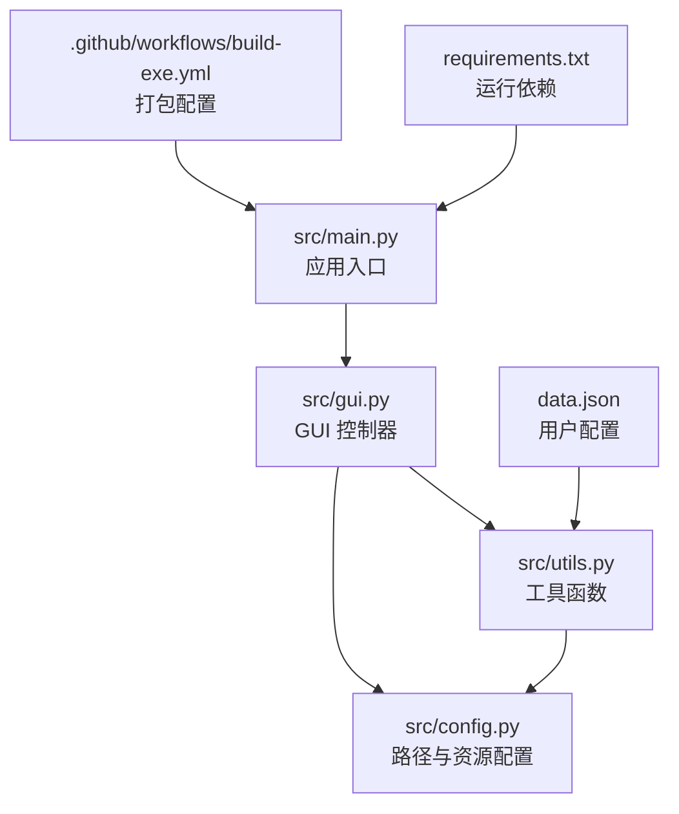
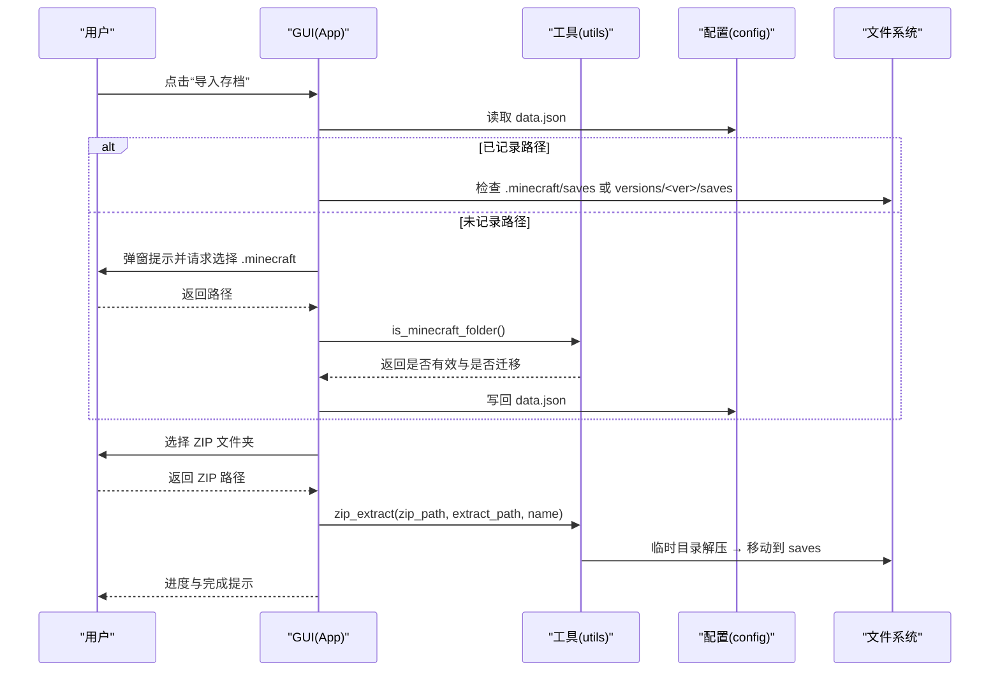
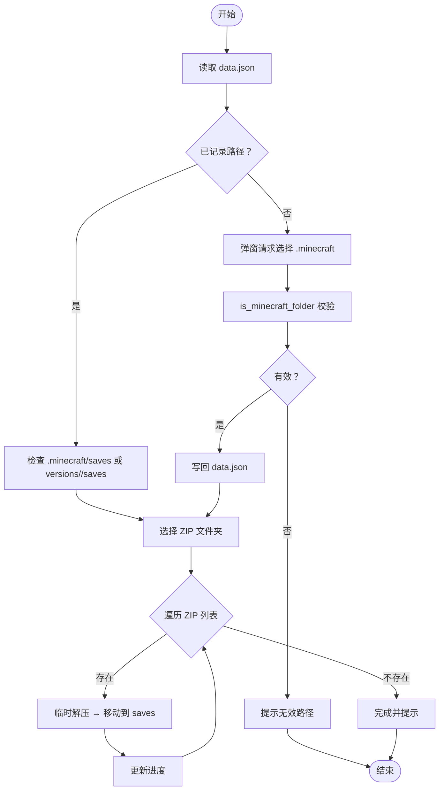
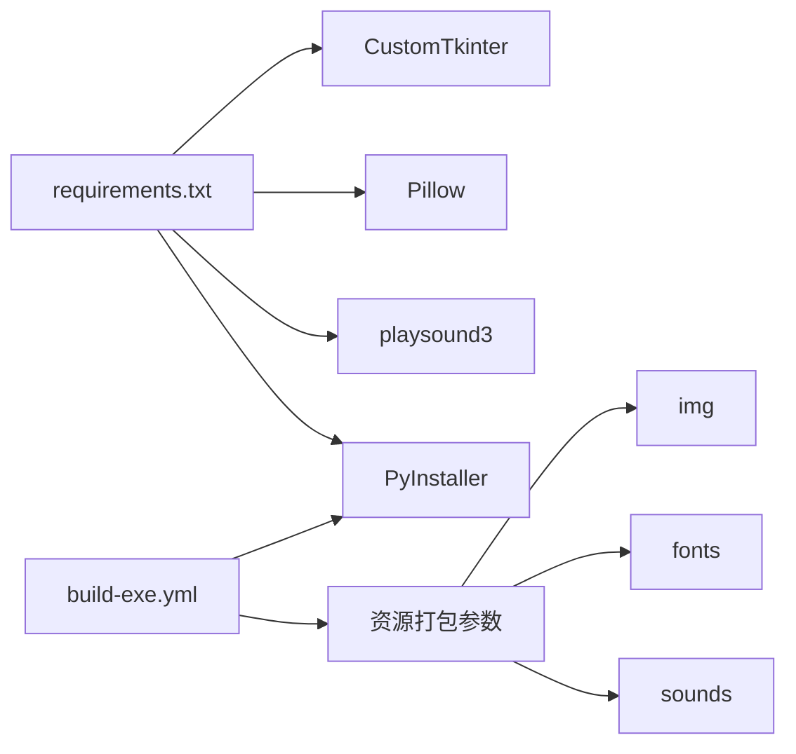

# 故障排除

<cite>
**本文引用的文件**
- [README.md](file://README.md)
- [src/main.py](file://src/main.py)
- [src/gui.py](file://src/gui.py)
- [src/utils.py](file://src/utils.py)
- [src/config.py](file://src/config.py)
- [.github/workflows/build-exe.yml](file://.github/workflows/build-exe.yml)
- [requirements.txt](file://requirements.txt)
- [data.json](file://data.json)
- [action_history.txt](file://action_history.txt)
</cite>

## 目录
1. [简介](#简介)
2. [项目结构](#项目结构)
3. [核心组件](#核心组件)
4. [架构总览](#架构总览)
5. [详细组件分析](#详细组件分析)
6. [依赖分析](#依赖分析)
7. [性能考虑](#性能考虑)
8. [故障排除指南](#故障排除指南)
9. [结论](#结论)
10. [附录](#附录)

## 简介
本指南面向使用“存档管理器”的用户，聚焦于常见问题的诊断与修复，涵盖 Minecraft 路径检测失败、ZIP 文件解压错误、权限问题、日志与调试技巧、性能识别与优化、以及跨平台兼容性问题与替代方案。内容基于仓库中的源码与构建配置，确保实用且可操作。

## 项目结构
- 主程序入口负责启动 GUI 应用。
- GUI 模块负责用户交互、路径选择、进度展示与消息提示。
- 工具模块负责 ZIP 解压、资源路径解析、配置读写、窗口布局等。
- 配置模块负责路径常量、打包环境适配与资源定位。
- 构建与依赖文件确保跨平台打包与运行时资源可用。

图表来源
- [src/main.py:1-7](file://src/main.py#L1-L7)
- [src/gui.py:1-732](file://src/gui.py#L1-L732)
- [src/utils.py:1-177](file://src/utils.py#L1-L177)
- [src/config.py:1-93](file://src/config.py#L1-L93)
- [.github/workflows/build-exe.yml:1-40](file://.github/workflows/build-exe.yml#L1-L40)
- [requirements.txt:1-10](file://requirements.txt#L1-L10)
- [data.json:1-4](file://data.json#L1-L4)

章节来源
- [src/main.py:1-7](file://src/main.py#L1-L7)
- [src/gui.py:1-732](file://src/gui.py#L1-L732)
- [src/utils.py:1-177](file://src/utils.py#L1-L177)
- [src/config.py:1-93](file://src/config.py#L1-L93)
- [.github/workflows/build-exe.yml:1-40](file://.github/workflows/build-exe.yml#L1-L40)
- [requirements.txt:1-10](file://requirements.txt#L1-L10)
- [data.json:1-4](file://data.json#L1-L4)

## 核心组件
- 应用入口：启动 GUI 主窗口。
- GUI 控制器：导入/导出/列表/修复等按钮行为，进度窗口与消息提示。
- 工具函数：ZIP 解压、资源图片加载、文件夹选择、配置读写、窗口居中与自适应宽度。
- 路径配置：开发/打包环境双路径解析，资源目录常量，声音与字体路径。
- 配置持久化：data.json 记录 Minecraft 路径与版本迁移标记。

章节来源
- [src/main.py:1-7](file://src/main.py#L1-L7)
- [src/gui.py:167-301](file://src/gui.py#L167-L301)
- [src/utils.py:4-32](file://src/utils.py#L4-L32)
- [src/utils.py:68-82](file://src/utils.py#L68-L82)
- [src/utils.py:85-113](file://src/utils.py#L85-L113)
- [src/utils.py:115-159](file://src/utils.py#L115-L159)
- [src/utils.py:161-177](file://src/utils.py#L161-L177)
- [src/config.py:14-93](file://src/config.py#L14-L93)
- [data.json:1-4](file://data.json#L1-L4)

## 架构总览
导入存档流程的关键节点：用户选择 ZIP 文件夹 → 选择 .minecraft 或版本目录 → 解压到 saves 目录 → 显示进度与结果。

图表来源
- [src/gui.py:167-301](file://src/gui.py#L167-L301)
- [src/utils.py:4-32](file://src/utils.py#L4-L32)
- [src/utils.py:98-113](file://src/utils.py#L98-L113)
- [src/utils.py:161-177](file://src/utils.py#L161-L177)
- [src/config.py:14-93](file://src/config.py#L14-L93)

## 详细组件分析

### 导入存档流程（关键路径）
- 步骤一：读取 data.json，判断是否已有 .minecraft 路径与迁移标记。
- 步骤二：若未记录，弹窗引导选择 .minecraft，并校验 launcher_profiles.json 与 saves/versions 结构。
- 步骤三：根据迁移标记决定目标 saves 路径（标准或 versions/<ver>/saves）。
- 步骤四：选择 ZIP 文件夹，遍历 *.zip 并逐个解压。
- 步骤五：解压到临时目录，再移动到目标 saves 目录，覆盖时先删除旧目录。
- 步骤六：显示进度与最终统计。

图表来源
- [src/gui.py:167-301](file://src/gui.py#L167-L301)
- [src/utils.py:4-32](file://src/utils.py#L4-L32)
- [src/utils.py:98-113](file://src/utils.py#L98-L113)
- [src/utils.py:161-177](file://src/utils.py#L161-L177)

章节来源
- [src/gui.py:167-301](file://src/gui.py#L167-L301)
- [src/utils.py:4-32](file://src/utils.py#L4-L32)
- [src/utils.py:98-113](file://src/utils.py#L98-L113)
- [src/utils.py:161-177](file://src/utils.py#L161-L177)

### ZIP 解压实现要点
- 临时目录：使用 config.TEMP_PATH，不存在则创建。
- 解压策略：先解压到临时目录，再移动到目标目录，避免直接解压到目标导致的权限与覆盖问题。
- 错误处理：空 ZIP 会抛出异常，提示无内容可提取。

章节来源
- [src/utils.py:4-32](file://src/utils.py#L4-L32)
- [src/config.py:26-29](file://src/config.py#L26-L29)

### 资源与路径解析
- 图片与字体：开发/打包环境双路径解析，确保打包后也能正确加载资源。
- 声音：通过 config.get_sound_path 获取路径，配合 playsound3 播放音效。
- data.json：读写封装，不存在时返回默认配置并自动创建。

章节来源
- [src/utils.py:34-65](file://src/utils.py#L34-L65)
- [src/config.py:77-90](file://src/config.py#L77-L90)
- [src/utils.py:85-113](file://src/utils.py#L85-L113)

## 依赖分析
- 运行时依赖：CustomTkinter、Pillow、playsound3、PyInstaller（打包）等。
- 构建配置：GitHub Actions 使用 PyInstaller 打包，包含 img/fonts/sounds 资源与隐藏导入。

图表来源
- [requirements.txt:1-10](file://requirements.txt#L1-L10)
- [.github/workflows/build-exe.yml:31-34](file://.github/workflows/build-exe.yml#L31-L34)

章节来源
- [requirements.txt:1-10](file://requirements.txt#L1-L10)
- [.github/workflows/build-exe.yml:1-40](file://.github/workflows/build-exe.yml#L1-L40)

## 性能考虑
- 解压策略：先解压到临时目录再移动，避免直接写入目标目录引发的频繁 I/O 与权限问题，同时减少中途失败对目标目录的影响。
- 进度反馈：逐个 ZIP 处理并更新进度，避免长时间无响应。
- 资源加载：打包环境下的路径解析与资源打包参数确保首次加载稳定，减少后续查找成本。

章节来源
- [src/utils.py:4-32](file://src/utils.py#L4-L32)
- [src/gui.py:264-296](file://src/gui.py#L264-L296)
- [.github/workflows/build-exe.yml:31-34](file://.github/workflows/build-exe.yml#L31-L34)

## 故障排除指南

### 一、Minecraft 路径检测失败
- 症状
  - “不是有效的 .minecraft 文件夹”提示。
  - 无法自动定位 saves 或 versions 目录。
- 可能原因
  - 选择的目录缺少 launcher_profiles.json。
  - 既无 saves 也无 versions 子目录。
  - 未勾选“版本迁移”但实际使用了 versions/<ver>/saves 结构。
- 诊断步骤
  - 确认所选目录包含 launcher_profiles.json。
  - 确认存在 saves 或 versions 子目录之一。
  - 若使用版本迁移，请在首次选择路径后勾选“版本迁移”。
- 修复建议
  - 重新选择正确的 .minecraft 根目录。
  - 若存在 versions 子目录，确保在首次选择时启用“版本迁移”，随后选择具体版本。
  - 如仍失败，手动在 data.json 中清空路径字段，重新引导选择。

章节来源
- [src/gui.py:214-240](file://src/gui.py#L214-L240)
- [src/utils.py:161-177](file://src/utils.py#L161-L177)
- [data.json:1-4](file://data.json#L1-L4)

### 二、ZIP 文件解压错误
- 症状
  - “ZIP 文件中没有找到可提取的内容”。
  - 解压后目标目录无内容或文件损坏。
- 可能原因
  - ZIP 文件为空或被破坏。
  - 解压到临时目录失败（权限不足或磁盘空间不足）。
  - 目标目录权限不足导致移动失败。
- 诊断步骤
  - 用其他工具验证 ZIP 是否可正常打开。
  - 检查 temp 目录是否存在且可写。
  - 检查目标 saves 目录权限。
- 修复建议
  - 使用合法 ZIP 文件重试。
  - 确保 temp 目录存在且可写（程序会在需要时自动创建）。
  - 以管理员身份运行或调整目标目录权限。
  - 若目标目录已存在同名世界，确认覆盖行为或手动清理。

章节来源
- [src/utils.py:24-28](file://src/utils.py#L24-L28)
- [src/utils.py:16-17](file://src/utils.py#L16-L17)
- [src/gui.py:274-280](file://src/gui.py#L274-L280)

### 三、权限问题
- 症状
  - 解压时报错（如无法创建/移动文件）。
  - 目标目录不可写。
- 可能原因
  - 目标 saves 目录位于受保护路径（如 Program Files）。
  - 当前用户无写权限。
- 修复建议
  - 将 .minecraft 放置于用户目录（如用户主目录下）。
  - 以管理员身份运行程序。
  - 更改目标目录权限或所有权。

章节来源
- [src/utils.py:16-17](file://src/utils.py#L16-L17)
- [src/gui.py:274-280](file://src/gui.py#L274-L280)

### 四、日志记录与调试技巧
- 内置提示
  - 成功/失败/覆盖确认等均通过消息框提示，便于用户感知当前状态。
- 调试建议
  - 观察进度窗口中的“正在处理世界”与百分比，定位卡顿或失败点。
  - 检查 data.json 是否正确记录了路径与迁移标记。
  - 在打包环境下，确认 img/fonts/sounds 资源已正确打包（参考构建配置）。
- 行为参考
  - 路径解析与资源加载在开发/打包环境均有适配，避免因路径问题导致的资源缺失。

章节来源
- [src/gui.py:264-301](file://src/gui.py#L264-L301)
- [src/gui.py:622-732](file://src/gui.py#L622-L732)
- [src/utils.py:34-65](file://src/utils.py#L34-L65)
- [.github/workflows/build-exe.yml:31-34](file://.github/workflows/build-exe.yml#L31-L34)

### 五、性能问题识别与优化
- 识别
  - 大量 ZIP 文件导入时，进度缓慢。
  - 解压过程中 CPU/IO 占用较高。
- 优化建议
  - 分批导入：将 ZIP 文件拆分为多个批次，逐批处理。
  - 预检：提前检查目标目录空间与权限，避免中途失败。
  - 降低并发：当前实现逐个处理，避免过多并发导致系统抖动。
  - 资源打包：确保 img/fonts/sounds 已打包，减少运行时查找开销。

章节来源
- [src/gui.py:264-296](file://src/gui.py#L264-L296)
- [.github/workflows/build-exe.yml:31-34](file://.github/workflows/build-exe.yml#L31-L34)

### 六、兼容性问题与替代方案
- Windows
  - 字体显示：确保打包时包含 fonts 资源，避免字体不显示。
  - 音效播放：确保打包时包含 sounds 资源与隐藏导入。
- Linux/macOS
  - 使用 PyInstaller 打包时，确保包含 img/fonts/sounds。
  - 若使用 UPX 压缩，注意启动时间可能略有增加。
- 替代方案
  - 若打包后仍出现资源缺失，检查构建命令中的 --add-data 参数是否齐全。
  - 若音频播放异常，确认 playsound3 已作为隐藏导入加入。

章节来源
- [README.md:55-86](file://README.md#L55-L86)
- [.github/workflows/build-exe.yml:31-34](file://.github/workflows/build-exe.yml#L31-L34)
- [requirements.txt:6](file://requirements.txt#L6)

## 结论
本指南围绕 Minecraft 路径检测、ZIP 解压、权限、日志调试、性能与兼容性等关键问题提供了系统化的诊断与修复路径。结合源码中的路径解析、资源加载与进度反馈机制，用户可快速定位并解决问题。建议在导入前预检路径与权限，使用合法 ZIP 文件，并在必要时以管理员身份运行，以获得最佳体验。

## 附录
- 快速检查清单
  - data.json 是否记录了正确的 .minecraft 路径与迁移标记？
  - ZIP 文件是否可正常打开？
  - temp 目录是否存在且可写？
  - 目标 saves 目录是否有写权限？
  - 打包时是否包含 img/fonts/sounds 资源与隐藏导入？