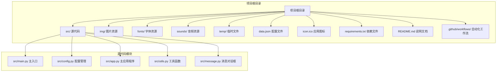
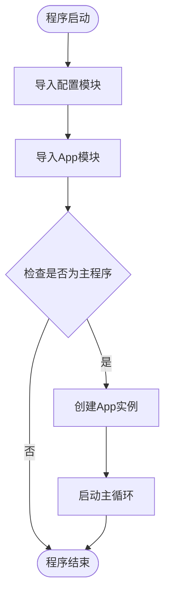
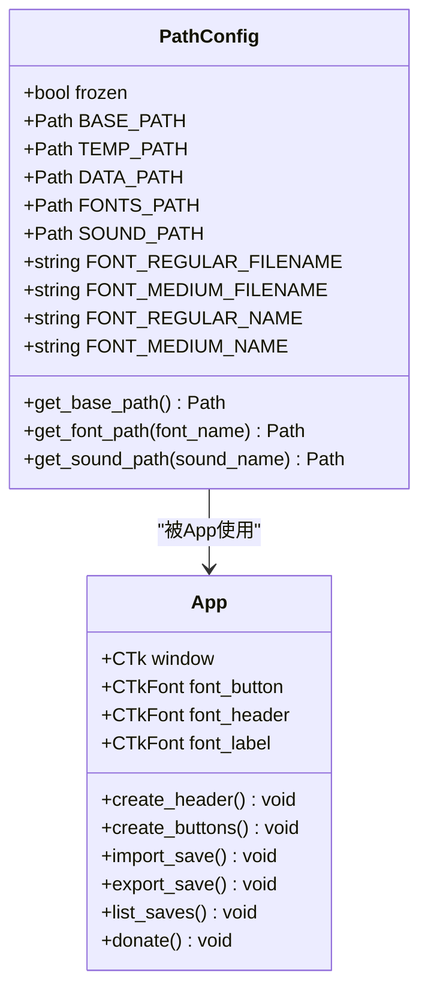
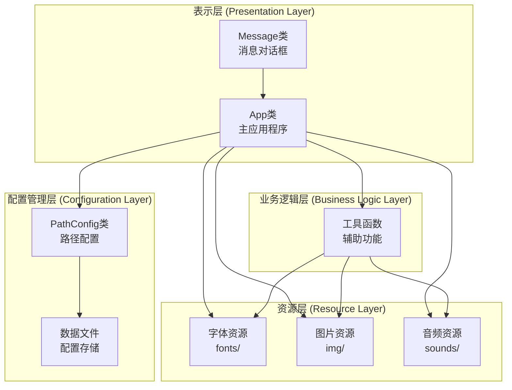
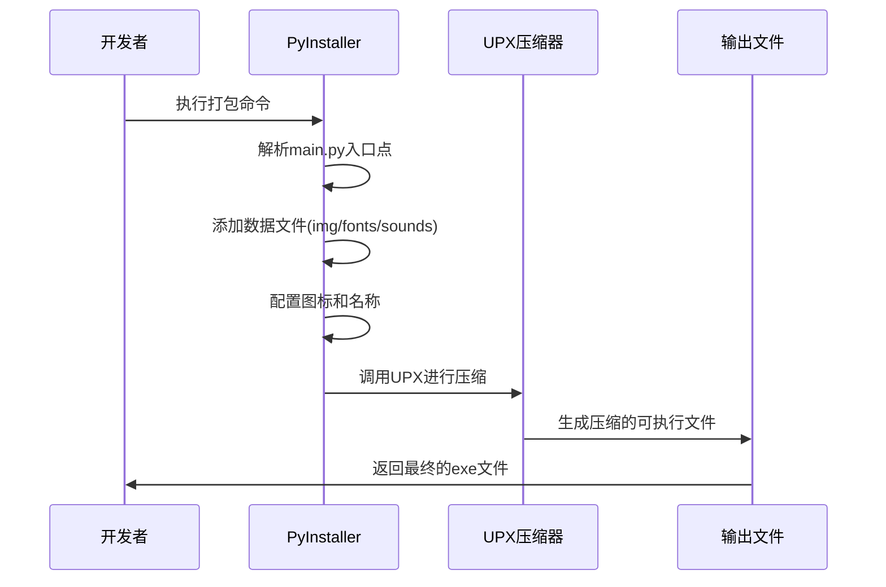
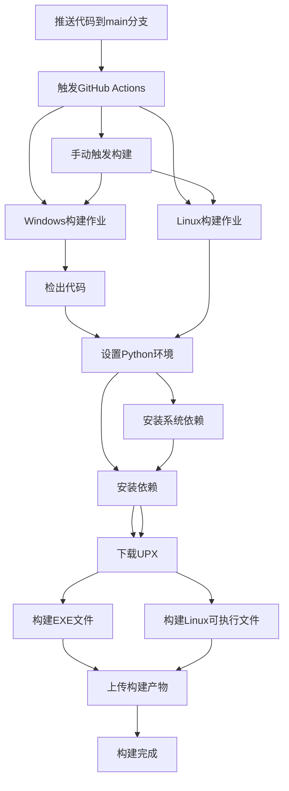
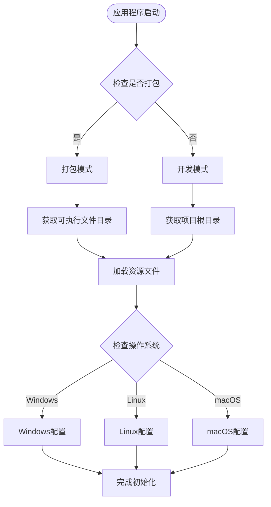
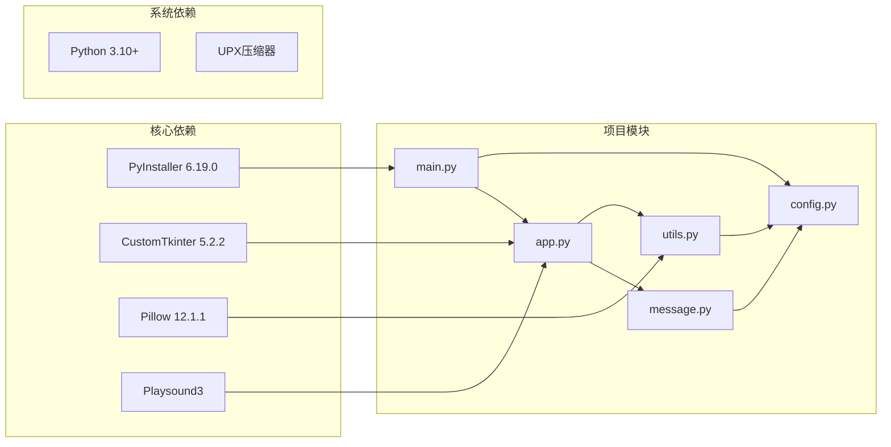
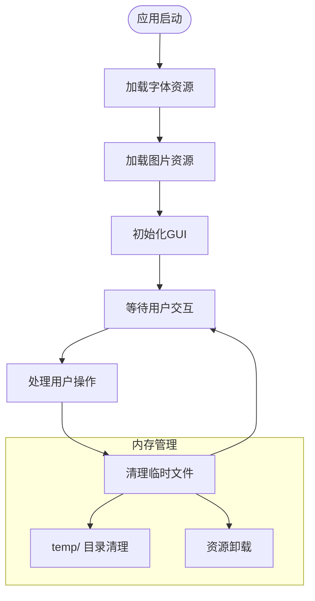

# 构建与部署

<cite>
**本文档引用的文件**
- [README.md](file://README.md)
- [requirements.txt](file://requirements.txt)
- [.github/workflows/build-exe.yml](file://.github/workflows/build-exe.yml)
- [src/main.py](file://src/main.py)
- [src/config.py](file://src/config.py)
- [src/app.py](file://src/app.py)
- [src/utils.py](file://src/utils.py)
- [src/message.py](file://src/message.py)
- [data.json](file://data.json)
- [icon.ico](file://icon.ico)
</cite>

## 更新摘要
**所做更改**
- 更新GitHub Actions工作流以反映双平台构建系统（Windows和Linux）
- 增强UPX集成配置，包含改进的版本管理和路径配置
- 新增Linux平台构建支持和特定配置
- 更新跨平台兼容性实现说明
- 完善UPX压缩优化流程说明

## 目录
1. [简介](#简介)
2. [项目结构](#项目结构)
3. [核心组件](#核心组件)
4. [架构概览](#架构概览)
5. [详细组件分析](#详细组件分析)
6. [依赖分析](#依赖分析)
7. [性能考虑](#性能考虑)
8. [故障排除指南](#故障排除指南)
9. [结论](#结论)
10. [附录](#附录)

## 简介

存档管理器是一个专为Minecraft Java版设计的存档管理工具，提供了导入、导出、备份和管理存档的便捷功能。该项目采用Python开发，使用CustomTkinter作为GUI框架，通过PyInstaller进行跨平台打包，现已支持Windows、Linux和macOS操作系统。

该工具的核心价值在于简化Minecraft存档管理流程，用户可以通过直观的图形界面完成复杂的存档操作，无需手动处理复杂的文件结构。项目现已实现全面的自动化构建系统，包含增强的UPX压缩集成和多平台支持。

## 项目结构

项目采用清晰的模块化组织结构，主要分为以下层次：

**图表来源**
- [README.md:25-34](file://README.md#L25-L34)
- [src/main.py:1-7](file://src/main.py#L1-L7)
- [src/config.py:14-46](file://src/config.py#L14-L46)

**章节来源**
- [README.md:25-34](file://README.md#L25-L34)
- [src/main.py:1-7](file://src/main.py#L1-L7)

## 核心组件

### 主入口模块 (src/main.py)

主入口模块负责应用程序的启动和初始化，采用简洁的设计模式：

**图表来源**
- [src/main.py:5-7](file://src/main.py#L5-L7)

### 配置管理模块 (src/config.py)

配置管理模块实现了智能的路径解析机制，支持开发环境和打包环境的无缝切换：

**图表来源**
- [src/config.py:14-93](file://src/config.py#L14-L93)
- [src/app.py:5-36](file://src/app.py#L5-L36)

**章节来源**
- [src/main.py:1-7](file://src/main.py#L1-L7)
- [src/config.py:14-93](file://src/config.py#L14-L93)

## 架构概览

存档管理器采用了分层架构设计，确保了良好的可维护性和扩展性：

**图表来源**
- [src/app.py:1-732](file://src/app.py#L1-L732)
- [src/config.py:14-93](file://src/config.py#L14-L93)
- [src/utils.py:1-177](file://src/utils.py#L1-L177)

## 详细组件分析

### PyInstaller打包配置

项目使用PyInstaller进行跨平台打包，配置文件包含了完整的打包指令：

**图表来源**
- [README.md:44-86](file://README.md#L44-L86)
- [.github/workflows/build-exe.yml:31-34](file://.github/workflows/build-exe.yml#L31-L34)

### GitHub Actions自动化构建

自动化构建流程现已升级为双平台构建系统，实现了CI/CD集成，确保每次推送都能自动生成可执行文件：

**图表来源**
- [.github/workflows/build-exe.yml:1-88](file://.github/workflows/build-exe.yml#L1-L88)

**章节来源**
- [README.md:44-86](file://README.md#L44-L86)
- [.github/workflows/build-exe.yml:1-88](file://.github/workflows/build-exe.yml#L1-L88)

### 跨平台兼容性实现

项目通过条件判断实现了对不同操作系统的完美支持：

**图表来源**
- [src/config.py:47-58](file://src/config.py#L47-L58)
- [src/config.py:69-75](file://src/config.py#L69-L75)

**章节来源**
- [src/config.py:14-93](file://src/config.py#L14-L93)

## 依赖分析

### 核心依赖关系

项目依赖关系清晰明确，主要依赖项包括：

**图表来源**
- [requirements.txt:1-10](file://requirements.txt#L1-L10)
- [src/main.py:1-3](file://src/main.py#L1-L3)

### 依赖版本管理

项目使用requirements.txt统一管理依赖版本，确保构建环境的一致性：

| 依赖包 | 版本要求 | 用途描述 |
|--------|----------|----------|
| altgraph | 0.17.5 | PyInstaller依赖 |
| customtkinter | 5.2.2 | GUI框架 |
| darkdetect | 0.8.0 | 系统主题检测 |
| packaging | 26.0 | 包管理工具 |
| pillow | 12.1.1 | 图像处理 |
| playsound3 | - | 音效播放 |
| pyinstaller | 6.19.0 | 可执行文件打包 |
| pyinstaller-hooks-contrib | 2026.2 | PyInstaller钩子 |

**章节来源**
- [requirements.txt:1-10](file://requirements.txt#L1-L10)

## 性能考虑

### 启动性能优化

项目在启动时采用了多项优化措施：

1. **延迟加载资源**：字体和图片资源采用按需加载策略
2. **缓存机制**：配置文件采用JSON格式，便于快速读取
3. **最小化依赖**：只加载必要的模块和资源

### 内存使用优化

**图表来源**
- [src/utils.py:15-32](file://src/utils.py#L15-L32)
- [src/config.py:26-29](file://src/config.py#L26-L29)

## 故障排除指南

### 常见构建问题及解决方案

#### PyInstaller打包失败

**问题症状**：打包过程中出现模块导入错误

**解决方案**：
1. 确保所有依赖都已正确安装
2. 检查隐藏导入参数是否完整
3. 验证资源文件路径配置正确

#### UPX压缩问题

**问题症状**：UPX压缩失败或生成的文件无法运行

**解决方案**：
1. 检查UPX版本兼容性（当前使用v5.1.1）
2. 确认UPX路径配置正确
3. 尝试禁用UPX进行基础打包验证
4. 验证UPX下载链接的有效性

#### Linux平台构建问题

**问题症状**：Linux构建失败或可执行文件无法运行

**解决方案**：
1. 确保安装了必要的系统依赖（python3-tk, python3-dev）
2. 验证UPX可执行权限（chmod +x upx）
3. 检查文件路径分隔符（Linux使用冒号分隔）
4. 确认字体和音频文件路径配置正确

#### 资源文件访问失败

**问题症状**：运行时无法找到字体、图片或音频文件

**解决方案**：
1. 验证资源文件是否正确添加到打包配置
2. 检查路径配置逻辑
3. 确认开发环境和打包环境的路径差异

### 调试技巧

1. **启用详细日志**：在开发环境中添加调试输出
2. **分步测试**：分别测试每个功能模块
3. **环境隔离**：使用虚拟环境进行独立测试
4. **平台对比**：在不同操作系统上测试构建结果

**章节来源**
- [README.md:83-86](file://README.md#L83-L86)

## 结论

存档管理器项目展现了优秀的工程实践，通过合理的架构设计、完善的自动化构建流程和跨平台兼容性，为用户提供了稳定可靠的Minecraft存档管理工具。

项目的主要优势包括：
- 清晰的模块化架构
- 完善的跨平台支持（Windows、Linux、macOS）
- 自动化的双平台CI/CD流程
- 增强的UPX压缩集成
- 详细的文档和配置说明

未来可以考虑的功能改进包括：
- 增强错误处理和用户反馈
- 添加更多的存档管理功能
- 优化性能和用户体验
- 扩展到更多平台支持

## 附录

### 开发环境搭建步骤

1. **系统要求**：Python 3.10+ 和 Git
2. **克隆项目**：`git clone <repository-url>`
3. **安装依赖**：`pip install -r requirements.txt`
4. **运行测试**：`python src/main.py`

### 发布流程最佳实践

1. **版本管理**：使用语义化版本控制
2. **代码审查**：在合并前进行代码审查
3. **测试验证**：确保所有功能正常工作
4. **文档更新**：同步更新相关文档
5. **发布说明**：编写详细的发布说明

### 版本管理策略

建议采用以下版本管理策略：
- **主版本号**：重大功能更新
- **次版本号**：新功能添加
- **修订号**：bug修复和小改进

### UPX集成配置

**Windows平台配置**：
- UPX版本：v5.1.1
- 下载路径：`https://github.com/upx/upx/releases/download/v5.1.1/upx-5.1.1-win64.zip`
- 可执行文件：`upx.exe`
- 路径配置：`--upx-dir=".."`

**Linux平台配置**：
- UPX版本：v5.1.1
- 下载路径：`https://github.com/upx/upx/releases/download/v5.1.1/upx-5.1.1-amd64_linux.tar.xz`
- 可执行文件：`upx`
- 权限设置：`chmod +x upx`
- 路径配置：`--upx-dir=".."`

### GitHub Actions工作流配置

**双平台构建架构**：
- **Windows作业**：构建.exe文件，使用Windows特定的UPX配置
- **Linux作业**：构建可执行文件，安装系统依赖并设置UPX权限
- **并行执行**：两个作业独立运行，互不干扰
- **产物上传**：分别上传Windows和Linux构建产物

**构建优化**：
- 缓存Python依赖
- 条件构建触发
- 失败时保留构建日志
- 支持手动触发构建