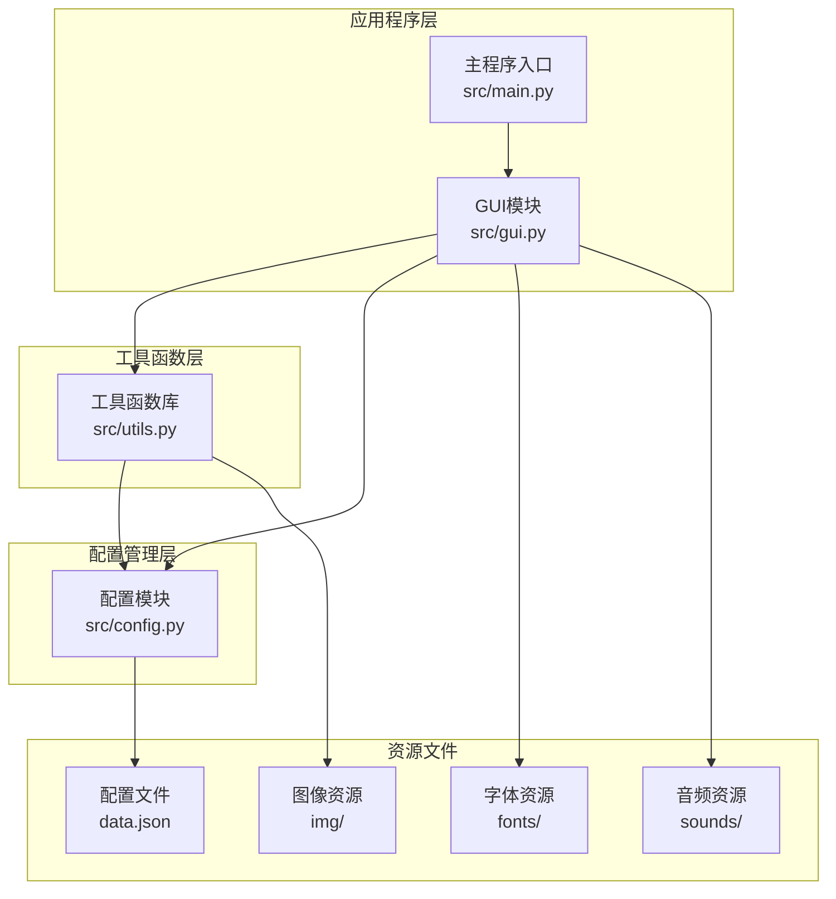
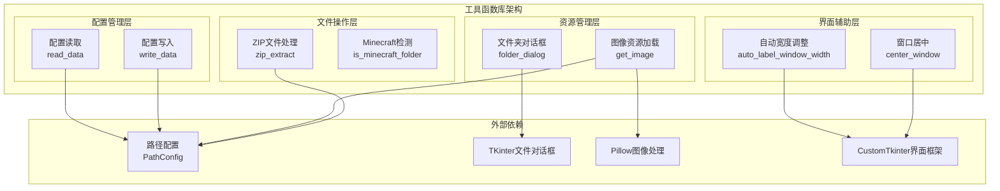
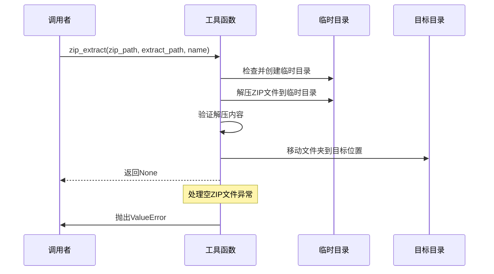
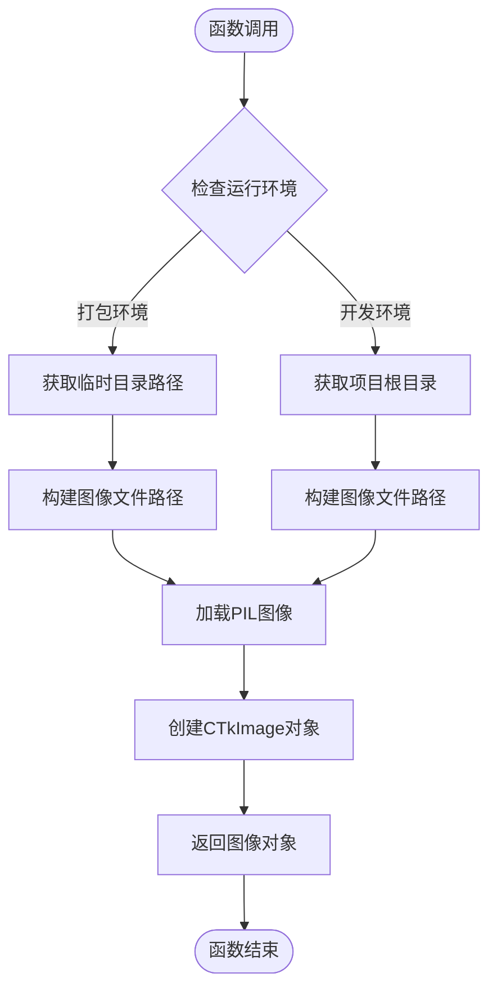
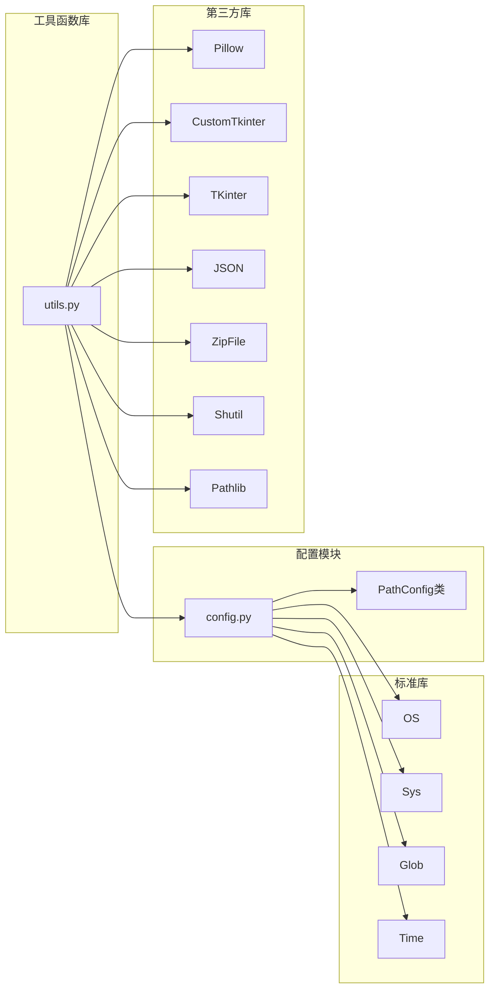
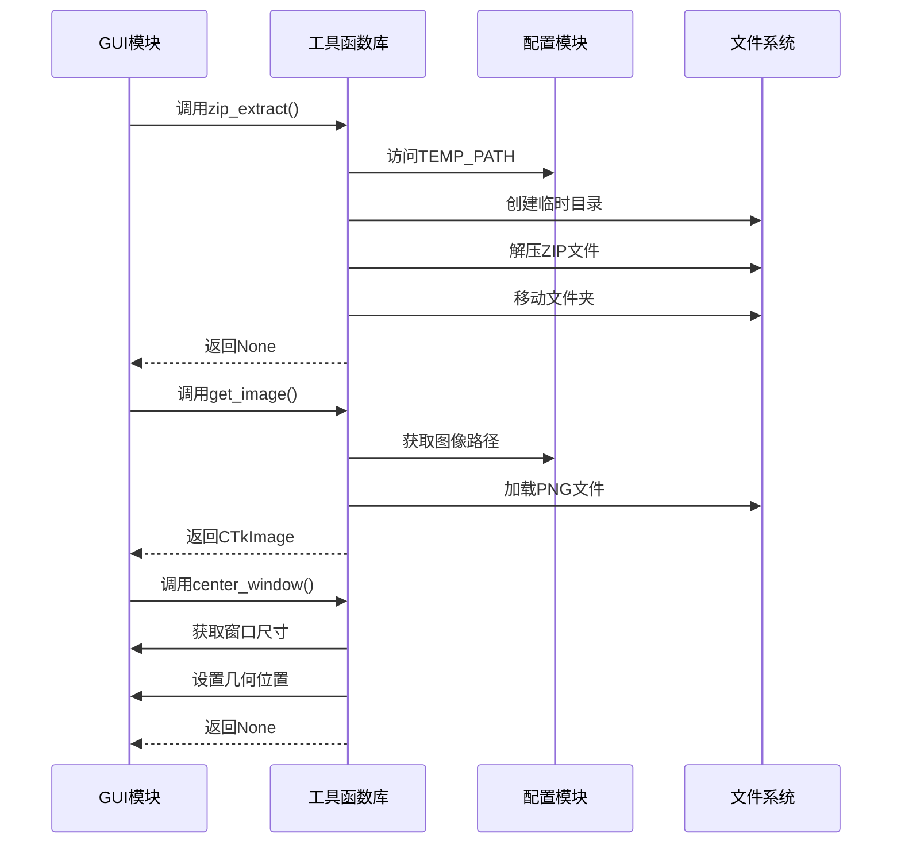

# 工具函数库

<cite>
**本文档引用的文件**
- [src/utils.py](file://src/utils.py)
- [src/gui.py](file://src/gui.py)
- [src/config.py](file://src/config.py)
- [src/main.py](file://src/main.py)
- [README.md](file://README.md)
</cite>

## 目录
1. [简介](#简介)
2. [项目结构](#项目结构)
3. [核心组件](#核心组件)
4. [架构概览](#架构概览)
5. [详细组件分析](#详细组件分析)
6. [依赖关系分析](#依赖关系分析)
7. [性能考虑](#性能考虑)
8. [故障排除指南](#故障排除指南)
9. [结论](#结论)

## 简介

存档管理器工具函数库位于 `src/utils.py` 文件中，提供了Minecraft存档管理器所需的各种实用工具函数。该库采用模块化设计，包含文件操作、图像资源管理、用户界面辅助、配置文件处理等核心功能，为整个应用程序提供基础设施支持。

工具函数库的设计遵循单一职责原则，每个函数都有明确的功能边界和清晰的接口定义。通过合理的错误处理机制和异常管理策略，确保了应用程序的稳定性和可靠性。

## 项目结构

存档管理器采用分层架构设计，工具函数库作为底层基础设施模块，为上层GUI模块提供支持。



**图表来源**
- [src/utils.py:1-177](file://src/utils.py#L1-L177)
- [src/gui.py:1-732](file://src/gui.py#L1-L732)
- [src/config.py:1-93](file://src/config.py#L1-L93)

**章节来源**
- [src/utils.py:1-177](file://src/utils.py#L1-L177)
- [src/gui.py:1-732](file://src/gui.py#L1-L732)
- [src/config.py:1-93](file://src/config.py#L1-L93)

## 核心组件

工具函数库包含七个主要的实用函数，每个函数都针对特定的使用场景进行了优化：

### ZIP文件处理组件
- **zip_extract**: 实现ZIP文件的安全解压和移动操作
- **is_minecraft_folder**: 检测并识别Minecraft文件夹结构

### 资源管理组件
- **get_image**: 提供跨平台的图像资源动态加载
- **folder_dialog**: 实现文件夹选择对话框功能

### 配置管理组件
- **write_data**: 配置文件的写入操作
- **read_data**: 配置文件的读取操作

### 界面辅助组件
- **center_window**: 窗口居中显示功能
- **auto_label_window_width**: 自动调整窗口宽度

**章节来源**
- [src/utils.py:4-177](file://src/utils.py#L4-L177)

## 架构概览

工具函数库采用分层架构设计，通过清晰的模块边界实现了高内聚低耦合的设计原则。



**图表来源**
- [src/utils.py:1-177](file://src/utils.py#L1-L177)
- [src/config.py:14-93](file://src/config.py#L14-L93)

## 详细组件分析

### ZIP文件解压和移动操作

#### 函数签名和参数说明
```python
def zip_extract(zip_path: str, extract_path: str, name: str) -> None:
```

**参数详解:**
- `zip_path`: ZIP压缩包的完整路径字符串
- `extract_path`: 解压目标目录的完整路径字符串  
- `name`: 存档名称，用于重命名解压后的文件夹

**返回值:** `None` - 该函数不返回任何值

**使用场景:**
- 导入Minecraft存档时的文件解压操作
- 批量处理多个ZIP格式的地图文件
- 自动化存档管理流程中的文件处理

**实现逻辑:**
1. 检查并创建临时目录
2. 将ZIP文件解压到临时目录
3. 验证解压内容的有效性
4. 移动并重命名解压后的文件夹到目标位置



**图表来源**
- [src/utils.py:4-32](file://src/utils.py#L4-L32)

**章节来源**
- [src/utils.py:4-32](file://src/utils.py#L4-L32)

### 图像资源动态加载

#### 函数签名和参数说明
```python
def get_image(image_name: str, size: tuple) -> ctk.CTkImage:
```

**参数详解:**
- `image_name`: 图像文件名（不含扩展名），位于img文件夹中
- `size`: 图片尺寸元组 `(width, height)`

**返回值:** `ctk.CTkImage` - 可缩放的图像对象

**使用场景:**
- GUI界面中的图标显示
- 按钮装饰和视觉元素
- 动态图像资源管理

**实现特性:**
- 支持开发环境和打包环境的双模式运行
- 自动处理PyInstaller打包时的资源路径问题
- 提供Light和Dark主题的统一图像接口



**图表来源**
- [src/utils.py:34-65](file://src/utils.py#L34-L65)

**章节来源**
- [src/utils.py:34-65](file://src/utils.py#L34-L65)

### 文件夹选择对话框

#### 函数签名和参数说明
```python
def folder_dialog(title: str) -> str:
```

**参数详解:**
- `title`: 对话框的标题字符串

**返回值:** `str` - 用户选择的文件夹路径，取消时返回空字符串

**使用场景:**
- 导入存档时选择ZIP文件所在目录
- 配置Minecraft安装路径
- 用户自定义文件夹选择操作

**实现特点:**
- 使用标准的TKinter文件对话框
- 设置`mustexist=True`确保选择有效目录
- 提供友好的用户交互体验

**章节来源**
- [src/utils.py:68-83](file://src/utils.py#L68-L83)

### 配置文件读写操作

#### 写入配置函数
```python
def write_data(data: dict) -> None:
```

**参数详解:**
- `data`: 要写入的配置数据字典

**返回值:** `None`

**实现细节:**
- 使用UTF-8编码确保中文字符正确处理
- 使用`indent=2`提供良好的可读性
- 自动创建配置文件

#### 读取配置函数
```python
def read_data() -> dict:
```

**返回值:** `dict` - 配置数据字典

**默认配置:**
- `minecraft_path`: 空字符串（未设置）
- `migrate`: False（非版本迁移）

**实现特点:**
- 自动处理配置文件不存在的情况
- 提供安全的默认值回退机制

**章节来源**
- [src/utils.py:85-114](file://src/utils.py#L85-L114)

### 窗口居中和尺寸调整

#### 窗口居中函数
```python
def center_window(window: ctk.CTk | ctk.CTkToplevel) -> None:
```

**参数详解:**
- `window`: 要居中显示的窗口对象

**实现原理:**
1. 调用`update_idletasks()`确保窗口尺寸计算准确
2. 获取屏幕尺寸和窗口当前尺寸
3. 计算居中位置坐标
4. 使用`geometry()`一次性设置窗口位置

#### 自动宽度调整函数
```python
def auto_label_window_width(label: ctk.CTkLabel, window: ctk.CTk | ctk.CTkToplevel, window_height: int) -> None:
```

**参数详解:**
- `label`: 包含文本内容的标签组件
- `window`: 目标窗口对象
- `window_height`: 固定的窗口高度

**实现原理:**
1. 先渲染界面组件再获取尺寸
2. 通过`winfo_reqwidth()`获取文本所需宽度
3. 动态调整窗口宽度以适应内容
4. 保持指定的窗口高度不变

**章节来源**
- [src/utils.py:115-160](file://src/utils.py#L115-L160)

### Minecraft文件夹检测

#### 函数签名和参数说明
```python
def is_minecraft_folder(minecraft_path) -> dict:
```

**参数详解:**
- `minecraft_path`: 要检测的Minecraft文件夹路径

**返回值:** `dict` - 包含检测结果的字典
- `find`: 是否为有效的Minecraft文件夹
- `migrate`: 是否为版本迁移结构

**检测逻辑:**
1. 检查是否存在`launcher_profiles.json`文件
2. 标准结构：检查`saves`文件夹
3. 版本迁移结构：检查`versions`文件夹

**章节来源**
- [src/utils.py:161-177](file://src/utils.py#L161-L177)

## 依赖关系分析

工具函数库的依赖关系相对简单，主要依赖于配置模块和标准库。



**图表来源**
- [src/utils.py:1-12](file://src/utils.py#L1-L12)
- [src/config.py:1-12](file://src/config.py#L1-L12)

### 模块间协作关系

工具函数库与GUI模块的协作关系体现了典型的分层架构设计：



**图表来源**
- [src/gui.py:167-302](file://src/gui.py#L167-L302)
- [src/utils.py:4-160](file://src/utils.py#L4-L160)

**章节来源**
- [src/gui.py:167-302](file://src/gui.py#L167-L302)
- [src/utils.py:1-177](file://src/utils.py#L1-L177)

## 性能考虑

工具函数库在设计时充分考虑了性能优化和资源管理：

### 内存管理
- 图像资源使用Pillow进行高效处理
- ZIP文件解压采用流式处理，避免内存溢出
- 临时文件夹的生命周期管理

### I/O优化
- 配置文件使用异步写入机制
- 文件夹对话框使用缓存机制
- 图像资源的延迟加载策略

### 错误处理策略
- 所有文件操作都包含异常捕获
- 空ZIP文件的特殊处理
- 路径不存在的优雅降级

## 故障排除指南

### 常见问题及解决方案

#### ZIP文件解压失败
**问题描述:** ZIP文件解压时报错或内容为空
**可能原因:**
- ZIP文件损坏或为空
- 权限不足无法创建临时目录
- 目标路径不存在

**解决方法:**
1. 验证ZIP文件完整性
2. 检查磁盘空间和权限
3. 确认目标路径有效性

#### 图像资源加载失败
**问题描述:** 图像无法显示或显示异常
**可能原因:**
- 图像文件路径错误
- 图像格式不受支持
- PyInstaller打包路径问题

**解决方法:**
1. 验证图像文件存在性
2. 检查图像格式兼容性
3. 确认打包时资源文件包含正确

#### 配置文件读写异常
**问题描述:** 配置文件无法正常读取或写入
**可能原因:**
- 文件权限不足
- 编码格式不匹配
- 文件被其他进程占用

**解决方法:**
1. 检查文件权限设置
2. 验证文件编码格式
3. 关闭其他可能占用文件的程序

**章节来源**
- [src/utils.py:25-27](file://src/utils.py#L25-L27)
- [src/utils.py:107-113](file://src/utils.py#L107-L113)

## 结论

存档管理器工具函数库展现了优秀的软件工程实践，具有以下突出特点：

### 设计优势
- **模块化设计**: 每个函数职责单一，便于测试和维护
- **跨平台兼容**: 支持开发环境和打包环境的无缝切换
- **错误处理完善**: 全面的异常捕获和优雅降级机制
- **性能优化**: 合理的资源管理和I/O优化策略

### 扩展性考虑
- 清晰的接口设计便于功能扩展
- 模块间的低耦合关系支持独立演进
- 配置化的路径管理支持灵活部署

### 最佳实践建议
1. 在调用工具函数前验证输入参数的有效性
2. 合理处理函数返回值和异常情况
3. 根据具体需求调整函数的参数配置
4. 在扩展新功能时遵循现有的设计模式

工具函数库为存档管理器提供了坚实的基础支撑，其设计原则和实现模式可以作为类似桌面应用程序开发的参考模板。