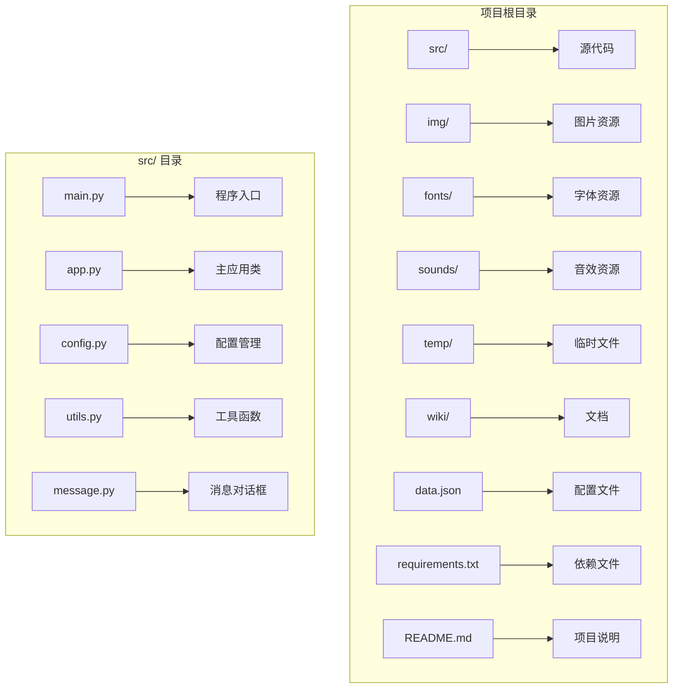
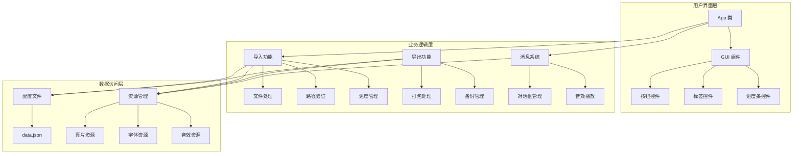
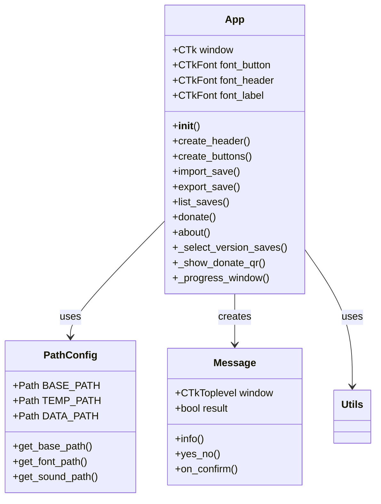
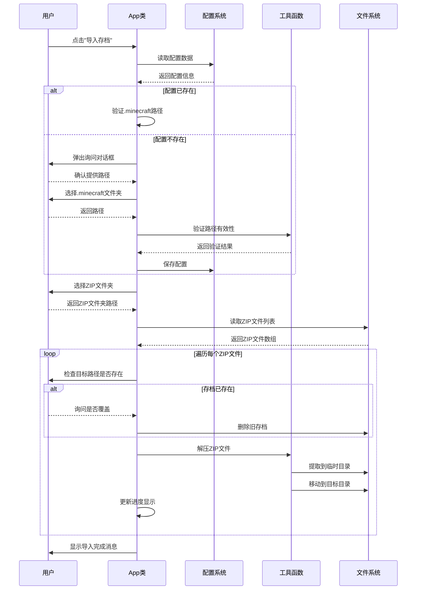
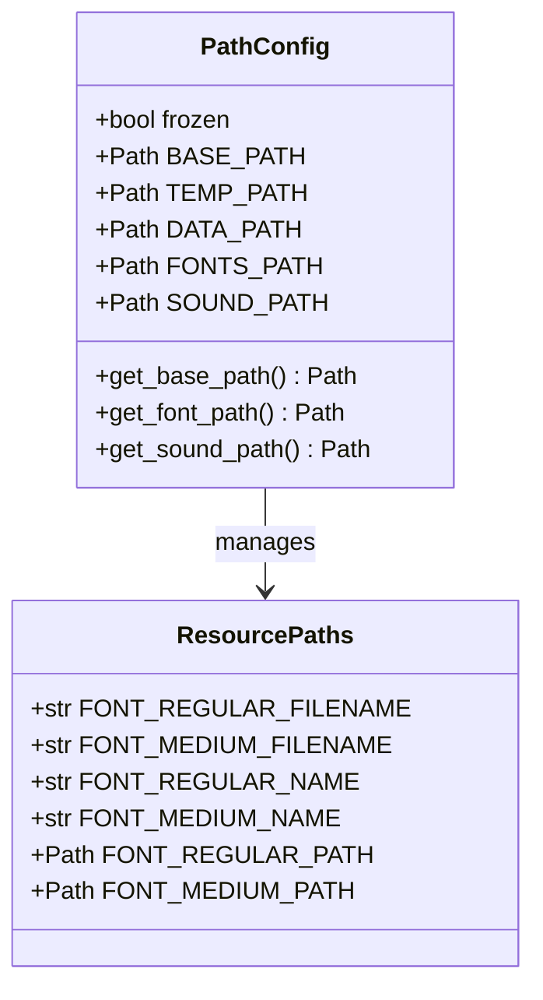
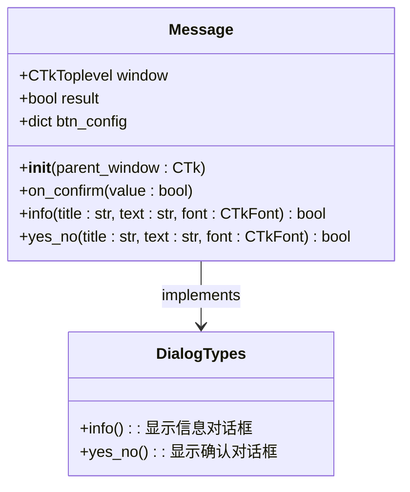
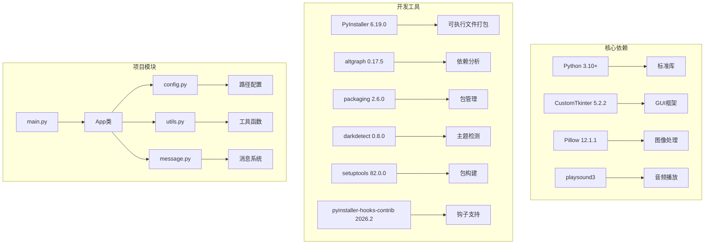
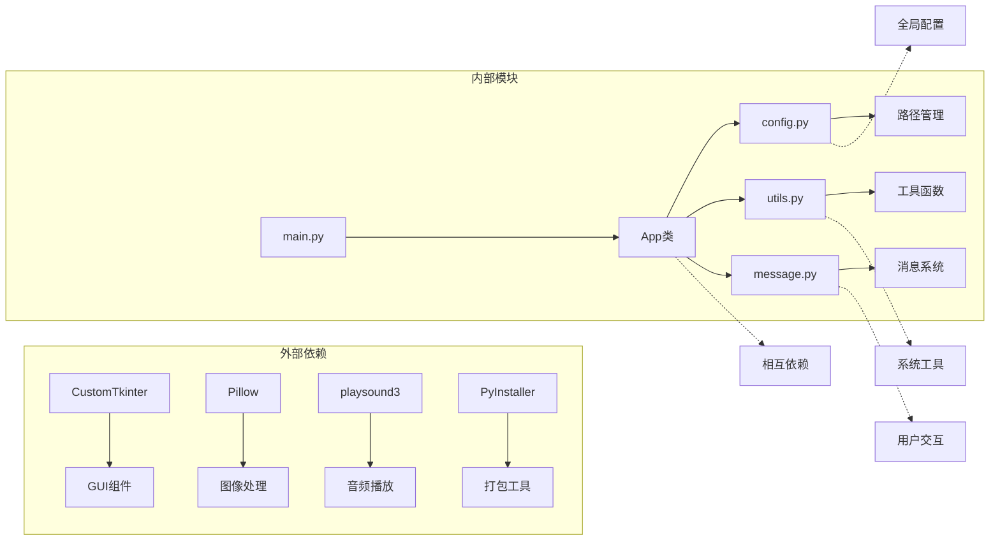

# 开发文档

<cite>
**本文档引用的文件**
- [src/app.py](file://src/app.py)
- [src/main.py](file://src/main.py)
- [src/config.py](file://src/config.py)
- [src/utils.py](file://src/utils.py)
- [src/message.py](file://src/message.py)
- [README.md](file://README.md)
- [requirements.txt](file://requirements.txt)
- [data.json](file://data.json)
- [wiki/开发文档.md](file://wiki/开发文档.md)
- [wiki/使用指南.md](file://wiki/使用指南.md)
- [wiki/功能介绍.md](file://wiki/功能介绍.md)
</cite>

## 目录
1. [项目概述](#项目概述)
2. [项目结构](#项目结构)
3. [核心组件](#核心组件)
4. [架构概览](#架构概览)
5. [详细组件分析](#详细组件分析)
6. [依赖关系分析](#依赖关系分析)
7. [性能考虑](#性能考虑)
8. [故障排除指南](#故障排除指南)
9. [结论](#结论)
10. [附录](#附录)

## 项目概述

Minecraft 存档管理器是一个专为 Minecraft Java 版设计的图形化存档管理工具。该项目提供了直观的用户界面，允许玩家轻松导入、导出和管理游戏存档。

### 主要功能特性
- **导入存档**：一键将下载的 ZIP 地图解压到 `.minecraft/saves` 文件夹
- **导出备份**：将现有存档打包备份（开发中）
- **存档列表**：查看和管理所有存档（开发中）
- **赞助支持**：支持开发者（已完成）

### 技术栈
- **编程语言**：Python 3.10+
- **GUI 框架**：CustomTkinter
- **图像处理**：Pillow
- **打包工具**：PyInstaller
- **音频播放**：playsound3

## 项目结构

项目采用模块化的文件组织结构，主要分为以下目录：



**图表来源**
- [src/app.py:1-645](file://src/app.py#L1-L645)
- [src/config.py:1-94](file://src/config.py#L1-L94)
- [src/utils.py:1-186](file://src/utils.py#L1-L186)

**章节来源**
- [README.md:25-34](file://README.md#L25-L34)
- [wiki/开发文档.md:3-21](file://wiki/开发文档.md#L3-L21)

## 核心组件

项目的核心由五个主要模块组成，每个模块都有明确的职责分工：

### 1. 应用程序入口 (main.py)
程序的入口点，负责创建 App 实例并启动主事件循环。

### 2. 主应用类 (App)
GUI 应用程序的主要控制器，包含所有用户界面和业务逻辑。

### 3. 配置管理 (config.py)
负责路径配置、资源管理和全局设置。

### 4. 工具函数 (utils.py)
提供各种实用工具函数，包括文件操作、图像处理和系统交互。

### 5. 消息对话框 (message.py)
封装了自定义的消息框和对话框功能。

**章节来源**
- [src/main.py:1-7](file://src/main.py#L1-L7)
- [src/app.py:6-38](file://src/app.py#L6-L38)
- [src/config.py:15-94](file://src/config.py#L15-L94)
- [src/utils.py:1-186](file://src/utils.py#L1-L186)
- [src/message.py:4-114](file://src/message.py#L4-L114)

## 架构概览

项目采用 MVC（Model-View-Controller）架构模式，结合模块化设计：



**图表来源**
- [src/app.py:170-306](file://src/app.py#L170-L306)
- [src/utils.py:4-32](file://src/utils.py#L4-L32)
- [src/message.py:29-114](file://src/message.py#L29-L114)

## 详细组件分析

### App 类详细分析

App 类是整个应用程序的核心控制器，采用了面向对象的设计模式：



**图表来源**
- [src/app.py:6-645](file://src/app.py#L6-L645)
- [src/config.py:15-94](file://src/config.py#L15-L94)
- [src/message.py:4-114](file://src/message.py#L4-L114)

#### 导入存档功能流程

导入存档功能是最复杂的业务逻辑，包含了完整的错误处理和用户交互：



**图表来源**
- [src/app.py:171-306](file://src/app.py#L171-L306)
- [src/utils.py:4-32](file://src/utils.py#L4-L32)

#### 赞助功能实现

赞助功能提供了用户友好的支付方式展示：

```mermaid
flowchart TD
A[用户点击"赞助一下"] --> B[创建赞助窗口]
B --> C[显示标题和描述]
C --> D[创建支付按钮]
D --> E[微信支付按钮]
D --> F[支付宝支付按钮]
E --> G[用户点击微信]
F --> H[用户点击支付宝]
G --> I[创建微信二维码窗口]
H --> J[创建支付宝二维码窗口]
I --> K[显示二维码图片]
J --> K
K --> L[窗口居中显示]
L --> M[模态化窗口]
```

**图表来源**
- [src/app.py:331-446](file://src/app.py#L331-L446)
- [src/app.py:566-596](file://src/app.py#L566-L596)

**章节来源**
- [src/app.py:170-446](file://src/app.py#L170-L446)

### 配置管理系统

PathConfig 类负责管理所有路径相关的配置：



**图表来源**
- [src/config.py:15-94](file://src/config.py#L15-L94)

**章节来源**
- [src/config.py:15-94](file://src/config.py#L15-L94)

### 工具函数模块

utils.py 提供了多种实用工具函数：

| 函数名称 | 功能描述 | 参数类型 | 返回值类型 |
|---------|----------|----------|------------|
| zip_extract | 解压ZIP文件到指定目录 | zip_path: str, extract_path: str, name: str | None |
| get_image | 获取可缩放图像对象 | image_name: str, size: tuple | CTkImage |
| folder_dialog | 文件夹选择对话框 | title: str | str |
| write_data | 写入配置数据 | data: dict | None |
| read_data | 读取配置数据 | 无 | dict |
| center_window | 窗口居中显示 | window: CTk | None |
| auto_label_window_width | 自动调整窗口宽度 | label: CTkLabel, window: CTk, window_height: int | None |
| is_minecraft_folder | 验证Minecraft路径 | minecraft_path: str | dict |

**章节来源**
- [src/utils.py:4-186](file://src/utils.py#L4-L186)

### 消息系统

Message 类封装了自定义的消息框功能：



**图表来源**
- [src/message.py:4-114](file://src/message.py#L4-L114)

**章节来源**
- [src/message.py:4-114](file://src/message.py#L4-L114)

## 依赖关系分析

项目使用了以下主要依赖库：



**图表来源**
- [requirements.txt:1-10](file://requirements.txt#L1-L10)
- [src/app.py:1-3](file://src/app.py#L1-L3)

### 依赖关系图



**图表来源**
- [src/app.py:1-3](file://src/app.py#L1-L3)
- [src/config.py:1-12](file://src/config.py#L1-L12)

**章节来源**
- [requirements.txt:1-10](file://requirements.txt#L1-L10)

## 性能考虑

### 内存管理
- 使用临时文件夹进行ZIP文件解压，避免内存溢出
- 及时清理临时文件和资源
- 合理使用图像缓存机制

### 文件操作优化
- 批量处理ZIP文件时使用进度条反馈
- 异步处理文件解压操作
- 避免重复的文件系统查询

### 用户体验优化
- 窗口居中显示，提升视觉效果
- 音效反馈增强用户体验
- 模态对话框确保操作完整性

## 故障排除指南

### 常见问题及解决方案

#### 1. Minecraft路径检测失败
**问题描述**：程序无法识别有效的.minecraft文件夹
**解决方案**：
- 确认选择的文件夹包含`launcher_profiles.json`文件
- 检查文件夹权限是否正确
- 验证Minecraft客户端是否正常安装

#### 2. ZIP文件解压失败
**问题描述**：导入过程中出现解压错误
**解决方案**：
- 检查ZIP文件是否损坏
- 确认目标磁盘空间充足
- 验证ZIP文件格式是否正确

#### 3. 图像资源加载失败
**问题描述**：界面图标显示异常
**解决方案**：
- 确认img文件夹中包含所需的PNG文件
- 检查打包时是否正确包含资源文件
- 验证文件路径是否正确

#### 4. 配置文件读取错误
**问题描述**：程序无法读取或写入data.json
**解决方案**：
- 检查文件权限设置
- 确认JSON格式是否正确
- 尝试删除配置文件重新生成

**章节来源**
- [src/utils.py:161-186](file://src/utils.py#L161-L186)
- [src/utils.py:98-114](file://src/utils.py#L98-L114)

## 结论

Minecraft 存档管理器是一个设计良好的Python桌面应用程序，具有以下特点：

### 优势
- **模块化设计**：清晰的职责分离，便于维护和扩展
- **用户友好**：直观的GUI界面和完善的错误处理
- **跨平台兼容**：支持Windows、Linux和macOS系统
- **可扩展性**：良好的架构设计支持新功能添加

### 改进建议
- 完善导出备份功能的实现
- 增加存档列表和管理功能
- 添加存档修复工具
- 实现关于软件功能

该项目为Minecraft玩家提供了便利的存档管理解决方案，其优秀的代码结构和设计模式为类似项目的开发提供了很好的参考价值。

## 附录

### 开发规范

#### 代码风格
- 代码和注释使用中文
- 使用英文变量名和函数名，遵循snake_case命名约定
- 所有函数使用中文文档字符串
- 在config.py中集中管理导入语句

#### 函数注释格式
```python
def function_name(param: type) -> return_type:
    """函数简短描述

    Args:
        param: 参数说明

    Returns:
        返回值说明
    """
```

#### 辅助方法命名
内部使用的辅助方法使用下划线前缀：
```python
def _helper_method(self):
    """这是内部辅助方法"""
    pass
```

### 构建和部署

#### 开发环境运行
```bash
python src/main.py
```

#### 打包可执行文件
```bash
cd src
pyinstaller -F --noconsole --icon="../icon.ico" --name="存档管理器" --add-data="../img;img" main.py
```

**章节来源**
- [wiki/开发文档.md:63-149](file://wiki/开发文档.md#L63-L149)