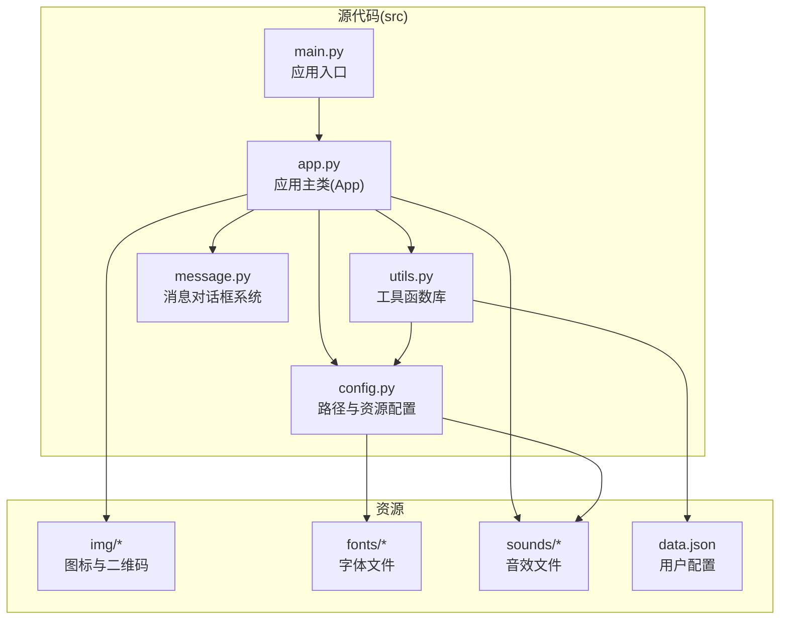
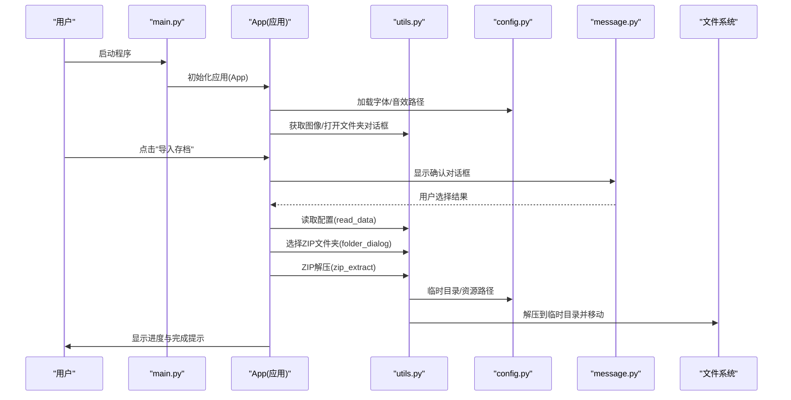
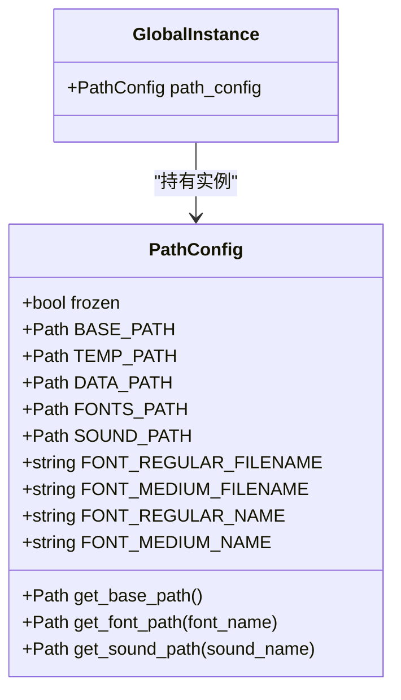
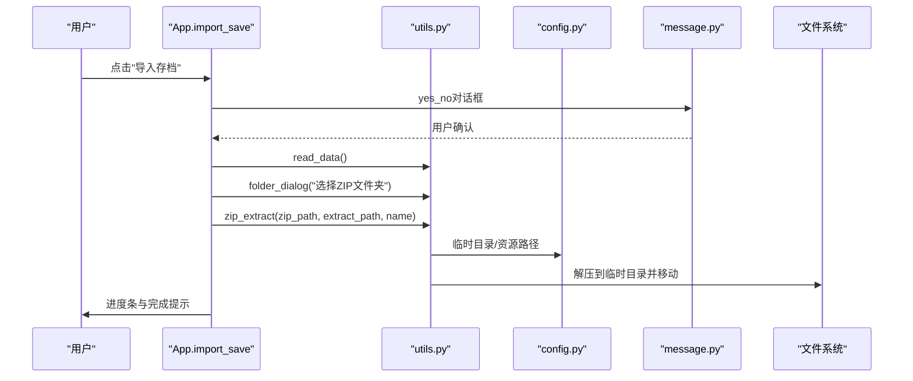
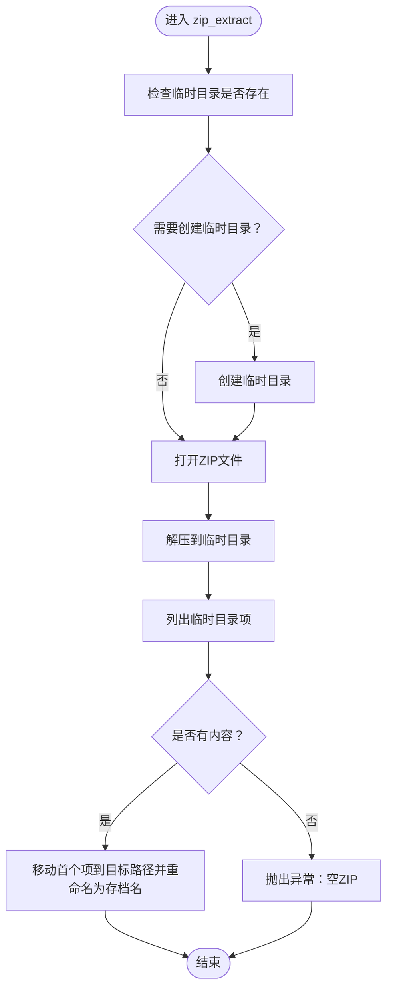
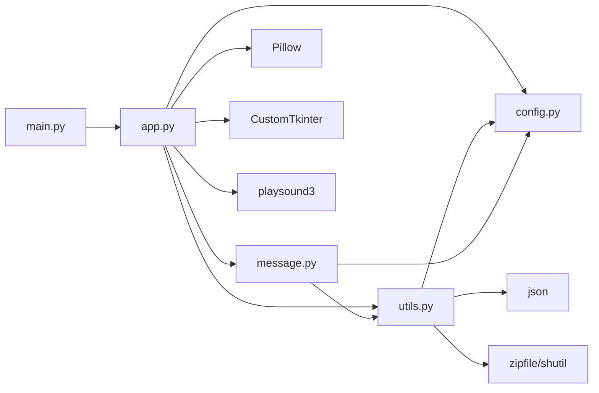

# 核心模块

<cite>
**本文引用的文件**
- [src/app.py](file://src/app.py)
- [src/config.py](file://src/config.py)
- [src/utils.py](file://src/utils.py)
- [src/main.py](file://src/main.py)
- [src/message.py](file://src/message.py)
- [README.md](file://README.md)
- [requirements.txt](file://requirements.txt)
- [data.json](file://data.json)
</cite>

## 更新摘要
**变更内容**
- 更新了核心模块架构：src/gui.py已被重构为src/app.py，采用新的App类设计
- 新增了捐赠窗口系统的详细实现和改进的方法组织
- 更新了模块间的依赖关系和通信机制
- 完善了API参考和最佳实践指导

## 目录
1. [简介](#简介)
2. [项目结构](#项目结构)
3. [核心组件](#核心组件)
4. [架构总览](#架构总览)
5. [详细组件分析](#详细组件分析)
6. [依赖分析](#依赖分析)
7. [性能考虑](#性能考虑)
8. [故障排查指南](#故障排查指南)
9. [结论](#结论)
10. [附录](#附录)

## 简介
本项目是一个面向 Minecraft Java 版的存档管理工具，提供导入、导出、列表查看与修复等能力。本文聚焦于三个核心模块：配置管理系统（config.py）、应用主类（app.py）与工具函数库（utils.py），阐述其设计理念、实现细节、职责边界、接口设计与相互依赖关系，并给出扩展与自定义建议、API 参考与最佳实践。

## 项目结构
项目采用"模块化分层"的组织方式：
- src 目录存放核心源代码：app.py（应用主类）、config.py（配置）、utils.py（工具）、message.py（消息对话框）、main.py（入口）
- 资源目录：img（图标与二维码）、fonts（字体）、sounds（音效）
- 配置文件：data.json（用户路径与迁移标记）
- 构建与依赖：requirements.txt（第三方库）、.github/workflows/build-exe.yml（CI 打包）

**图表来源**
- [src/main.py:1-7](file://src/main.py#L1-L7)
- [src/app.py:1-645](file://src/app.py#L1-L645)
- [src/config.py:1-94](file://src/config.py#L1-L94)
- [src/utils.py:1-186](file://src/utils.py#L1-L186)
- [src/message.py:1-114](file://src/message.py#L1-L114)

**章节来源**
- [README.md:25-34](file://README.md#L25-L34)
- [src/main.py:1-7](file://src/main.py#L1-L7)

## 核心组件
- 配置管理系统（config.py）
  - 职责：统一管理路径、字体、音效资源，适配开发与打包两种运行环境，提供资源路径查询接口。
  - 关键点：区分 frozen 与非 frozen 环境，动态定位资源目录；封装字体与音效路径，供应用与工具模块使用。
- 应用主类（app.py）
  - 职责：构建主窗口、按钮布局、消息对话框；实现导入存档流程、版本选择、进度反馈、赞助窗口等交互。
  - 关键点：基于 CustomTkinter 构建；通过工具函数与配置模块协作；对导入流程进行状态管理与用户反馈。
- 工具函数库（utils.py）
  - 职责：提供 ZIP 解压、图像加载、文件夹选择、数据读写、窗口居中与自适应宽度、Minecraft 路径校验等通用能力。
  - 关键点：与 config 模块耦合紧密，确保资源路径一致性；对打包环境与开发环境分别处理资源路径。
- 消息对话框系统（message.py）
  - 职责：提供统一的消息提示与确认对话框，支持模态化、音效触发、自适应窗口宽度。
  - 关键点：封装通用对话框逻辑，减少重复代码；支持信息提示和用户确认两种模式。

**章节来源**
- [src/config.py:15-94](file://src/config.py#L15-L94)
- [src/app.py:6-645](file://src/app.py#L6-L645)
- [src/utils.py:1-186](file://src/utils.py#L1-L186)
- [src/message.py:4-114](file://src/message.py#L4-L114)

## 架构总览
整体架构采用"入口驱动 + 模块协作"的模式：
- main.py 作为入口，创建 App 应用实例并启动事件循环
- App 与工具模块均依赖配置模块提供的资源路径
- 导入流程贯穿 App（交互）、工具（解压与数据持久化）、配置（资源路径）三者

**图表来源**
- [src/main.py:5-7](file://src/main.py#L5-L7)
- [src/app.py:171-305](file://src/app.py#L171-L305)
- [src/utils.py:4-32](file://src/utils.py#L4-L32)
- [src/config.py:48-91](file://src/config.py#L48-L91)
- [src/message.py:29-65](file://src/message.py#L29-L65)

## 详细组件分析

### 配置管理系统（config.py）
- 设计理念
  - 将资源路径抽象为统一入口，屏蔽开发与打包环境差异
  - 提供字体与音效路径查询，便于应用与工具模块按需使用
- 核心类与方法
  - PathConfig 类
    - get_base_path：根据是否冻结环境返回基础路径
    - get_font_path：返回字体文件的绝对路径
    - get_sound_path：返回音效文件的绝对路径
  - 实例 path_config：全局共享的配置实例
- 关键数据
  - BASE_PATH、TEMP_PATH、DATA_PATH、FONTS_PATH、SOUND_PATH
  - FONT_* 常量：字体文件名与系统名称
- 依赖关系
  - 无外部依赖，仅使用标准库与第三方库（PIL、customtkinter）的路径解析能力
- 扩展建议
  - 新增资源类型时，在类中添加相应字段与访问方法
  - 若需多语言或主题切换，可在类中扩展枚举与映射

**图表来源**
- [src/config.py:15-94](file://src/config.py#L15-L94)

**章节来源**
- [src/config.py:15-94](file://src/config.py#L15-L94)

### 应用主类（app.py）
- 设计理念
  - 使用 CustomTkinter 构建跨平台桌面界面，统一风格与交互体验
  - 将业务流程（如导入存档）封装为方法，提升可维护性
  - 采用模块化方法组织，将不同功能分类到相应的代码块中
- 主要类与方法
  - App 类
    - __init__：初始化窗口、加载字体、设置组件字体、创建头部与按钮区、窗口居中
    - create_header：创建标题与图标
    - create_buttons：创建四大功能按钮（导入、导出、列表、修复、赞助、关于）
    - import_save：导入存档主流程（路径检测、版本迁移、ZIP 解压、进度反馈）
    - _select_version_saves：版本选择弹窗（动态高度、模态化、居中）
    - donate：赞助窗口主方法
    - _show_donate_qr：展示赞助码二维码窗口
    - _progress_window：进度条窗口模板
    - export_save/list_saves/about：预留功能（当前提示开发中）
  - 方法组织结构
    - 初始化方法（第6-38行）
    - UI 创建方法（第39-169行）
    - 核心功能方法（第170-446行）
    - 辅助功能方法（第448-644行）
- 依赖关系
  - 依赖 config.py（路径配置）、utils.py（工具函数）、message.py（消息对话框）、playsound3（音效播放）
- 流程示例：导入存档
  - 读取配置 -> 选择ZIP文件夹 -> 校验ZIP列表 -> 创建进度窗口 -> 逐个解压 -> 覆盖确认 -> 完成提示

**图表来源**
- [src/app.py:171-305](file://src/app.py#L171-L305)
- [src/utils.py:4-32](file://src/utils.py#L4-L32)
- [src/config.py:27-29](file://src/config.py#L27-L29)
- [src/message.py:67-114](file://src/message.py#L67-L114)

**章节来源**
- [src/app.py:6-645](file://src/app.py#L6-L645)

### 工具函数库（utils.py）
- 设计理念
  - 提供与业务解耦的通用能力，降低应用与配置模块的重复逻辑
  - 对打包与开发环境的资源路径差异进行透明处理
- 核心函数
  - zip_extract：先解压至临时目录，再移动到目标路径，保证原子性与完整性
  - get_image：根据运行环境选择资源路径，返回可缩放的 CTkImage
  - folder_dialog：封装文件夹选择对话框，返回路径或空字符串
  - write_data/read_data：读写 data.json，保存用户路径与迁移标记
  - center_window/auto_label_window_width：窗口居中与自适应宽度
  - is_minecraft_folder：判断路径是否为 .minecraft 目录（含版本迁移结构）
- 依赖关系
  - 依赖 config.py（路径配置）、json、zipfile、shutil、PIL、CustomTkinter
- 错误处理
  - 对空 ZIP 文件抛出异常，提示用户检查压缩包
  - 对无效路径返回默认配置，避免崩溃

**图表来源**
- [src/utils.py:4-32](file://src/utils.py#L4-L32)

**章节来源**
- [src/utils.py:1-186](file://src/utils.py#L1-L186)

### 消息对话框系统（message.py）
- 设计理念
  - 提供统一的消息提示与确认对话框，支持模态化、音效触发、自适应窗口宽度
  - 封装通用对话框逻辑，减少重复代码
- 核心类与方法
  - Message 类
    - __init__：初始化对话框窗口、设置样式、配置按钮样式
    - on_confirm：确认操作，保存用户选择并关闭窗口
    - info：消息通知框（模态化、音效触发、自适应窗口宽度）
    - yes_no：选择框（模态化、音效触发、自适应窗口宽度）
- 依赖关系
  - 依赖 config.py（路径配置）、utils.py（工具函数）、playsound3（音效播放）
- 扩展建议
  - 可以扩展更多类型的对话框，如输入框、警告框等
  - 可以添加更多的样式配置选项

**章节来源**
- [src/message.py:4-114](file://src/message.py#L4-L114)

## 依赖分析
- 模块内聚与耦合
  - config.py 低耦合：仅提供路径与资源查询，无业务逻辑
  - app.py 高内聚：围绕界面与交互，依赖 config、utils、message
  - utils.py 中等耦合：依赖 config，提供通用工具
  - message.py 中等耦合：依赖 config、utils，提供对话框功能
- 外部依赖
  - CustomTkinter：GUI 框架
  - Pillow：图像处理
  - playsound3：音效播放
  - PyInstaller：打包（开发阶段）
- 潜在风险
  - 资源路径在打包与开发环境的差异处理需保持一致
  - ZIP 解压流程依赖临时目录，需确保权限与磁盘空间
  - 模态窗口的正确设置避免窗口管理问题

**图表来源**
- [src/main.py:1-7](file://src/main.py#L1-L7)
- [src/app.py:1-3](file://src/app.py#L1-L3)
- [src/utils.py:1](file://src/utils.py#L1)
- [src/message.py:1-2](file://src/message.py#L1-L2)
- [requirements.txt:1-10](file://requirements.txt#L1-L10)

**章节来源**
- [requirements.txt:1-10](file://requirements.txt#L1-L10)

## 性能考虑
- 资源加载
  - 字体与音效在应用启动时加载一次，避免重复 IO
  - 图像加载按需进行，注意缓存策略（可选）
- 文件操作
  - ZIP 解压使用临时目录，完成后移动，减少碎片写入
  - 批量导入时使用进度窗口，避免界面卡顿
- 打包优化
  - 使用 PyInstaller 打包时合理配置资源路径与 UPX 压缩，平衡体积与启动时间
- 窗口管理
  - 模态窗口的延迟设置避免 grab failed 错误
  - 窗口居中计算使用 update_idletasks 确保准确尺寸

## 故障排查指南
- 无法找到 .minecraft 目录
  - 现象：提示"不是有效的 .minecraft 文件夹"
  - 排查：确认 launcher_profiles.json 是否存在；检查路径是否正确
  - 参考：is_minecraft_folder 的判断逻辑
- ZIP 文件为空或损坏
  - 现象：解压时报错或无内容
  - 排查：检查 ZIP 包是否完整；尝试用其他工具验证
  - 参考：zip_extract 的空内容检查
- 资源路径异常（打包后）
  - 现象：字体、音效或图片加载失败
  - 排查：确认打包命令中 --add-data 正确包含 img/fonts；检查 sys._MEIPASS 路径
  - 参考：get_image 与 get_font_path/get_sound_path 的环境分支
- 进度窗口未显示或卡住
  - 现象：进度条不更新
  - 排查：确保在循环中调用 update 或更新 UI 组件；避免阻塞主线程
  - 参考：_progress_window 与 import_save 的进度更新
- 模态窗口问题
  - 现象：窗口无法正确模态化或出现 grab failed
  - 排查：使用 after(100, ...) 延迟设置模态；确保 transient 正确设置
  - 参考：_show_donate_qr 和 _select_version_saves 的模态设置

**章节来源**
- [src/utils.py:161-186](file://src/utils.py#L161-L186)
- [src/utils.py:4-32](file://src/utils.py#L4-L32)
- [src/app.py:597-644](file://src/app.py#L597-L644)
- [src/app.py:566-596](file://src/app.py#L566-L596)

## 结论
本项目通过清晰的模块划分与简洁的接口设计，实现了从路径配置、工具函数到应用交互的完整闭环。config.py 提供稳定的资源路径抽象，utils.py 负责通用能力与环境适配，app.py 聚焦用户体验与业务流程，message.py 提供统一的对话框体验。新的App类架构采用了更好的方法组织，捐赠窗口系统得到了完整实现。建议在后续迭代中完善导出、列表与修复功能，并持续优化资源加载与错误提示，以提升稳定性与可维护性。

## 附录

### 模块级 API 参考

- 配置系统（config.py）
  - PathConfig.get_base_path() -> Path
  - PathConfig.get_font_path(font_name: str) -> Path
  - PathConfig.get_sound_path(sound_name: str) -> Path
  - 全局实例：path_config（单例）

- 应用主类（app.py）
  - App.__init__()
  - App.create_header() -> None
  - App.create_buttons() -> None
  - App.import_save() -> None
  - App.export_save() -> None
  - App.list_saves() -> None
  - App.donate() -> None
  - App.about() -> None
  - App._select_version_saves(minecraft_path) -> str
  - App._show_donate_qr(platform: str, parent_win) -> None
  - App._progress_window(text: str) -> tuple

- 工具函数库（utils.py）
  - zip_extract(zip_path: str, extract_path: str, name: str) -> None
  - get_image(image_name: str, size: tuple) -> CTkImage
  - folder_dialog(title: str) -> str
  - write_data(data: dict) -> None
  - read_data() -> dict
  - center_window(window) -> None
  - auto_label_window_width(label, window, window_height) -> None
  - is_minecraft_folder(minecraft_path) -> dict

- 消息对话框系统（message.py）
  - Message.__init__(parent_window: ctk.CTk) -> None
  - Message.on_confirm(value: bool = False) -> None
  - Message.info(title: str, text: str, font: ctk.CTkFont) -> bool
  - Message.yes_no(title: str, text: str, font: ctk.CTkFont) -> bool

### 最佳实践
- 资源路径
  - 在工具函数中统一通过 config 模块获取路径，避免硬编码
- 错误处理
  - 对用户输入与外部文件进行严格校验，提供明确的错误提示
- 打包与兼容
  - 在打包命令中包含 img、fonts、sounds 等资源目录
  - 验证 frozen 与非 frozen 环境下的路径一致性
- 可扩展性
  - 新增功能时优先在 utils.py 中沉淀通用逻辑，减少 app 与 config 模块的重复代码
- 窗口管理
  - 使用 after(100, ...) 延迟设置模态，避免 grab failed
  - 正确设置 transient 属性，确保窗口层级关系
- 方法组织
  - 采用模块化方法组织，将相关功能分类到相应的代码块中
  - 使用下划线前缀标识内部辅助方法，提高代码可读性