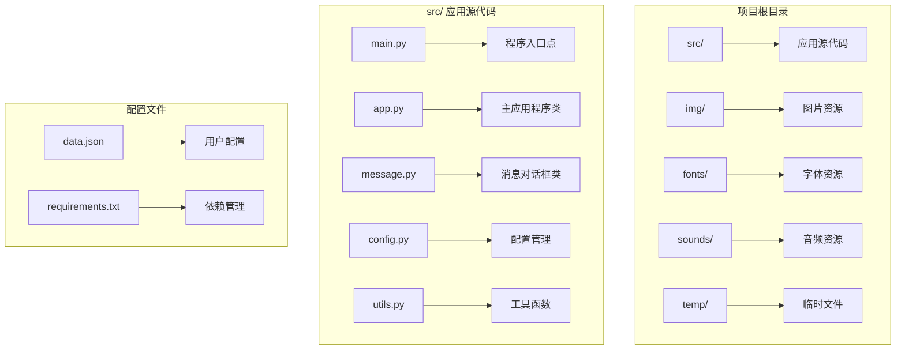
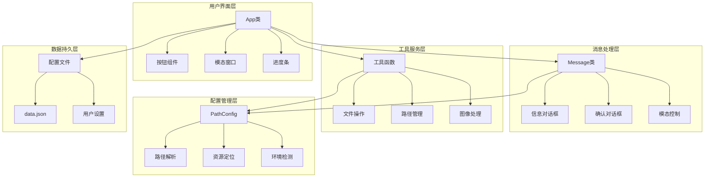
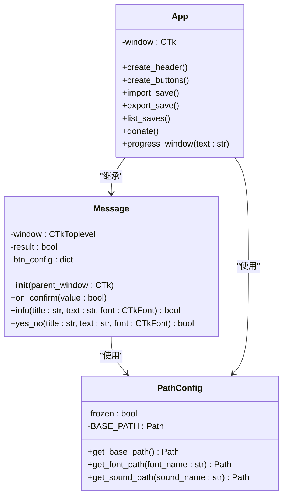
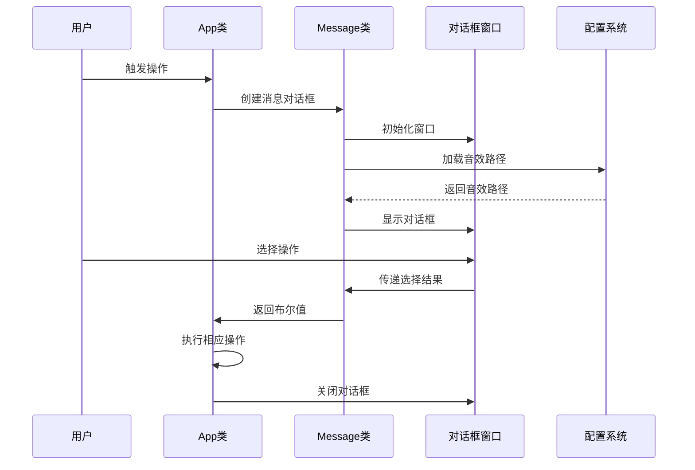
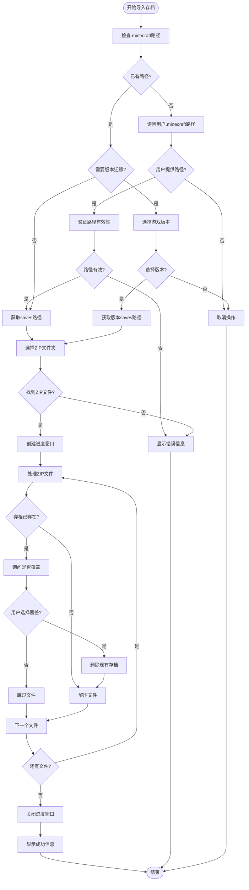
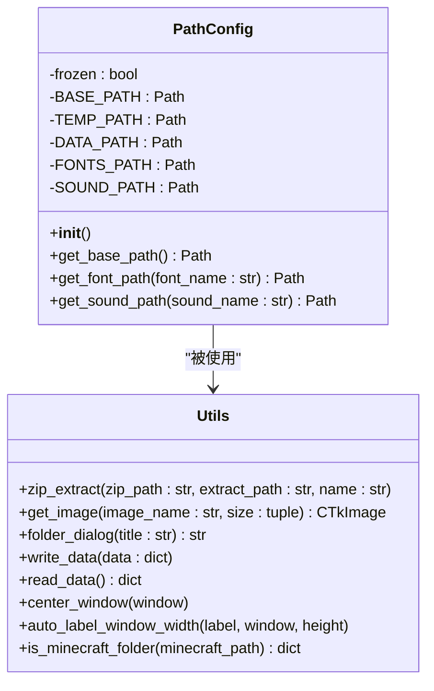
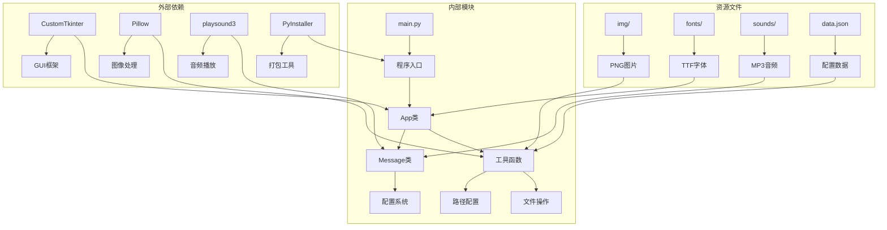

# 消息对话框系统

<cite>
**本文档引用的文件**
- [app.py](file://src/app.py)
- [message.py](file://src/message.py)
- [main.py](file://src/main.py)
- [config.py](file://src/config.py)
- [utils.py](file://src/utils.py)
- [README.md](file://README.md)
- [requirements.txt](file://requirements.txt)
- [data.json](file://data.json)
</cite>

## 目录
1. [简介](#简介)
2. [项目结构](#项目结构)
3. [核心组件](#核心组件)
4. [架构概览](#架构概览)
5. [详细组件分析](#详细组件分析)
6. [依赖关系分析](#依赖关系分析)
7. [性能考虑](#性能考虑)
8. [故障排除指南](#故障排除指南)
9. [结论](#结论)

## 简介

这是一个基于Python和CustomTkinter的消息对话框系统，专门为Minecraft存档管理器设计。该系统提供了统一的消息提示、确认对话框和进度显示功能，支持多种交互模式和用户体验优化。

系统的核心设计理念是通过模块化的消息对话框类来封装所有用户交互逻辑，包括信息提示、用户确认、进度显示等功能。该设计确保了代码的可维护性和一致性，同时提供了丰富的视觉反馈和声音效果。

## 项目结构

项目采用清晰的模块化结构，每个功能模块都有明确的职责分工：

**图表来源**
- [main.py:1-7](file://src/main.py#L1-L7)
- [app.py:1-631](file://src/app.py#L1-L631)
- [message.py:1-114](file://src/message.py#L1-L114)

**章节来源**
- [README.md:25-34](file://README.md#L25-L34)
- [requirements.txt:1-10](file://requirements.txt#L1-L10)

## 核心组件

### 主应用程序类 (App)

主应用程序类负责管理整个GUI应用程序的生命周期和用户界面布局。它继承了消息对话框的功能，并提供了完整的Minecraft存档管理功能。

主要特性：
- **多按钮界面**：提供导入、导出、存档列表、修复、赞助、关于等六个功能按钮
- **模态窗口管理**：确保用户必须完成当前操作才能继续其他操作
- **进度显示**：为长时间操作提供可视化进度反馈
- **版本兼容性**：支持标准和版本迁移两种Minecraft安装结构

### 消息对话框类 (Message)

消息对话框类是系统的核心组件，提供了统一的用户交互接口：

主要功能：
- **信息提示框**：显示重要信息和状态更新
- **确认对话框**：处理用户的选择和决策
- **模态窗口**：阻塞父窗口直到用户响应
- **声音反馈**：为不同类型的对话框提供相应的音效

### 配置管理系统

配置系统负责管理应用程序的各种设置和路径信息：

- **路径配置**：动态检测开发环境和打包环境的差异
- **资源管理**：统一管理字体、图片、音频等静态资源
- **跨平台支持**：支持Windows、Linux和macOS平台

**章节来源**
- [app.py:5-631](file://src/app.py#L5-L631)
- [message.py:4-114](file://src/message.py#L4-L114)
- [config.py:15-94](file://src/config.py#L15-L94)

## 架构概览

系统采用分层架构设计，确保了良好的模块分离和可扩展性：

**图表来源**
- [app.py:1-631](file://src/app.py#L1-L631)
- [message.py:1-114](file://src/message.py#L1-L114)
- [utils.py:1-186](file://src/utils.py#L1-L186)
- [config.py:1-94](file://src/config.py#L1-L94)

## 详细组件分析

### 消息对话框类详细分析

消息对话框类是整个系统的核心，采用了面向对象的设计模式：

**图表来源**
- [message.py:4-114](file://src/message.py#L4-L114)
- [app.py:5-631](file://src/app.py#L5-L631)
- [config.py:15-94](file://src/config.py#L15-L94)

#### 消息对话框的工作流程

**图表来源**
- [message.py:24-65](file://src/message.py#L24-L65)
- [app.py:203-240](file://src/app.py#L203-L240)

#### 导入存档功能的完整流程

**图表来源**
- [app.py:167-301](file://src/app.py#L167-L301)
- [utils.py:4-32](file://src/utils.py#L4-L32)

**章节来源**
- [message.py:1-114](file://src/message.py#L1-L114)
- [app.py:167-301](file://src/app.py#L167-L301)

### 配置管理系统分析

配置管理系统采用了单例模式，确保全局只有一个配置实例：

**图表来源**
- [config.py:15-94](file://src/config.py#L15-L94)
- [utils.py:1-186](file://src/utils.py#L1-L186)

**章节来源**
- [config.py:1-94](file://src/config.py#L1-L94)
- [utils.py:161-186](file://src/utils.py#L161-L186)

## 依赖关系分析

系统依赖关系清晰且模块化，每个组件都有明确的职责边界：

**图表来源**
- [requirements.txt:1-10](file://requirements.txt#L1-L10)
- [main.py:1-7](file://src/main.py#L1-L7)
- [app.py:1-3](file://src/app.py#L1-L3)

### 依赖注入和模块化设计

系统采用了良好的依赖注入模式，减少了模块间的耦合：

- **配置注入**：通过全局配置实例提供统一的资源访问
- **工具函数**：独立的工具函数便于测试和重用
- **事件驱动**：通过回调函数处理用户交互

**章节来源**
- [requirements.txt:1-10](file://requirements.txt#L1-L10)
- [app.py:1-3](file://src/app.py#L1-L3)

## 性能考虑

### 内存管理优化

系统在内存管理方面采用了多项优化策略：

- **延迟加载**：图片和字体资源按需加载，减少启动时间
- **临时文件管理**：使用临时目录进行文件操作，避免磁盘碎片
- **模态窗口控制**：及时销毁不再使用的对话框窗口

### 用户体验优化

- **异步操作**：音频播放设置为非阻塞模式，避免界面冻结
- **进度反馈**：长操作提供实时进度显示
- **声音提示**：不同类型的操作提供相应的音效反馈

### 跨平台兼容性

系统通过以下机制确保跨平台兼容性：

- **路径处理**：使用Pathlib处理不同操作系统的路径差异
- **资源定位**：动态检测打包环境和开发环境的资源路径
- **窗口管理**：适配不同操作系统的窗口行为

## 故障排除指南

### 常见问题及解决方案

#### 1. 路径相关问题

**问题**：找不到.minecraft文件夹
**解决方案**：
- 确认.minecraft文件夹的正确位置
- 检查是否有launcher_profiles.json文件
- 验证文件夹权限

#### 2. ZIP文件处理问题

**问题**：ZIP文件无法解压
**解决方案**：
- 检查ZIP文件完整性
- 确认目标目录有足够的磁盘空间
- 验证存档名称的有效性

#### 3. 资源加载问题

**问题**：图片或字体无法显示
**解决方案**：
- 检查资源文件是否存在于正确的目录
- 验证打包时是否包含了所有必要的资源文件
- 确认文件权限设置

#### 4. 音频播放问题

**问题**：音效无法播放
**解决方案**：
- 检查音频文件是否存在
- 验证音频格式的兼容性
- 确认系统音频设备正常工作

**章节来源**
- [utils.py:161-186](file://src/utils.py#L161-L186)
- [message.py:34-35](file://src/message.py#L34-L35)

## 结论

这个消息对话框系统展现了优秀的软件工程实践，具有以下突出特点：

### 设计优势

1. **模块化设计**：清晰的职责分离和依赖关系
2. **可扩展性**：易于添加新的对话框类型和功能
3. **跨平台兼容**：支持多种操作系统和部署方式
4. **用户体验**：提供丰富的视觉和听觉反馈

### 技术亮点

- **面向对象设计**：合理运用继承和组合模式
- **异步处理**：避免界面冻结，提升响应性
- **资源管理**：智能的资源加载和缓存策略
- **错误处理**：完善的异常处理和用户反馈机制

### 改进建议

1. **单元测试**：为关键功能添加自动化测试
2. **日志记录**：增强错误诊断和调试能力
3. **国际化支持**：添加多语言界面支持
4. **配置热重载**：允许运行时修改配置而无需重启

该系统为Minecraft存档管理提供了坚实的技术基础，其设计原则和实现模式可以作为其他桌面应用程序开发的参考模板。