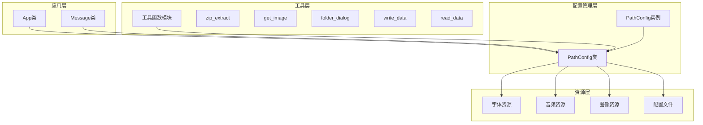
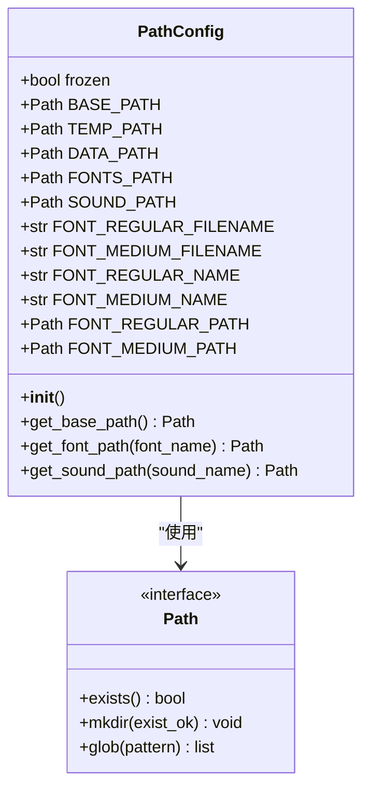
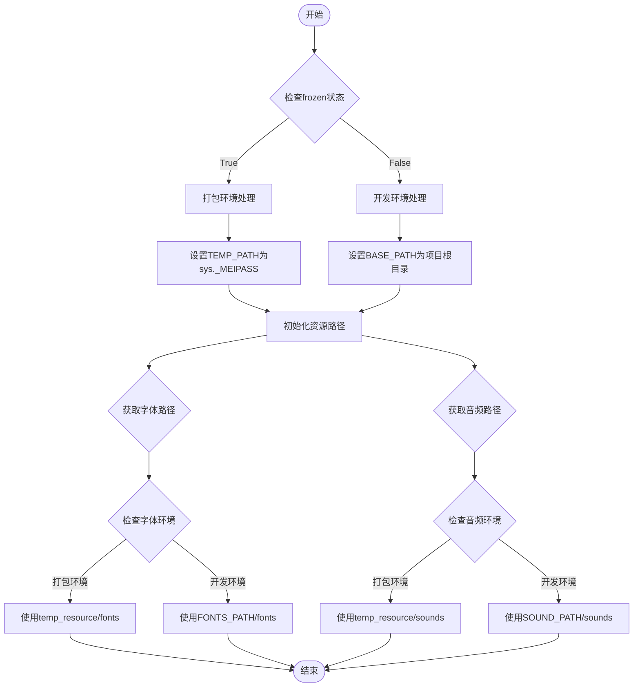
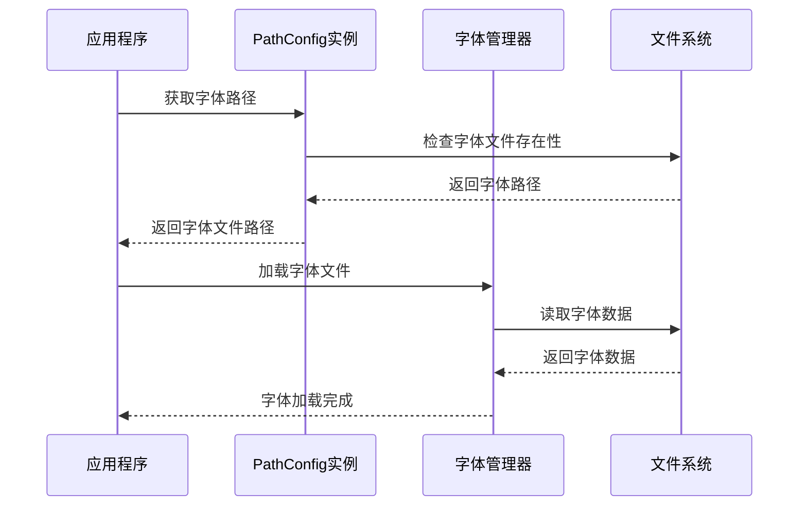
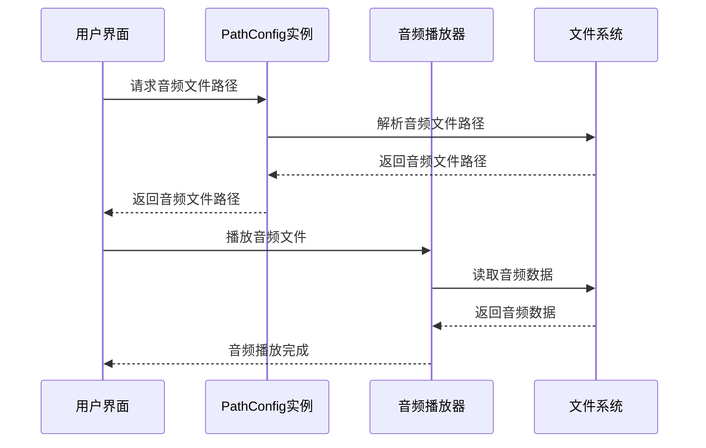
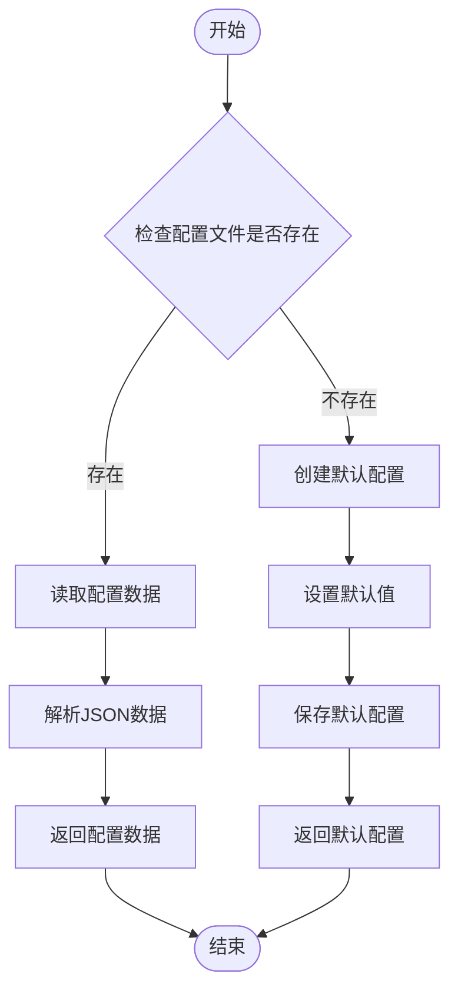
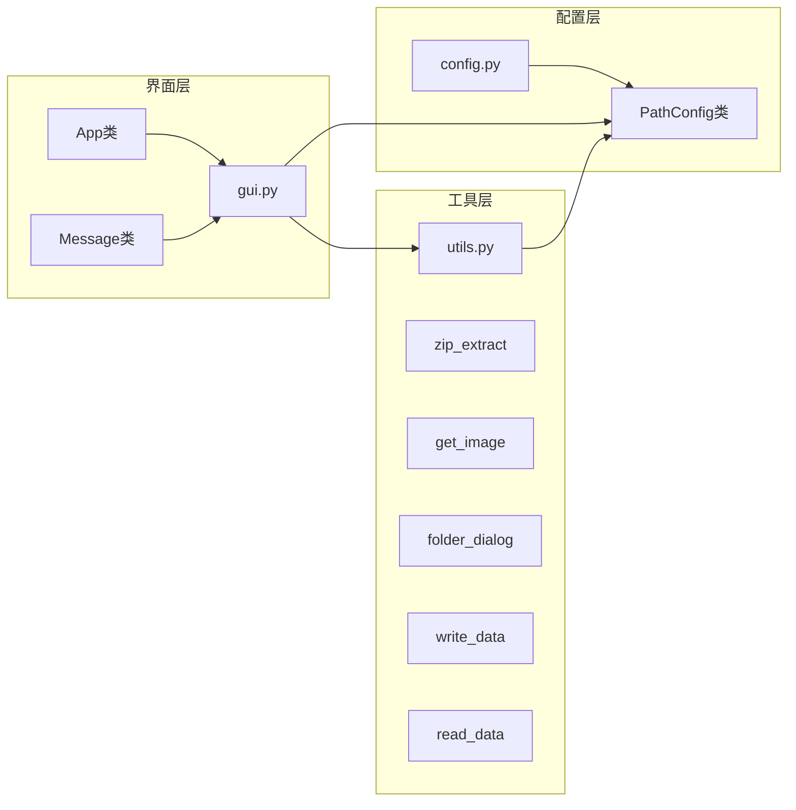

# 配置管理系统

<cite>
**本文引用的文件**
- [src/config.py](file://src/config.py)
- [src/gui.py](file://src/gui.py)
- [src/utils.py](file://src/utils.py)
- [src/main.py](file://src/main.py)
- [README.md](file://README.md)
- [requirements.txt](file://requirements.txt)
- [data.json](file://data.json)
</cite>

## 目录
1. [简介](#简介)
2. [项目结构](#项目结构)
3. [核心组件](#核心组件)
4. [架构概览](#架构概览)
5. [详细组件分析](#详细组件分析)
6. [依赖分析](#依赖分析)
7. [性能考虑](#性能考虑)
8. [故障排除指南](#故障排除指南)
9. [结论](#结论)
10. [附录](#附录)

## 简介

存档管理器的配置管理系统围绕PathConfig类构建，该类负责处理应用程序在开发环境和打包环境中的路径解析问题。系统通过统一的路径配置接口，为字体、音频、图像等资源提供一致的访问方式，同时支持PyInstaller打包环境的特殊需求。

该系统的核心设计理念是环境无关性：无论是在开发环境还是打包后的可执行文件中，都能正确解析和访问所需的资源文件。通过智能的环境检测机制，系统能够自动适应不同的部署场景。

## 项目结构

存档管理器采用模块化的项目结构，主要分为以下几个关键部分：

```mermaid
graph TB
subgraph "项目根目录"
Root[项目根目录]
Src[src/] - 源代码目录
Fonts[fonts/] - 字体资源目录
Sounds[sounds/] - 音频资源目录
Img[img/] - 图像资源目录
Temp[temp/] - 临时文件目录
Data[data.json] - 配置文件
end
subgraph "源代码结构"
Config[src/config.py] - 配置管理
GUI[src/gui.py] - 图形界面
Utils[src/utils.py] - 工具函数
Main[src/main.py] - 主入口
end
Root --> Src
Root --> Fonts
Root --> Sounds
Root --> Img
Root --> Temp
Root --> Data
Src --> Config
Src --> GUI
Src --> Utils
Src --> Main
```

**图表来源**
- [src/config.py:1-93](file://src/config.py#L1-L93)
- [src/gui.py:1-732](file://src/gui.py#L1-L732)
- [src/utils.py:1-177](file://src/utils.py#L1-L177)

**章节来源**
- [README.md:25-34](file://README.md#L25-L34)
- [src/config.py:14-93](file://src/config.py#L14-L93)

## 核心组件

### PathConfig类设计

PathConfig类是整个配置系统的核心，它实现了以下关键功能：

#### 环境检测机制
- **开发环境识别**：通过检查`__file__`的相对路径来确定项目根目录
- **打包环境识别**：使用`sys.frozen`属性检测PyInstaller打包状态
- **动态路径解析**：根据环境类型返回相应的基础路径

#### 资源管理策略
- **字体资源管理**：统一管理HarmonyOS Sans SC字体系列
- **音频资源管理**：提供音频文件的动态加载机制
- **配置文件管理**：维护data.json的读写操作

#### 路径解析机制
- **基础路径解析**：`get_base_path()`方法处理不同环境的基础路径
- **字体路径解析**：`get_font_path()`方法区分开发和打包环境的字体路径
- **音频路径解析**：`get_sound_path()`方法提供音频文件的完整路径

**章节来源**
- [src/config.py:14-93](file://src/config.py#L14-L93)

## 架构概览

配置管理系统采用分层架构设计，确保各组件之间的松耦合和高内聚：



**图表来源**
- [src/gui.py:5-732](file://src/gui.py#L5-L732)
- [src/config.py:14-93](file://src/config.py#L14-L93)
- [src/utils.py:1-177](file://src/utils.py#L1-L177)

## 详细组件分析

### PathConfig类深度分析

#### 类结构设计



**图表来源**
- [src/config.py:14-93](file://src/config.py#L14-L93)

#### 环境检测逻辑

PathConfig类通过以下机制实现智能环境检测：

1. **冻结状态检测**：使用`getattr(sys, 'frozen', False)`判断是否为打包环境
2. **基础路径确定**：
   - 打包环境：使用`sys.executable.parent`获取可执行文件所在目录
   - 开发环境：使用`Path(__file__).parent.parent`获取项目根目录
3. **资源路径映射**：为不同环境设置相应的资源访问路径

#### 路径解析算法



**图表来源**
- [src/config.py:47-90](file://src/config.py#L47-L90)

**章节来源**
- [src/config.py:14-93](file://src/config.py#L14-L93)

### 资源管理策略

#### 字体资源管理

PathConfig类实现了完整的字体资源管理机制：

- **字体文件定义**：HarmonyOS Sans SC Regular和Medium两个字体变体
- **系统字体名称**：使用带空格的字体名称以便在系统中正确识别
- **动态路径解析**：根据环境类型返回相应的字体文件路径

字体加载流程：



**图表来源**
- [src/gui.py:22-29](file://src/gui.py#L22-L29)
- [src/config.py:40-42](file://src/config.py#L40-L42)

#### 音频资源管理

音频资源管理提供了灵活的动态加载机制：

- **音频文件类型**：支持MP3、WAV等多种音频格式
- **异步播放支持**：通过playsound3库实现非阻塞音频播放
- **环境适配**：自动处理打包环境中的音频文件访问

音频播放流程：



**图表来源**
- [src/gui.py:13](file://src/gui.py#L13)
- [src/gui.py:652](file://src/gui.py#L652)
- [src/gui.py:690](file://src/gui.py#L690)

**章节来源**
- [src/config.py:44-90](file://src/config.py#L44-L90)
- [src/gui.py:13-13](file://src/gui.py#L13)

### 配置文件管理

#### 数据持久化机制

系统通过data.json文件实现配置数据的持久化存储：

- **配置数据结构**：包含minecraft_path和migrate两个关键字段
- **默认配置**：提供合理的默认值确保应用程序正常启动
- **JSON序列化**：使用UTF-8编码确保中文字符正确存储

配置文件操作流程：



**图表来源**
- [src/utils.py:85-114](file://src/utils.py#L85-L114)

**章节来源**
- [src/utils.py:85-114](file://src/utils.py#L85-L114)
- [data.json:1-4](file://data.json#L1-L4)

## 依赖分析

### 外部依赖关系

配置系统依赖于多个外部库来实现其功能：

```mermaid
graph TB
subgraph "核心依赖"
Sys[sys] - Python标准库
OS[os] - Python标准库
PathLib[pathlib.Path] - Python标准库
JSON[json] - Python标准库
end
subgraph "GUI框架"
CustomTK[customtkinter] - GUI框架
PIL[Pillow] - 图像处理
end
subgraph "打包工具"
PyInstaller[PyInstaller] - 可执行文件打包
Playsound3[playsound3] - 音频播放
end
subgraph "文件操作"
ZipFile[zipfile] - ZIP文件处理
Shutil[shutil] - 文件复制
Glob[glob] - 文件匹配
end
PathConfig --> Sys
PathConfig --> OS
PathConfig --> PathLib
PathConfig --> JSON
App --> CustomTK
App --> PIL
App --> PyInstaller
App --> Playsound3
Utils --> ZipFile
Utils --> Shutil
Utils --> Glob
```

**图表来源**
- [requirements.txt:1-10](file://requirements.txt#L1-L10)
- [src/config.py:1-12](file://src/config.py#L1-L12)

### 内部模块依赖

配置系统内部模块之间的依赖关系清晰且有序：



**图表来源**
- [src/config.py:14-93](file://src/config.py#L14-L93)
- [src/utils.py:1-177](file://src/utils.py#L1-L177)
- [src/gui.py:1-732](file://src/gui.py#L1-L732)

**章节来源**
- [requirements.txt:1-10](file://requirements.txt#L1-L10)
- [src/config.py:14-93](file://src/config.py#L14-L93)

## 性能考虑

### 路径解析优化

配置系统在路径解析方面采用了多项优化策略：

- **缓存机制**：PathConfig实例在初始化时计算并缓存所有路径，避免重复计算
- **懒加载策略**：资源文件的路径解析只在实际需要时进行
- **环境检测优化**：使用简单的布尔检查而非复杂的路径比较

### 内存使用优化

- **最小化实例数量**：系统只创建一个PathConfig实例供全局使用
- **延迟初始化**：资源路径在首次使用时才进行解析和验证
- **资源释放**：图像和音频资源在使用后及时释放

### 启动时间优化

- **快速环境检测**：使用高效的sys属性检查替代复杂的文件系统查询
- **批量路径设置**：在单次初始化中设置所有必要的路径变量
- **避免不必要的I/O操作**：只有在必要时才访问文件系统

## 故障排除指南

### 常见问题及解决方案

#### 路径解析错误

**问题描述**：应用程序无法找到字体或音频文件
**可能原因**：
- 打包时未正确包含资源文件
- 环境检测失败导致路径解析错误
- 文件权限问题

**解决步骤**：
1. 验证PyInstaller打包命令中的`--add-data`参数
2. 检查资源文件是否存在于正确的目录结构中
3. 确认应用程序具有读取权限

#### 字体加载失败

**问题描述**：字体无法正确加载或显示异常
**可能原因**：
- 字体文件损坏或格式不支持
- 字体名称与系统字体名称不匹配
- 字体文件路径解析错误

**解决步骤**：
1. 验证字体文件的完整性
2. 检查字体名称是否与系统字体注册名称一致
3. 使用调试模式检查字体路径解析结果

#### 音频播放问题

**问题描述**：音频文件无法播放或播放异常
**可能原因**：
- 音频格式不受支持
- 音频文件路径错误
- 音频播放库安装问题

**解决步骤**：
1. 尝试使用不同的音频格式（如WAV）
2. 验证音频文件路径的有效性
3. 检查playsound3库的安装状态

**章节来源**
- [src/config.py:16-23](file://src/config.py#L16-L23)
- [src/utils.py:4-32](file://src/utils.py#L4-L32)

## 结论

存档管理器的配置管理系统通过PathConfig类实现了环境无关的路径解析机制，为应用程序提供了稳定可靠的资源访问能力。系统的设计充分考虑了开发环境和打包环境的差异，通过智能的环境检测和路径解析算法，确保了应用程序在不同部署场景下的正常运行。

该系统的主要优势包括：

- **环境适应性强**：能够自动适应开发和生产环境的不同需求
- **扩展性良好**：模块化设计便于添加新的资源类型和功能
- **维护成本低**：统一的配置接口减少了代码重复和维护复杂度
- **性能优化到位**：通过缓存和懒加载策略提升了应用程序性能

未来可以考虑的改进方向包括：
- 添加更详细的日志记录机制
- 实现资源文件的版本管理和自动更新
- 增加更多的错误恢复和容错机制

## 附录

### 使用示例

#### 获取基础路径
```python
from config import path_config

# 获取项目基础路径
base_path = path_config.BASE_PATH
print(f"基础路径: {base_path}")
```

#### 获取字体路径
```python
from config import path_config

# 获取Regular字体路径
regular_font_path = path_config.FONT_REGULAR_PATH
print(f"Regular字体路径: {regular_font_path}")

# 获取Medium字体路径
medium_font_path = path_config.FONT_MEDIUM_PATH
print(f"Medium字体路径: {medium_font_path}")
```

#### 获取音频路径
```python
from config import path_config

# 获取特定音频文件路径
audio_path = path_config.get_sound_path('message_info.mp3')
print(f"音频文件路径: {audio_path}")
```

### 扩展最佳实践

#### 添加新资源类型
1. 在PathConfig类中添加新的路径常量
2. 实现相应的路径解析方法
3. 在GUI或工具函数中使用新资源

#### 配置系统扩展
1. 在data.json中添加新的配置项
2. 在utils.py中实现对应的读写函数
3. 在GUI中添加相应的配置界面

#### 环境兼容性
1. 始终使用PathConfig类进行路径解析
2. 避免硬编码绝对路径
3. 测试打包后的应用程序功能

**章节来源**
- [src/config.py:14-93](file://src/config.py#L14-L93)
- [src/utils.py:85-114](file://src/utils.py#L85-L114)