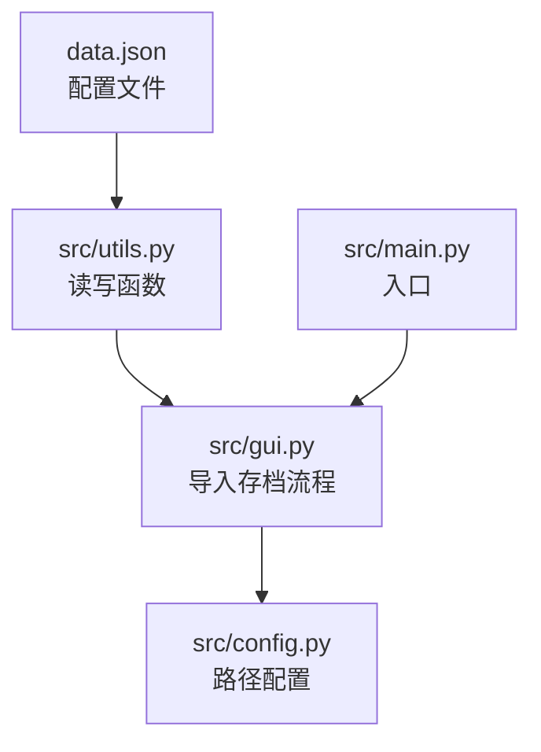
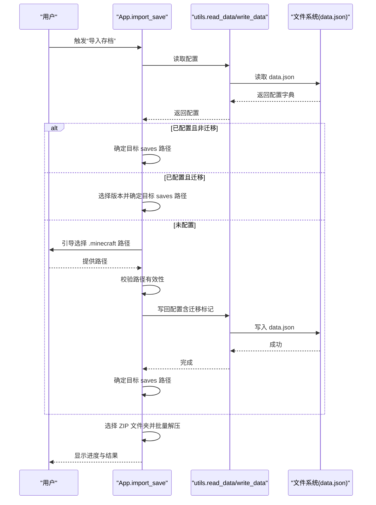
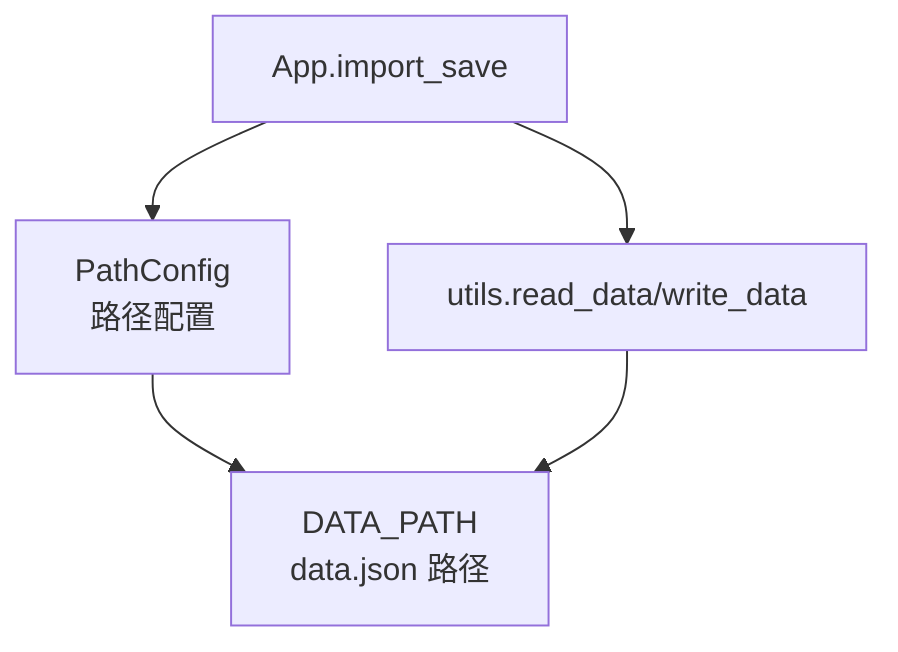

# 配置管理

<cite>
**本文引用的文件**
- [data.json](file://data.json)
- [src/config.py](file://src/config.py)
- [src/utils.py](file://src/utils.py)
- [src/gui.py](file://src/gui.py)
- [src/main.py](file://src/main.py)
- [README.md](file://README.md)
- [requirements.txt](file://requirements.txt)
</cite>

## 目录
1. [简介](#简介)
2. [项目结构](#项目结构)
3. [核心组件](#核心组件)
4. [架构总览](#架构总览)
5. [详细组件分析](#详细组件分析)
6. [依赖分析](#依赖分析)
7. [性能考虑](#性能考虑)
8. [故障排查指南](#故障排查指南)
9. [结论](#结论)
10. [附录](#附录)

## 简介
本文件面向存档管理器的配置管理系统，聚焦 data.json 配置文件的结构与字段含义，以及配置的读取、写入与验证机制。文档还解释用户偏好设置（如 Minecraft 安装路径与版本迁移标记）的存储与管理方式，并提供配置文件的备份与恢复方法、默认值与约束条件、安全建议与最佳实践，以及配置变更对应用行为的影响。

## 项目结构
- 配置文件 data.json 位于项目根目录，作为 JSON 格式的用户配置持久化存储。
- 配置读写与路径解析由工具模块负责，GUI 模块在导入存档流程中读取并写回配置。
- 项目使用自定义 UI 框架与资源打包，配置文件路径通过路径配置类在开发与打包环境下自动适配。

图表来源
- [data.json:1-4](file://data.json#L1-L4)
- [src/utils.py:84-113](file://src/utils.py#L84-L113)
- [src/gui.py:167-301](file://src/gui.py#L167-L301)
- [src/config.py:14-93](file://src/config.py#L14-L93)
- [src/main.py:1-7](file://src/main.py#L1-L7)

章节来源
- [README.md:25-34](file://README.md#L25-L34)
- [src/config.py:14-93](file://src/config.py#L14-L93)
- [src/utils.py:84-113](file://src/utils.py#L84-L113)
- [src/gui.py:167-301](file://src/gui.py#L167-L301)

## 核心组件
- 配置文件 data.json：包含用户偏好设置，当前包含两个键值对。
- 路径配置类 PathConfig：负责在开发与打包环境下解析基础路径、资源路径与配置文件路径。
- 工具模块 utils：提供读取配置、写入配置、文件夹选择对话框、ZIP 解压等通用能力。
- GUI 模块 gui：在导入存档流程中读取配置、校验 Minecraft 路径、必要时写回配置（如首次选择路径与版本迁移标记）。

章节来源
- [data.json:1-4](file://data.json#L1-L4)
- [src/config.py:14-93](file://src/config.py#L14-L93)
- [src/utils.py:84-113](file://src/utils.py#L84-L113)
- [src/gui.py:167-301](file://src/gui.py#L167-L301)

## 架构总览
配置管理的控制流围绕 data.json 展开：GUI 在导入存档前读取配置，若未配置则引导用户选择 .minecraft 路径并写回配置；随后根据配置决定目标存档目录与版本迁移策略。

图表来源
- [src/gui.py:167-301](file://src/gui.py#L167-L301)
- [src/utils.py:84-113](file://src/utils.py#L84-L113)
- [data.json:1-4](file://data.json#L1-L4)

## 详细组件分析

### data.json 配置文件结构与字段说明
- 文件位置：项目根目录
- 结构：JSON 对象，包含以下键：
  - minecraft_path：字符串，Minecraft 安装目录路径。默认为空字符串。
  - migrate：布尔值，指示是否为版本迁移结构（versions 子目录）。默认为 false。
- 作用：持久化用户偏好设置，驱动导入流程的目标路径选择与版本迁移逻辑。

章节来源
- [data.json:1-4](file://data.json#L1-L4)

### 配置读取与写入机制
- 读取：
  - 若配置文件不存在，返回默认配置字典（包含上述两个键，值分别为默认值）。
  - 若存在，则解析为字典返回。
- 写入：
  - 将传入的字典写回 data.json，采用 UTF-8 编码与缩进格式化，确保可读性。
- 调用点：
  - 导入存档流程在首次确认 .minecraft 路径与版本迁移标记后写回配置。
  - 读取发生在每次导入前，以决定后续行为。

章节来源
- [src/utils.py:84-113](file://src/utils.py#L84-L113)
- [src/gui.py:173-232](file://src/gui.py#L173-L232)

### 配置验证与约束
- 路径有效性：
  - 通过检测 launcher_profiles.json 与 saves 或 versions 目录的存在性，判断是否为有效的 .minecraft 目录。
- 迁移标记：
  - 当检测到 versions 目录存在时，将 migrate 标记为 true，并允许用户选择具体版本，从而确定最终目标 saves 路径。
- 默认行为：
  - 未配置时，引导用户输入路径；配置后，后续导入流程不再重复询问。

章节来源
- [src/utils.py:161-177](file://src/utils.py#L161-L177)
- [src/gui.py:180-301](file://src/gui.py#L180-L301)

### 用户偏好设置的存储与管理
- 存储位置：data.json
- 管理方式：
  - 首次导入时，若未配置，弹窗引导用户选择 .minecraft 目录；校验通过后写回配置。
  - 若检测到版本迁移结构，同时写入 migrate 标记与目标版本路径信息。
  - 后续导入流程直接读取配置，避免重复交互。
- 影响范围：影响目标存档目录的选择与版本迁移逻辑。

章节来源
- [src/gui.py:180-301](file://src/gui.py#L180-L301)
- [src/utils.py:84-113](file://src/utils.py#L84-L113)

### 配置文件的备份与恢复
- 备份：
  - 直接复制 data.json 到安全位置即可完成备份。
- 恢复：
  - 将备份文件覆盖到原路径，重启应用后生效。
- 注意事项：
  - 恢复前请确保应用已退出，避免写入冲突。
  - 恢复后建议手动验证 .minecraft 路径与版本迁移标记是否正确。

章节来源
- [data.json:1-4](file://data.json#L1-L4)

### 配置项的默认值、可选值范围与约束条件
- minecraft_path
  - 类型：字符串
  - 默认值：空字符串
  - 约束：必须为有效 .minecraft 目录路径（通过内部校验逻辑判断）
- migrate
  - 类型：布尔值
  - 默认值：false
  - 约束：仅在检测到版本迁移结构时设为 true；否则保持 false
- 可选值范围：无额外枚举，但受路径有效性与目录结构约束

章节来源
- [data.json:1-4](file://data.json#L1-L4)
- [src/utils.py:161-177](file://src/utils.py#L161-L177)

### 配置修改的安全建议与最佳实践
- 修改前备份：在修改 data.json 前先备份原文件，以防误改导致导入流程异常。
- 仅在应用未运行时编辑：避免多进程并发写入造成数据损坏。
- 保持路径有效性：确保 minecraft_path 指向包含 launcher_profiles.json 与 saves 或 versions 的有效目录。
- 逐步验证：修改后重启应用，先进行一次导入测试，确认目标路径与版本迁移逻辑正常。
- 版本迁移场景：若 .minecraft 目录包含 versions 子目录，务必选择正确的游戏版本后再导入。

章节来源
- [src/utils.py:84-113](file://src/utils.py#L84-L113)
- [src/utils.py:161-177](file://src/utils.py#L161-L177)
- [src/gui.py:180-301](file://src/gui.py#L180-L301)

### 配置变更对应用程序行为的影响
- 未配置阶段：首次导入时弹窗引导选择 .minecraft 目录；若检测到版本迁移结构，会进一步引导选择版本。
- 已配置阶段：导入流程直接使用配置中的路径与迁移标记，无需再次询问。
- 目标路径影响：根据 migrate 标记与 .minecraft 目录结构，决定最终写入的 saves 路径（标准结构或版本迁移结构）。
- 行为一致性：配置一旦写回，后续导入流程将遵循该配置，直至用户主动修改。

章节来源
- [src/gui.py:180-301](file://src/gui.py#L180-L301)
- [src/utils.py:161-177](file://src/utils.py#L161-L177)

## 依赖分析
- 路径解析依赖：
  - PathConfig 在开发与打包环境下分别解析基础路径与资源路径，保证 data.json 的定位一致。
- 读写依赖：
  - utils.read_data 与 utils.write_data 依赖 PathConfig.DATA_PATH，确保跨平台与打包环境的一致性。
- GUI 依赖：
  - App.import_save 在导入流程中读取与写回配置，依赖 utils 的读写函数与路径配置。

图表来源
- [src/config.py:14-93](file://src/config.py#L14-L93)
- [src/utils.py:84-113](file://src/utils.py#L84-L113)
- [src/gui.py:167-301](file://src/gui.py#L167-L301)

章节来源
- [src/config.py:14-93](file://src/config.py#L14-L93)
- [src/utils.py:84-113](file://src/utils.py#L84-L113)
- [src/gui.py:167-301](file://src/gui.py#L167-L301)

## 性能考虑
- 配置读写为轻量级 JSON 操作，I/O 开销极低，对整体性能影响可忽略。
- 路径解析与文件系统检测在导入流程中触发，建议在应用启动时仅做必要检查，避免重复扫描。
- 批量导入时，进度窗口与文件操作分离，避免阻塞 UI 线程。

## 故障排查指南
- data.json 无法读取或写入
  - 检查 data.json 是否被其他进程占用，或权限不足。
  - 确认应用处于退出状态后再进行手动编辑。
- .minecraft 路径无效
  - 确认路径包含 launcher_profiles.json 与 saves 或 versions 目录。
  - 若为版本迁移结构，确保 versions 目录存在且包含可选版本。
- 导入后找不到目标存档目录
  - 检查 migrate 标记与 .minecraft 目录结构是否匹配。
  - 如需切换版本，重新选择版本并写回配置。

章节来源
- [src/utils.py:161-177](file://src/utils.py#L161-L177)
- [src/gui.py:180-301](file://src/gui.py#L180-L301)

## 结论
配置管理系统以 data.json 为核心，结合路径配置类与工具模块，实现了对用户偏好的持久化与读取。通过在导入流程中进行路径校验与迁移标记写回，系统能够在不同 .minecraft 目录结构下稳定工作。遵循备份与验证的最佳实践，可有效降低配置变更带来的风险。

## 附录
- 项目依赖（节选）：CustomTkinter、Pillow、playsound3、PyInstaller 等，用于 UI、图像处理与打包。
- 项目结构要点：data.json 位于项目根目录，路径配置类在开发与打包环境下自动适配资源路径。

章节来源
- [requirements.txt:1-10](file://requirements.txt#L1-L10)
- [README.md:25-34](file://README.md#L25-L34)