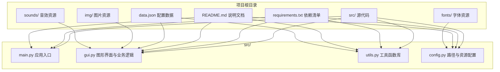
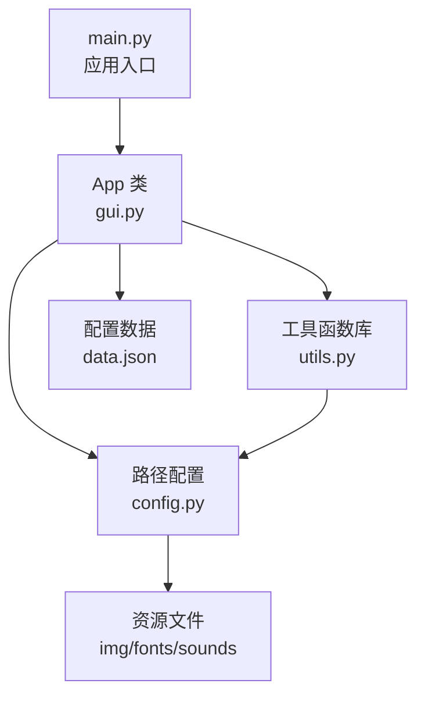
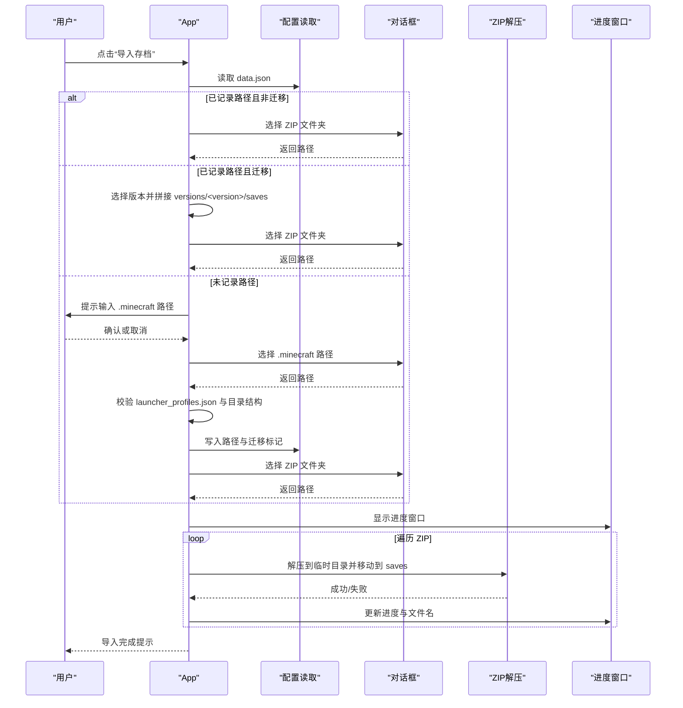
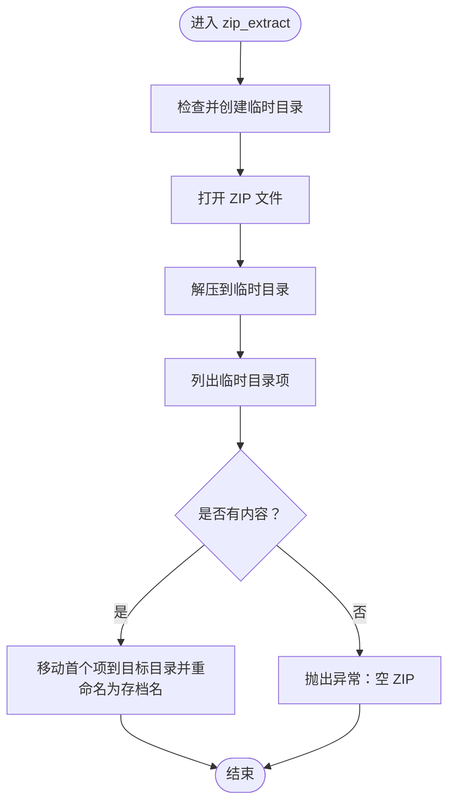

# 项目概述

<cite>
**本文引用的文件**
- [README.md](file://README.md)
- [src/main.py](file://src/main.py)
- [src/gui.py](file://src/gui.py)
- [src/utils.py](file://src/utils.py)
- [src/config.py](file://src/config.py)
- [requirements.txt](file://requirements.txt)
- [data.json](file://data.json)
- [check_font_name.py](file://check_font_name.py)
</cite>

## 目录
1. [简介](#简介)
2. [项目结构](#项目结构)
3. [核心组件](#核心组件)
4. [架构总览](#架构总览)
5. [详细组件分析](#详细组件分析)
6. [依赖关系分析](#依赖关系分析)
7. [性能考虑](#性能考虑)
8. [故障排除指南](#故障排除指南)
9. [结论](#结论)
10. [附录](#附录)

## 简介
本项目是一个面向 Minecraft Java 版的存档管理工具，旨在简化存档导入、导出、备份与列表管理等常见操作。通过图形化界面，用户可以一键将 ZIP 地图解压到 .minecraft/saves 或版本迁移结构下的对应目录，并提供进度反馈与交互式确认机制。项目采用 Python 与 CustomTkinter 构建跨平台桌面应用，支持打包为独立可执行文件，便于非技术用户直接使用。

本工具解决的实际问题包括：
- 快速批量导入 ZIP 地图至 Minecraft 存档目录
- 在不同版本迁移场景下正确识别并定位 saves 路径
- 提供进度可视化与覆盖确认，降低误操作风险
- 通过本地配置文件持久化 Minecraft 根目录路径，提升后续使用效率

## 项目结构
项目采用“模块化分层”的组织方式，核心源代码位于 src 目录，资源文件（图片、字体、声音）分别置于 img、fonts、sounds 等目录，配置数据存储在 data.json 中。构建与打包脚本通过 requirements.txt 管理依赖，README.md 提供使用说明与打包指南。

图表来源
- [src/main.py:1-7](file://src/main.py#L1-L7)
- [src/gui.py:1-730](file://src/gui.py#L1-L730)
- [src/utils.py:1-177](file://src/utils.py#L1-L177)
- [src/config.py:1-93](file://src/config.py#L1-L93)
- [requirements.txt:1-10](file://requirements.txt#L1-L10)
- [README.md:1-94](file://README.md#L1-L94)

章节来源
- [README.md:25-34](file://README.md#L25-L34)
- [src/main.py:1-7](file://src/main.py#L1-L7)
- [src/config.py:1-93](file://src/config.py#L1-L93)

## 核心组件
- 应用入口与生命周期
  - main.py 负责导入配置与 GUI 类，创建 App 实例并启动主循环。
- 图形界面与交互
  - gui.py 定义 App 类，负责窗口布局、按钮事件绑定、导入/导出/列表等功能入口，以及消息弹窗与进度窗口的封装。
- 工具函数库
  - utils.py 提供 ZIP 解压、图片加载、文件夹选择、数据读写、窗口居中与自适应宽度、Minecraft 路径检测等通用能力。
- 资源与路径配置
  - config.py 提供 PathConfig 类，统一管理开发/打包两种运行环境下的资源路径解析、字体与音频路径获取。
- 配置与状态
  - data.json 保存 Minecraft 根目录路径与版本迁移标记，供后续导入流程复用。

章节来源
- [src/main.py:1-7](file://src/main.py#L1-L7)
- [src/gui.py:1-730](file://src/gui.py#L1-L730)
- [src/utils.py:1-177](file://src/utils.py#L1-L177)
- [src/config.py:1-93](file://src/config.py#L1-L93)
- [data.json:1-4](file://data.json#L1-L4)

## 架构总览
整体采用“入口-界面-工具-配置”分层架构，职责清晰、耦合度低。App 类作为控制器协调 GUI 与工具函数；PathConfig 统一资源路径；utils 提供跨模块复用能力；data.json 作为轻量级本地数据库。

图表来源
- [src/main.py:1-7](file://src/main.py#L1-L7)
- [src/gui.py:1-730](file://src/gui.py#L1-L730)
- [src/utils.py:1-177](file://src/utils.py#L1-L177)
- [src/config.py:1-93](file://src/config.py#L1-L93)
- [data.json:1-4](file://data.json#L1-L4)

## 详细组件分析

### 应用入口与生命周期
- 职责
  - 导入配置与 GUI 类，创建 App 实例并启动 Tk 主循环。
- 设计要点
  - 保持入口极简，逻辑集中在 GUI 类中，便于扩展与测试。
- 性能与稳定性
  - 启动时加载资源路径与字体，确保界面渲染一致性。

章节来源
- [src/main.py:1-7](file://src/main.py#L1-L7)

### 图形界面与交互（App 类）
- 职责
  - 初始化窗口、加载字体、创建标题与功能按钮区域。
  - 提供导入存档、导出存档、存档列表、赞助、关于等入口。
  - 封装进度窗口与消息弹窗，提供用户交互反馈。
- 关键流程
  - 导入存档流程：检测 .minecraft 路径（含版本迁移）、选择 ZIP 文件夹、遍历 ZIP 并解压到 saves 目录、覆盖确认与进度反馈。
  - 导出存档与列表功能当前为占位实现，提示开发中。
- 错误处理
  - 路径无效、未选择文件夹、ZIP 空内容等情况均进行提示与回退。
- 可扩展性
  - 通过按钮命令与消息弹窗封装，新增功能只需扩展 App 方法并绑定按钮即可。

图表来源
- [src/gui.py:167-299](file://src/gui.py#L167-L299)
- [src/utils.py:98-113](file://src/utils.py#L98-L113)
- [src/utils.py:161-177](file://src/utils.py#L161-L177)

章节来源
- [src/gui.py:1-730](file://src/gui.py#L1-L730)

### 工具函数库（utils.py）
- ZIP 解压
  - 先解压到临时目录，再移动到目标目录，避免直接解压到目标导致的多层嵌套。
  - 对空 ZIP 进行校验并抛出异常，保证健壮性。
- 图片加载
  - 支持开发与打包两种环境下的资源路径解析，统一返回可缩放的 CTkImage。
- 文件夹选择
  - 基于 Tkinter 的 askdirectory，返回空字符串表示取消。
- 数据读写
  - 读取默认配置（空路径、false 标记），写入 JSON 配置文件。
- 窗口辅助
  - 居中显示、根据文本宽度自适应窗口宽度，提升用户体验。
- Minecraft 路径检测
  - 通过检查 launcher_profiles.json 与目录结构判断是否为有效 .minecraft 路径，区分标准与版本迁移结构。

图表来源
- [src/utils.py:4-32](file://src/utils.py#L4-L32)

章节来源
- [src/utils.py:1-177](file://src/utils.py#L1-L177)

### 资源与路径配置（config.py）
- 职责
  - 统一管理开发与打包两种运行环境下的资源路径，包括字体、音频与临时目录。
  - 提供字体与音频路径解析方法，确保在 PyInstaller 打包后仍能正确加载资源。
- 设计要点
  - 通过 sys.executable 与 sys._MEIPASS 区分运行环境，避免硬编码路径。
  - 将字体与音频路径抽象为 PathConfig 实例，供全局使用。

章节来源
- [src/config.py:1-93](file://src/config.py#L1-L93)

### 配置与状态（data.json）
- 结构
  - minecraft_path：记录 .minecraft 根目录路径
  - migrate：标记是否为版本迁移结构
- 作用
  - 首次使用时引导用户选择路径并写入配置，后续导入流程可直接复用。

章节来源
- [data.json:1-4](file://data.json#L1-L4)

### 字体家族名检测（check_font_name.py）
- 用途
  - 读取字体元数据，输出正确的 family name，指导在 config.py 中正确配置字体名称。
- 影响
  - 确保 GUI 字体加载与显示一致，避免因 family name 不匹配导致的渲染问题。

章节来源
- [check_font_name.py:1-53](file://check_font_name.py#L1-L53)

## 依赖关系分析
- 运行时依赖
  - Python 3.10+、CustomTkinter、Pillow、playsound3、pyinstaller（打包）
- 模块间依赖
  - main.py 依赖 config 与 gui
  - gui.py 依赖 config、utils、playsound3
  - utils.py 依赖 config
  - config.py 依赖 PIL、customtkinter、pathlib、json、shutil、zipfile 等

图表来源
- [src/main.py:1-7](file://src/main.py#L1-L7)
- [src/gui.py:1-730](file://src/gui.py#L1-L730)
- [src/utils.py:1-177](file://src/utils.py#L1-L177)
- [src/config.py:1-93](file://src/config.py#L1-L93)

章节来源
- [requirements.txt:1-10](file://requirements.txt#L1-L10)
- [src/main.py:1-7](file://src/main.py#L1-L7)
- [src/gui.py:1-730](file://src/gui.py#L1-L730)
- [src/utils.py:1-177](file://src/utils.py#L1-L177)
- [src/config.py:1-93](file://src/config.py#L1-L93)

## 性能考虑
- 资源加载
  - 字体与图片在应用启动时加载一次，避免重复 IO。
  - 打包环境下通过临时资源路径访问，减少磁盘扫描。
- ZIP 解压策略
  - 先解压到临时目录再移动，避免直接解压到目标目录导致的层级问题与权限冲突。
- 用户体验
  - 进度窗口实时更新，覆盖确认避免误删，提升可靠性。
- 打包优化
  - README 提供 PyInstaller 打包与 UPX 压缩方案，平衡体积与启动时间。

## 故障排除指南
- 无法找到 .minecraft 路径
  - 确认所选目录包含 launcher_profiles.json；若为版本迁移结构，需选择包含 versions 子目录的 .minecraft 根目录。
- ZIP 文件为空或解压失败
  - 检查 ZIP 是否损坏或为空；工具会对空内容抛出异常。
- 图片/字体加载失败
  - 确认资源文件存在于 img/fonts/sounds 目录；打包后确保资源随可执行文件一起分发。
- 导出/列表功能提示开发中
  - 当前版本尚未实现，后续版本将逐步完善。

章节来源
- [src/utils.py:161-177](file://src/utils.py#L161-L177)
- [src/utils.py:4-32](file://src/utils.py#L4-L32)
- [src/gui.py:596-618](file://src/gui.py#L596-L618)

## 结论
本项目以简洁实用为目标，围绕 Minecraft Java 版存档导入这一核心需求，提供了直观易用的图形界面与稳健的底层实现。通过模块化设计与资源路径抽象，既满足初学者的使用需求，也为后续扩展（如导出、列表、修复等）预留了清晰接口。建议在后续版本中完善导出与列表功能，并引入更完善的日志与错误报告机制，进一步提升可用性与可维护性。

## 附录
- 使用方法
  - 打开程序，点击对应功能按钮，选择文件夹，等待完成。
- 开发与打包
  - 安装依赖后，可在 src 目录使用 PyInstaller 打包为独立可执行文件，支持添加资源与 UPX 压缩。

章节来源
- [README.md:18-24](file://README.md#L18-L24)
- [README.md:42-86](file://README.md#L42-L86)