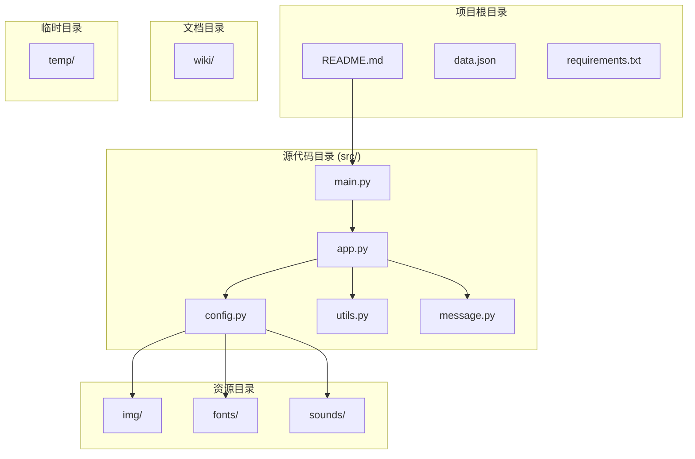
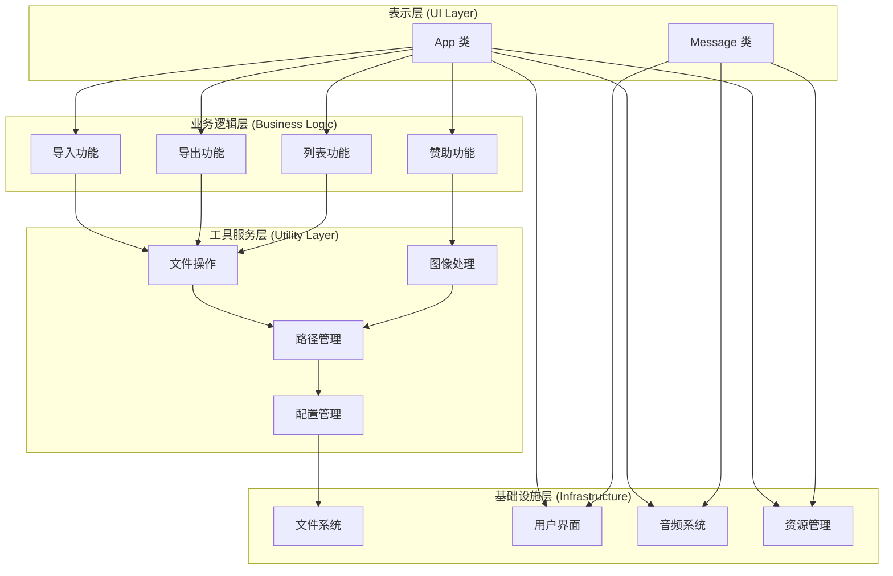
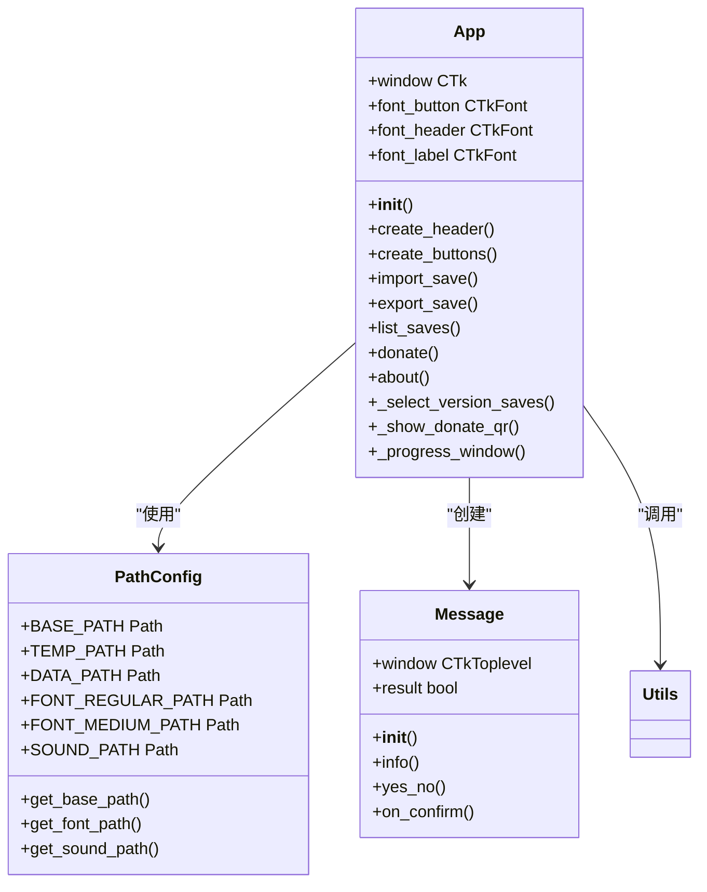
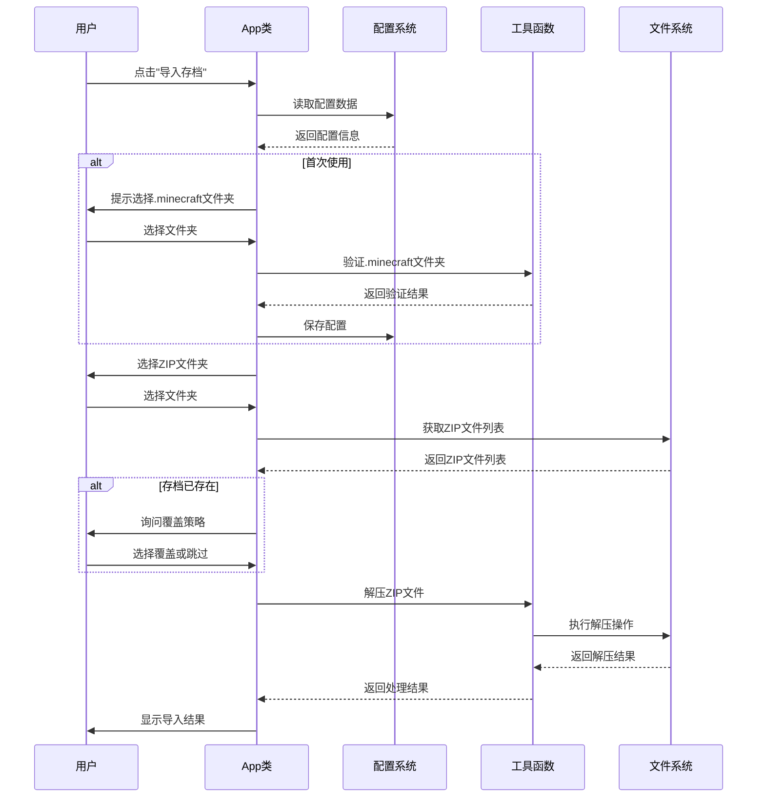
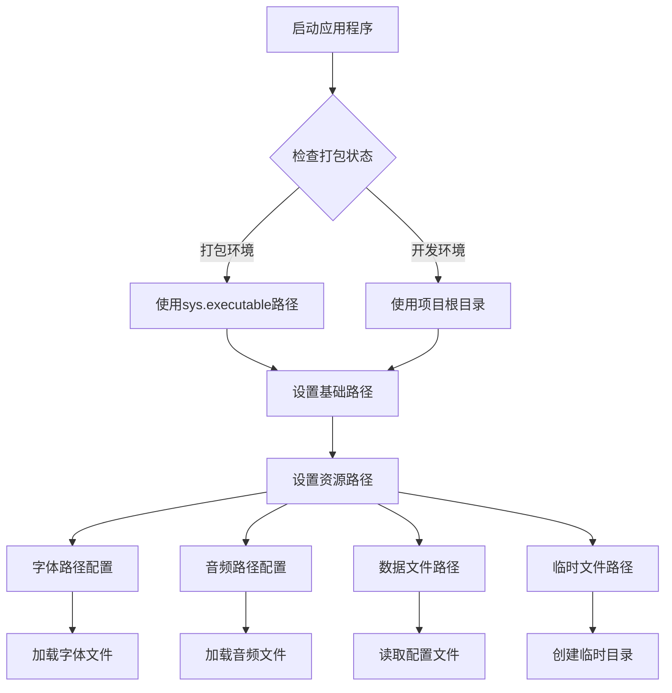
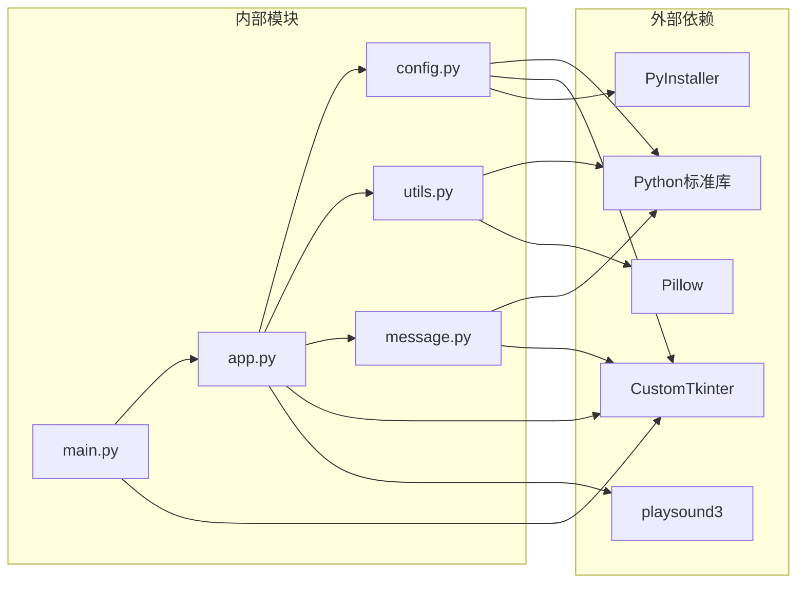

# 问题模板系统

<cite>
**本文档引用的文件**
- [README.md](file://README.md)
- [src/main.py](file://src/main.py)
- [src/app.py](file://src/app.py)
- [src/config.py](file://src/config.py)
- [src/utils.py](file://src/utils.py)
- [src/message.py](file://src/message.py)
- [data.json](file://data.json)
- [requirements.txt](file://requirements.txt)
- [wiki/Home.md](file://wiki/Home.md)
- [wiki/使用指南.md](file://wiki/使用指南.md)
- [wiki/开发文档.md](file://wiki/开发文档.md)
</cite>

## 目录
1. [项目概述](#项目概述)
2. [项目结构](#项目结构)
3. [核心组件](#核心组件)
4. [架构概览](#架构概览)
5. [详细组件分析](#详细组件分析)
6. [依赖关系分析](#依赖关系分析)
7. [性能考虑](#性能考虑)
8. [故障排除指南](#故障排除指南)
9. [结论](#结论)

## 项目概述

Minecraft 存档管理器是一个专为 Minecraft Java 版设计的图形化存档管理工具。该项目提供了直观的用户界面，使玩家能够轻松导入、导出和管理游戏存档。

### 主要功能特性

- **导入存档**：一键将下载的 ZIP 地图解压到 `.minecraft/saves` 文件夹
- **导出备份**：将现有存档打包备份（开发中）
- **存档列表**：查看和管理所有存档（开发中）
- **赞助支持**：支持开发者

### 技术架构

- **编程语言**：Python 3.10+
- **GUI 框架**：CustomTkinter
- **图像处理**：Pillow
- **打包工具**：PyInstaller
- **音频播放**：playsound3

## 项目结构

项目采用模块化的文件组织方式，每个模块都有明确的职责分工：

**图表来源**
- [src/main.py:1-7](file://src/main.py#L1-L7)
- [src/app.py:1-645](file://src/app.py#L1-L645)
- [src/config.py:1-94](file://src/config.py#L1-L94)

**章节来源**
- [README.md:25-34](file://README.md#L25-L34)
- [wiki/开发文档.md:3-21](file://wiki/开发文档.md#L3-L21)

## 核心组件

### 应用程序入口点

应用程序通过 `main.py` 启动，创建 `App` 实例并启动主事件循环。

### 主应用类 (App)

`App` 类是整个应用程序的核心，负责：
- GUI 界面的创建和管理
- 用户交互事件的处理
- 核心业务逻辑的执行
- 资源管理和配置处理

### 配置管理系统

`PathConfig` 类提供统一的路径管理功能，支持开发环境和打包环境的不同需求。

### 工具函数库

`utils.py` 包含各种实用工具函数，包括文件操作、图像处理、用户界面辅助等功能。

### 消息对话框系统

`Message` 类提供统一的消息提示和用户交互界面，支持信息提示和确认对话框。

**章节来源**
- [src/main.py:1-7](file://src/main.py#L1-L7)
- [src/app.py:6-38](file://src/app.py#L6-L38)
- [src/config.py:15-94](file://src/config.py#L15-L94)
- [src/utils.py:1-186](file://src/utils.py#L1-L186)
- [src/message.py:4-114](file://src/message.py#L4-L114)

## 架构概览

项目采用分层架构设计，各层职责明确，耦合度低：

**图表来源**
- [src/app.py:171-330](file://src/app.py#L171-L330)
- [src/utils.py:4-186](file://src/utils.py#L4-L186)
- [src/config.py:15-94](file://src/config.py#L15-L94)

## 详细组件分析

### App 类详细分析

`App` 类是应用程序的核心控制器，采用面向对象的设计模式：

**图表来源**
- [src/app.py:6-645](file://src/app.py#L6-L645)
- [src/config.py:15-94](file://src/config.py#L15-L94)
- [src/message.py:4-114](file://src/message.py#L4-L114)

#### 导入存档功能流程

导入存档功能是最复杂的业务逻辑，涉及多个步骤和用户交互：

**图表来源**
- [src/app.py:171-306](file://src/app.py#L171-L306)
- [src/utils.py:4-32](file://src/utils.py#L4-L32)

**章节来源**
- [src/app.py:171-306](file://src/app.py#L171-L306)
- [src/utils.py:4-32](file://src/utils.py#L4-L32)

### 配置管理系统分析

配置管理系统提供统一的路径管理和资源访问功能：

**图表来源**
- [src/config.py:48-94](file://src/config.py#L48-L94)

**章节来源**
- [src/config.py:15-94](file://src/config.py#L15-L94)

### 工具函数库分析

工具函数库提供应用程序所需的各种辅助功能：

| 函数类别 | 主要功能 | 关键实现 |
|---------|----------|----------|
| 文件操作 | ZIP解压、文件移动 | 使用zipfile和shutil模块 |
| 图像处理 | 图片加载、缩放 | 使用Pillow库 |
| 用户界面 | 文件对话框、窗口居中 | 使用CustomTkinter |
| 配置管理 | JSON文件读写 | 使用json模块 |

**章节来源**
- [src/utils.py:4-186](file://src/utils.py#L4-L186)

## 依赖关系分析

项目依赖关系清晰，采用松耦合设计：

**图表来源**
- [requirements.txt:1-10](file://requirements.txt#L1-L10)
- [src/main.py:1-2](file://src/main.py#L1-L2)
- [src/app.py:1-3](file://src/app.py#L1-L3)

**章节来源**
- [requirements.txt:1-10](file://requirements.txt#L1-L10)
- [src/main.py:1-2](file://src/main.py#L1-L2)

## 性能考虑

### 内存管理

- 使用临时目录进行ZIP文件解压，避免内存溢出
- 及时清理临时文件，释放磁盘空间
- 合理使用图像缓存，避免重复加载

### I/O优化

- 批量处理ZIP文件，减少文件系统操作次数
- 异步处理用户交互，避免界面阻塞
- 使用进度条反馈处理状态

### 资源管理

- 统一的资源加载机制，支持打包和开发环境
- 音频文件异步播放，不影响主程序执行
- 图像资源预加载，提升用户体验

## 故障排除指南

### 常见问题及解决方案

| 问题类型 | 症状描述 | 可能原因 | 解决方案 |
|---------|----------|----------|----------|
| 路径错误 | 无法找到.minecraft文件夹 | 路径配置错误或权限问题 | 删除data.json重新配置 |
| ZIP解压失败 | 导入过程中断 | ZIP文件损坏或空间不足 | 检查ZIP完整性，清理磁盘空间 |
| 界面显示异常 | 按钮或字体显示错位 | 字体文件缺失或路径错误 | 重新安装程序，检查字体文件 |
| 音效无法播放 | 提示框无声音 | 音频驱动或权限问题 | 检查系统音频设置 |

### 调试技巧

1. **日志记录**：在关键操作处添加日志输出
2. **异常捕获**：使用try-catch处理可能出现的错误
3. **状态检查**：在执行重要操作前检查系统状态
4. **回滚机制**：对于危险操作提供撤销功能

**章节来源**
- [src/app.py:207-244](file://src/app.py#L207-L244)
- [src/utils.py:161-186](file://src/utils.py#L161-L186)

## 结论

Minecraft 存档管理器项目展现了良好的软件工程实践，具有以下特点：

### 设计优势

- **模块化架构**：清晰的职责分离，便于维护和扩展
- **用户友好**：直观的界面设计和流畅的用户体验
- **跨平台支持**：支持Windows、Linux和macOS系统
- **可扩展性**：预留了完善的扩展接口

### 技术亮点

- **统一的配置管理**：支持开发和生产环境的无缝切换
- **健壮的错误处理**：完善的异常处理和用户反馈机制
- **资源优化**：合理的内存和I/O资源管理
- **打包优化**：使用PyInstaller实现高效的程序打包

### 发展建议

1. **功能完善**：继续开发导出备份和存档列表功能
2. **性能优化**：考虑多线程处理大型ZIP文件
3. **国际化**：支持多语言界面
4. **插件系统**：为高级用户提供扩展能力

该项目为Minecraft玩家提供了便利的存档管理解决方案，其清晰的架构设计和良好的代码质量为后续功能扩展奠定了坚实基础。